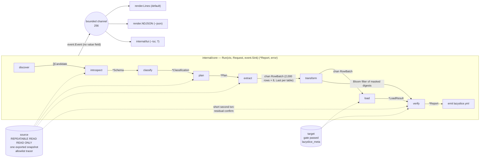
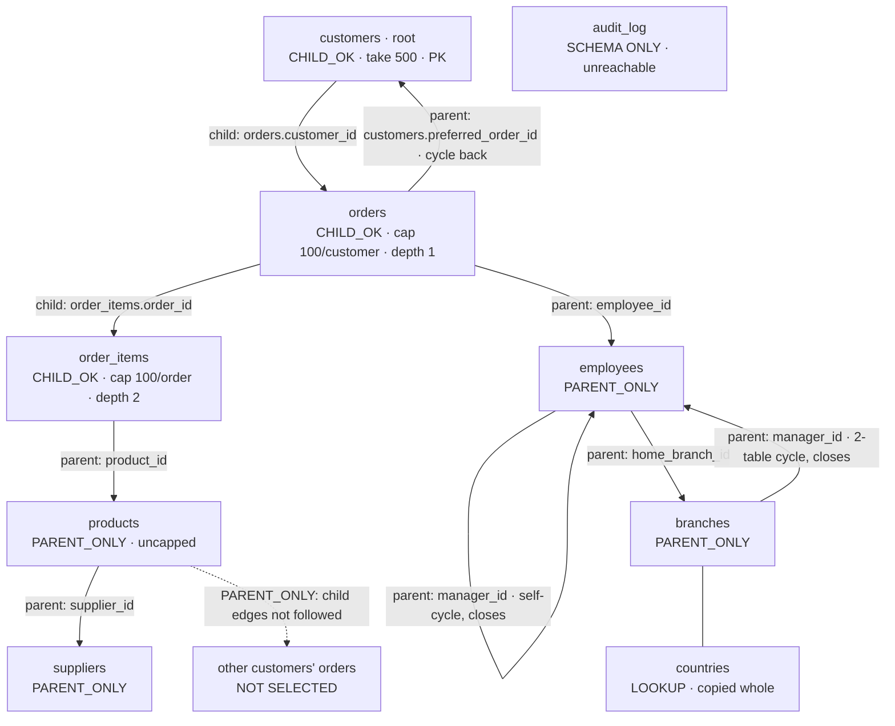

# lazyslice architecture

Written 2026-09-05 from docs/adr/001 to 006 and the research they cite; revised the same day after the phase 2 adversarial review (tracker T-0018), whose findings are addressed inline. This document is the reference the phase 3 scaffold and the phase 4 stages are built against; where it and an ADR disagree, the ADR wins and this file is corrected. Names in code are final; numbers marked *default* are flags.

Contents: the pipeline · stage interfaces and types · the subset planner · classification · deterministic masking · the residual scan · the progress event model · the CLI surface · first run · the emitted `lazyslice.yml` · the target: schema recreation and the marker table · repository layout · dependencies · the v1 cut line.

## 1. The pipeline

Nine stages (ADR-005): **discover → introspect → classify → plan → extract → transform → load → verify → emit.** One entry point, `core.Run`, drives them; the line printer, the NDJSON writer and the TUI are three sinks on one event channel and none of them reaches a stage directly.



Where each hard problem from research/HARD_PROBLEMS.md lives: §1 subsetting in **plan**; §2 masking in **transform** (and the `mask` module); §3 classification in **classify**; §4 streaming in **extract** and **load**; §4.3's snapshot-lifetime trap in **plan** (the printed hold estimate) and **verify** (the second short transaction).

A run holds the source snapshot from the start of introspect to the end of extract, releases it, loads, verifies, then emits. Stage transitions are events, so the transcript in CONCEPT.md is the event stream rendered as lines.

**Entry points, recorded after T-PIN (2026-09-08):** `core.Run` (the run), `core.Introspect` (the introspect subcommand), and `core.Preview` (a plan-only pass that returns the resolved endpoints and the schema fingerprint so `--tui` can pin the writing run to what the operator reviewed via `core.Request.Reviewed`; a mismatch refuses with `core.refused.reviewed_changed`, exit 12). There is no fourth; the three share one prologue and epilogue.

## 2. Stage interfaces and types

Package `internal/pipeline`. Engine-facing interfaces are implemented in `internal/pg`; classify, plan and transform are engine-agnostic. `ctx` is `context.Context` throughout.

**Import graph.** `internal/ref` is a leaf package holding only `TableRef` and `ColumnRef` and importing nothing. `internal/event` imports `ref`. `internal/pipeline` imports `ref`, `event`, `dsn` and `mask`. `internal/textsig` is a second leaf (the value-only halves of the classifier's validators and the embedded name dictionary) importing only `ref` and `pipeline`, so `classify` and `verify` share one implementation without importing each other (T-0055, 2026-09-08). The stage packages import `pipeline`. `event` never imports `pipeline`, so the graph is acyclic; `TestImportGraph` in phase 3 fails on any edge added in the other direction. `Config` and every type in this section live in `pipeline` and nowhere else; `internal/emit` implements `Emitter` over `pipeline.Config` and holds no type of its own.

```go
package pipeline

import (
    "context"
    "time"

    "github.com/Liarea/lazyslice/internal/dsn"
    "github.com/Liarea/lazyslice/internal/event"
    "github.com/Liarea/lazyslice/internal/ref"
    "github.com/Liarea/lazyslice/mask"
)

// ---------- identifiers ----------
//
// Declared in internal/ref (package ref, no imports):
//   type TableRef struct{ Schema, Name string }
//   type ColumnRef struct { Table TableRef; Column string }
// Aliased here so the rest of this document reads without the prefix.
// Ordering everywhere is by (Schema, Name), then Column; the planner and the
// emitter rely on that order (§3).

type TableRef = ref.TableRef
type ColumnRef = ref.ColumnRef

// ---------- discover ----------

type Provenance int

const (
    FromYml Provenance = iota // ./lazyslice.yml (rung 0)
    FromEnvVar                // DATABASE_URL, .env* (rung 1)
    FromLibpq                 // PGHOST/PGSERVICE (rung 2)
    FromContainer             // running Postgres container (rung 3)
    FromStoppedContainer      // exited container (rung 4)
    FromCompose               // compose service name only, never a DSN (rung 5)
    FromFlag                  // --source / --target
)

type Candidate struct {
    Ref        dsn.Ref    // host, port, database, user, and Params (allowlisted transport keys, T-0135); String() never prints a password
    Provenance Provenance
    Label      string     // compose service, container name, env var name
    Local      bool       // loopback, or a container whose compose working_dir matches cwd
    Reachable  bool
    ConnectErr string     // sanitised; empty when reachable
    Version    int        // server major, 0 when unreachable
    Tables     int        // user tables, from pg_class; the gate's cap (§9) is checked against this
    Empty      *bool      // nil at discovery, always; only Target.Gate fills it (§9 "Target")
    EmptyHint  bool       // one batched pg_class query at discovery: "no user table has relpages > 0";
                          // renders as "probably empty" in the candidate list and never gates a write
    Marked     bool       // lazyslice_meta present
    MetaSchema int        // lazyslice_meta.schema_version, 0 when absent
    CanCreate  bool       // has_schema_privilege(current_user, 'public', 'CREATE')
    SystemID   string     // pg_control_system().system_identifier when callable
}

type Discoverer interface {
    // Discover walks the ladder in ARCHITECTURE.md §9 with a 2 s listing budget
    // and a 1 s per-candidate dial timeout, emitting each candidate as it resolves.
    // Inside the dial it runs at most three reads per candidate, inside one
    // REPEATABLE READ READ ONLY transaction it opens and rolls back: version,
    // the pg_class count and hint, and to_regclass('lazyslice_meta'). It never
    // probes emptiness table by table; that is the gate's job, after discovery,
    // and the decision header prints "checking…" until the gate answers.
    Discover(ctx context.Context, workdir string, sink event.Sink) ([]Candidate, error)
}

// Provisioner is the --create-target path (§9 "Provisioning"), in
// internal/discover/provision. It is the only code that creates or starts a
// container, and it is never called without --create-target or a "yes" to Q1.
type Provisioner interface {
    // Provision pulls or finds postgres:<major>, creates lazyslice-target-<project>
    // bound to a free loopback port, starts it, waits for pg_isready (60 s), and
    // returns the candidate. A container of that name that already exists is
    // started if stopped and reused if running; it is never recreated or removed.
    Provision(ctx context.Context, project string, major int, sink event.Sink) (Candidate, error)
}

// ---------- source and target handles ----------

type SnapshotID string

type RolePrivileges struct {
    Role       string
    Superuser  bool
    Writable   []TableRef // tables where the role has INSERT, UPDATE or DELETE
    Unreadable []TableRef // tables where has_table_privilege(..., 'SELECT') is false;
                          // consumed by the planner (§3 "Unreadable tables"), never by extract
}

// Source is the read side. Every transaction it opens is
// REPEATABLE READ READ ONLY and every statement passes the shape allowlist
// (ADR-005 "Source"): all five pgx tracers are registered on the source pool,
// and a statement whose shape is not registered gets a cancelled context from
// TraceQueryStart and a recorded violation. Source code paths use Query only;
// TestSourceNeverCopiesOrBatches fails if internal/pg calls CopyFrom, SendBatch
// or Prepare on a Source connection.
type Source interface {
    Privileges(ctx context.Context) (RolePrivileges, error)
    // Snapshot opens the holder transaction and calls pg_export_snapshot().
    Snapshot(ctx context.Context) (SnapshotID, error)
    // Reader opens a connection that runs SET TRANSACTION SNAPSHOT id.
    // With a pooler that cannot import a snapshot, Reader returns the holder
    // connection itself and the run is serialised (ADR-005 "Pooled endpoints").
    Reader(ctx context.Context, id SnapshotID) (Reader, error)
    // Short opens a fresh, short REPEATABLE READ READ ONLY transaction on a
    // new snapshot; used only by verify for residual confirmation.
    Short(ctx context.Context) (Reader, error)
    Release(ctx context.Context) error // ends the holder transaction
    Trace() []TracedStatement           // for invariant I4
}

type TracedStatement struct {
    At      time.Time
    Shape   string // the registered shape's name, e.g. "plan.child_keys"; "" when refused
    SQL     string // statement text with parameters elided, never values
    Refused bool
}

// Reader exposes only Query. This is authorship hygiene: Query executes any
// SQL, so read-only is enforced by the tracer and the READ ONLY transaction,
// not by this type.
type Reader interface {
    Query(ctx context.Context, sql string, args ...any) (Rows, error)
    Close(ctx context.Context) error
}

type Rows interface {
    Next() bool
    Scan(dest ...any) error
    Err() error
    Close()
}

// Verdict is tri-state so that "not probed" can never be read as eligible.
// The zero value is NotProbed.
type Verdict int

const (
    NotProbed Verdict = iota
    Refused
    Eligible
)

type Eligibility struct {
    Verdict     Verdict
    Reason      event.Code         // rendered by the sink; every refusal reason is a row in docs/ERRORS.md
    RowCounts   map[TableRef]int64 // filled when refused for rows
    TableCount  int                // filled when refused for the table cap
    Marked       bool              // lazyslice_meta present
    MarkerBound  bool              // marker present, readable, and bound to this source and this catalog (§11.2)
    PrevKeyFP    string            // from the marker, "" when unbound
    PrevClassFP  string            // from the marker, "" when unbound
    MarkerRunID  string            // the marker row the gate read, re-verified under the drop's own lock (§11.2)
    MarkerStatus string            // that row's status, for the same re-verification
    SameCluster  bool              // system_identifier equal to the source's; a printed warning, never a refusal
    Local        bool              // Candidate.Local; a remote target needs --allow-remote-target HOST
}

type Target interface {
    // Gate implements ADR-005 "Target". It returns Verdict == Eligible only
    // when every probe ran to completion; any error, timeout or unprobed table
    // is Refused, never NotProbed-treated-as-ok. allowRemoteHost is the value of
    // --allow-remote-target, "" when absent.
    Gate(ctx context.Context, source dsn.Ref, sourceSystemID string, allowRemoteHost string) (Eligibility, error)
    Writer(ctx context.Context) (Writer, error)
}

type Writer interface {
    Exec(ctx context.Context, sql string, args ...any) error
    CopyFrom(ctx context.Context, table TableRef, cols []string, rows <-chan []any) (int64, error)
    Begin(ctx context.Context) (Tx, error)
    // RegisterTypes registers the source's enum, domain, composite and
    // user-defined array types on every connection this writer uses, after
    // the DDL has created them and before COPY. It is a method, not an
    // optional second interface: an optional interface that misses is a load
    // step that vanishes with no compile error (T-0093, 2026-09-09).
    RegisterTypes(ctx context.Context, s *Schema) error
}

type Tx interface {
    Exec(ctx context.Context, sql string, args ...any) error
    // Query is the one read the loader cannot delegate to the verifier: the
    // lock-and-recheck of §11.2 has to read the target after LOCK TABLE and
    // before DROP TABLE, inside this transaction and no other.
    Query(ctx context.Context, sql string, args ...any) (Rows, error)
    CopyFrom(ctx context.Context, table TableRef, cols []string, rows <-chan []any) (int64, error)
    Commit(ctx context.Context) error
    Rollback(ctx context.Context) error
}

// ---------- introspect ----------
//
// Schema carries everything §11.1 needs to recreate the object classes v1
// recreates, and counts what it does not. Definition text comes from the
// catalog's own deparser (pg_get_expr, pg_get_constraintdef, pg_get_indexdef),
// never from our own printer, so the target receives the source's expression
// verbatim.

type Column struct {
    Name        string
    TypeName    string // as pg_catalog.format_type
    TypeOID     uint32
    TypMod      int32
    Collation   string // "" when the type's default collation
    Nullable    bool
    Default     string // pg_get_expr(adbin, adrelid); "" when none
    DefaultOriginal string // the catalog's own text of Default from before §11.1's literal rewrite; "" when not rewritten (T-0134)
    Generated   string // pg_get_expr of a generated column's expression; "" when not generated
    Identity    string // "", "a" (always), "d" (by default)
    IdentitySeq *SequenceDef // parameters of the identity sequence, when Identity != ""
    Domain      string // CREATE DOMAIN name, if any
    Checks      []string // CHECK expressions naming this column, for classification and masking constraints
    Fingerprint string // sha256 over (TypeOID, TypMod, Nullable, Domain)[:8]
}

type Index struct {
    Name       string
    Columns    []string // empty for an expression index
    Unique     bool
    Partial    bool
    Expression bool
    Def        string   // pg_get_indexdef, recreated verbatim in the target
}

type Constraint struct {
    Name string
    Kind byte   // 'p' primary, 'u' unique, 'c' check, 'f' foreign, 'x' exclusion
    Def  string // pg_get_constraintdef
}

type SequenceDef struct {
    Name      string // schema-qualified
    Column    string // owned column via pg_get_serial_sequence; "" when unowned
    Start     int64
    Increment int64
    Min, Max  int64
    Cache     int64
    Cycle     bool
}

type Table struct {
    Ref          TableRef
    Columns      []Column
    PK           []string
    Indexes      []Index      // every index; the planner filters Unique && !Partial && !Expression
    Constraints  []Constraint // table-level, in creation order; FKs also appear in Schema.FKs
    Sequences    []SequenceDef
    Partitioned  bool         // relkind 'p'; recreated as a plain table in the target (§11.1)
    PartitionKey []string
    Partitions   []TableRef   // leaf partitions via pg_inherits, recursively; empty for a plain table
    Parent       *TableRef    // for a partition, its root
    RLS          bool         // relrowsecurity
    ForceRLS     bool         // relforcerowsecurity
    Triggers     int          // user triggers on the source; counted in Schema.NotRecreated
    ApproxRows   int64        // pg_class.reltuples, planning only, never a gate
    Samples      [][]any      // up to 200 rows by TABLESAMPLE SYSTEM ... REPEATABLE (seed); never serialised
    SampledFrom  *TableRef    // the leaf partition the samples came from; nil for a plain table
}

// Object names a source object v1 does not recreate: kinds are "view",
// "matview", "function", "procedure", "trigger", "policy", "rule", "comment",
// "privilege", "publication", "foreign_table", "operator", "collation". The
// count per kind is printed by the plan and recorded in the yml.
type Object struct{ Kind, Name string }

type Extension struct{ Name, Schema string }

// NamedDef is a CREATE statement for an enum, domain or composite type,
// rendered from the catalog at introspect.
type NamedDef struct{ Name, Def string }

type ForeignKey struct {
    Name       string
    Child      TableRef
    ChildCols  []string
    Parent     TableRef
    ParentCols []string
    MatchFull  bool
    Validated  bool // convalidated; unvalidated FKs are hints
    Virtual    bool // inferred polymorphic edge, parent-direction only
    Indexed    bool // child columns covered by an index
}

type Schema struct {
    ServerVersion int
    Schemas       []string     // user schemas, ordered
    Extensions    []Extension  // every installed extension a recreated column, index or default depends on
    Enums         map[string][]string
    Domains       []NamedDef
    Composites    []NamedDef
    Tables        []Table
    FKs           []ForeignKey
    NotRecreated  []Object     // §11.1; never a refusal, always printed
    Fingerprint   string       // sha256 over the recreated object classes, hex; §11.1 says what is hashed
}

type Introspector interface {
    Introspect(ctx context.Context, r Reader) (*Schema, error)
}

// Schema.Samples holds production values and is the only field in this
// package that does. It is never serialised: no renderer, subcommand, --json
// output or --debug path writes it, and TestNoValueBearingFieldSerialised
// asserts that the types reachable from event.Event, Config, Decision, Plan
// and Report exclude Table.Samples, RowBatch and dsn.DSN (THREAT_MODEL.md T4).

// ---------- classify ----------

type Category string

const (
    CatNone         Category = "none"
    CatPersonName   Category = "person_name"
    CatEmail        Category = "email"
    CatPhone        Category = "phone"
    CatAddress      Category = "address"
    CatGeo          Category = "geo"
    CatPersonDate   Category = "person_date"
    CatNationalID   Category = "national_id"
    CatFinancial    Category = "financial_account"
    CatNetworkID    Category = "network_id"
    CatOnlineID     Category = "online_id"
    CatCredential   Category = "credential"
    CatFreeText     Category = "free_text"
    CatSpecial      Category = "special_category"
    CatBinary       Category = "binary_personal"
    CatSemiStruct   Category = "semi_structured"
    CatDerivedText Category = "derived_text" // tsvector, always masked to empty (ADR-010)
)

type Confidence int

const (
    ConfNone     Confidence = iota
    ConfLow
    ConfPossible // mask threshold
    ConfLikely
    ConfCertain
)

type DecisionSource int

const (
    ByClassifier DecisionSource = iota
    ByYmlUnmask
    ByFlagUnmask
    ByYmlRaise
    ByFKPropagation
    ByNeighbour // neighbouring-column rule
)

// Reason is not free-form. It is rendered from a fixed template set in
// internal/classify/reasons.go whose placeholders admit only identifiers
// (column, table, pattern name, dictionary name, validator name) and counts;
// TestReasonGrammar parses every emitted reason back against the template set
// and fails on any string a template did not produce. A sample value can
// therefore never appear in a reason, the yml or an event.
type Decision struct {
    Col         ColumnRef
    Category    Category
    Confidence  Confidence
    Reason      string // "name matches email; 100/100 samples parse as addresses"
    Masker      mask.ID
    Masked      bool
    Source      DecisionSource
    TypeFP      string // Column.Fingerprint at decision time
    UniqueIndex bool   // the column is under a unique index; the generator must fit d_required (§5)
    Domain      int64  // admissible output domain, min(column domain, generator Domain()); 0 when unknown
    SmallDomain bool   // Domain < 2 × distinct sampled values: masking is a recoverable substitution (§5)
    Refused     string // non-empty when a unique column's domain is too small (exit 12)
}

type Classification struct {
    Decisions   map[ColumnRef]Decision
    Drift       []ColumnRef // columns the committed yml had never seen
    Expired     []ColumnRef // opt-outs ignored because TypeFP changed
    Fingerprint string      // sha256 over (rule-pack version, and per column: category, masker)[:16], recomputed by core after the plan because the plan's unique-index pick may overwrite Masker; §5 "Determinism scope"
}

type Sampler interface {
    // Samples returns Table.Samples for the column; the classifier never issues SQL.
    Samples(col ColumnRef) []any
}

type Classifier interface {
    Classify(schema *Schema, s Sampler, prior *Config) (*Classification, error) // pure
}

// ---------- plan ----------

type Mode int

const (
    ChildOK    Mode = iota // root, or reached via a child edge; children are followed
    ParentOnly             // reached via a parent edge; a leaf for the child step
    Lookup                 // copied whole
    SchemaOnly             // unreachable; DDL only
)

type IdentityKind int

const (
    IdentityPK IdentityKind = iota
    IdentityUnique
    IdentityPseudo
)

type Identity struct {
    Kind    IdentityKind
    Columns []string
    Types   []uint32 // TypeOID per column, drives Chunk encoding
}

// KeySet is a sorted set of key tuples, ordered by the identity columns in
// order. Single int8 keys are stored as []int64; composite or non-integer keys
// as sorted slabs of encoded tuples. Bytes() is the single source of truth for
// the memory estimate (§3): the []int64 implementation returns len × 8 × 2
// (the slice, doubled for overhead, which is the figure ADR-005 quotes); the
// slab implementation returns its slab size × 2. Iteration order is the key
// order, never Go map order.
//
// Chunks materialises a second copy of the whole set: every chunk is built
// before any is returned, and each chunk holds its own typed arrays. EachChunk
// builds one chunk at a time and drops it, and is what internal/extract walks
// a keyed step with. FirstChunk returns the first chunk only, or nil for an
// empty set, and is what internal/verify's sample compare takes. EachChunk
// stops at the first error f returns and returns it (T-0050, 2026-09-08).
type KeySet interface {
    Len() int
    Bytes() int64
    Chunks(n int) []Chunk // consecutive runs of at most n tuples, in key order
    FirstChunk(n int) Chunk
    EachChunk(n int, f func(Chunk) error) error
}

// Chunk is one unnest argument list: one typed array per identity column, so
// a composite key of k columns is unnest($1, ..., $k) with k parallel arrays.
// Column(i) is []int64 for int2/int4/int8, []string for text, varchar, bpchar
// and citext, []pgtype.UUID for uuid, and []string holding the text form for
// every other type; Cast(i) is the matching SQL cast ("::int8[]", "::text[]",
// "::uuid[]", or "::text[]" with the joined column written as
// unnest($i::text[])::<format_type>). pgx v5.10.0 encodes these without
// registration; []any is never passed to Query because pgx cannot infer an
// array OID for it. The composite-key fixture in testdata/ exercises every branch.
type Chunk interface {
    Len() int
    Column(i int) any
    Cast(i int) string
}

type Step struct {
    Table    TableRef
    Mode     Mode
    Identity Identity
    Keys     KeySet // nil for Lookup and SchemaOnly
    Cap      int    // per parent key per edge, 0 when unused
    Depth    int
    Why      string // rendered from a template set like Decision.Reason: "child of orders via order_items.order_id",
                    // "parent of ...", "lookup", "unreachable", "unreadable", "skipped"; never free-form
}

// AssumedRowsPerSec is the extract throughput the hold estimate assumes. It
// is a constant, printed beside the estimate ("assuming 20,000 rows/s"), so
// the estimate is falsifiable rather than circular; the phase 5 performance
// task (docs/BUILD_PLAN.md PROMPT 5.3) recalibrates it from measurement.
const AssumedRowsPerSec = 20_000

type Estimate struct {
    Rows         int64
    Bytes        int64
    KeyMemory    int64   // Σ KeySet.Bytes() over every step with keys
    FilterMemory int64   // residual Bloom filter, 29 bits per masked cell; JSON leaves count individually (§6)
    HoldSeconds  float64 // measured plan time + Rows / AssumedRowsPerSec
}

type PlanRequest struct {
    Root         *TableRef // nil: computed default
    Take         int
    Where        string
    Cap          int
    TableCaps    map[TableRef]int
    Depth        int
    RowBudget    int64
    MemoryBudget int64
    Keys         map[TableRef][]string // --key table=col,col, or the yml's keys: block
    Skip         []TableRef            // --skip-table, or the yml's skipped: block
}

type Plan struct {
    Root       TableRef
    RootReason string // "23 inbound − 0 outbound FKs; name preference"
    Take       int
    Steps      []Step        // in load order (SCC condensation, topologically sorted, ties by (schema, name))
    SCCs       [][]TableRef  // every SCC with more than one table, or a self-cycle
    Virtual    []ForeignKey  // inferred polymorphic edges followed
    Unmapped   []string      // "_type values that map to no table"
    Unindexed  []ForeignKey
    Skipped    []TableRef    // dropped to SchemaOnly by --skip-table
    Unreadable []TableRef    // unreachable tables the role cannot read, dropped to SchemaOnly
    Estimate   Estimate
    SnapshotID SnapshotID
}

type Planner interface {
    Plan(ctx context.Context, r Reader, schema *Schema, cls *Classification, req PlanRequest) (*Plan, error)
}

// ---------- extract, transform, load ----------

// RowBatch is the extract → transform → load contract. Tables are strictly
// sequential on the channel: every batch of table T is sent before the first
// batch of the next table in plan order, and Last marks T's final batch. A
// table with no rows sends exactly one empty batch with Last set, so the
// loader always sees a boundary. The loader opens T's transaction on Seq 0 and
// commits it on Last; it never infers a boundary from a change of Table. A
// future parallel extract must change this contract, not work around it.
type RowBatch struct {
    Table TableRef
    Cols  []string
    Rows  [][]any
    Seq   int  // per table, from 0
    Last  bool // final batch for Table
}

type Extractor interface {
    // Extract streams every step in plan order, one table at a time, into out
    // and closes it.
    Extract(ctx context.Context, r Reader, plan *Plan, out chan<- RowBatch) error
}

// Residual is the Bloom filter of HMAC(runKey, enc(column, path, canonical(source)))
// for every masked cell and, for JSON documents, every masked leaf keyed by
// its path, built during transform and read by verify (§6). enc is the
// length-prefixed encoding in §5. The run key is random per run and never
// leaves the process. Implemented in internal/transform/bloom.go.
type Residual interface {
    Add(col ColumnRef, path string, canonical []byte)
    MayContain(col ColumnRef, path string, canonical []byte) bool
    Cells() int64
    Bytes() int64
}

type Transformer interface {
    // Transform is pure apart from Residual.Add; it masks in place and returns the batch.
    Transform(b RowBatch, cls *Classification, key *mask.Key, res Residual) (RowBatch, error)
}

type LoadResult struct {
    Rows      map[TableRef]int64
    Sequences map[TableRef][]string
    Elapsed   time.Duration
}

type Loader interface {
    // Load recreates the object classes in §11.1 (pre-data), copies every
    // table under one transaction opened at Seq 0 and committed at Last, then
    // indexes, FKs NOT VALID, sequences, ANALYZE.
    Load(ctx context.Context, w Writer, plan *Plan, schema *Schema, in <-chan RowBatch) (*LoadResult, error)
}

// ---------- verify, emit ----------

type Check struct {
    Name   string // "fk", "residual", "residual_unconfirmable", "second_net", "sequences", "row_count", "unmasked_identical"
    Passed bool
    Code   event.Code
    Table  TableRef
    Column string
    Count  int64
}

type Report struct {
    Checks      []Check
    Rows        map[TableRef]int64
    Elapsed     time.Duration
    ExitCode    int
    Unconfirmed int64 // residual filter hits confirmed absent from the source (false positive or source changed)
    Probes      int64 // source confirmation probes issued, against the cap in §6
}

type Verifier interface {
    // Verify uses src.Short for residual confirmation and for the unmasked
    // sample comparison, never the run snapshot. schema supplies the column
    // types the second net canonicalises by and the identity columns the
    // sample comparison fetches by.
    Verify(ctx context.Context, src Source, w Writer, schema *Schema, plan *Plan, cls *Classification, res Residual, lr *LoadResult) (*Report, error)
}

// Config is the in-memory form of lazyslice.yml (§10). It is read by
// Classifier as the prior (opt-outs, raises, extra patterns) and written by
// Emitter. It holds references and decisions; a field that could hold a
// secret is a compile error by convention, enforced by TestConfigHasNoSecretField.
type Config struct {
    Version           int
    Tool              string
    PlanOnly          bool       // written by --plan --config PATH; §8 and ADR-004
    Source            Provenance
    SourceRef         dsn.Ref
    PasswordCommand   string     // the --password-command string, a reference; never its output
    Target            Provenance
    TargetRef         dsn.Ref
    Root              TableRef
    Take              int
    Where             string     // "" when the predicate held a literal; see WhereFingerprint
    WhereFingerprint  string     // sha256(where)[:16] when Where was withheld (§10)
    Cap               int
    Caps              map[TableRef]int
    Depth             int
    RowBudget         int64
    MemoryBudget      int64
    Keys              map[TableRef][]string // --key, recorded; a default the flag overrides
    Skipped           []TableRef            // --skip-table, recorded
    SchemaFingerprint string
    ClassFingerprint  string     // Classification.Fingerprint
    SnapshotID        SnapshotID // "" when PlanOnly
    SecretFingerprint string
    ExtraPatterns     []Pattern
    Columns           map[ColumnRef]ColumnConfig
    Plan              PlanSummary
}

type Pattern struct {
    Name       string   // regex over column or table name
    Category   Category
    Confidence Confidence // the floor this pattern raises to; never lowers
}

type ColumnConfig struct {
    Category    Category
    Confidence  Confidence
    Reason      string
    Masker      mask.ID
    Unique      bool
    TypeFP      string
    MappingFile string   // ADR-006 escape hatch; gitignored
    Unmask      *Unmask
}

type Unmask struct {
    Reason string // never empty: --unmask TABLE.COL=REASON rejects the bare form (§8)
    By     string
    TypeFP string // the opt-out expires when the column's fingerprint changes
}

type PlanSummary struct {
    Tables       int
    Rows         int64
    Lookups      []TableRef
    Unreachable  []TableRef
    SCCs         [][]TableRef
    VirtualFKs   []ForeignKey
    NotRecreated map[string]int // Object.Kind → count (§11.1)
    SmallDomain  []ColumnRef    // masked columns whose substitution is recoverable by frequency (§5)
}

type Emitter interface {
    Emit(plan *Plan, cls *Classification, report *Report, req PlanRequest, source, target Candidate, keyFP string) (*Config, error)
    Write(path string, cfg *Config) error
    Read(path string) (*Config, error)
}
```

`core.Request` mirrors the CLI flags in §8 field for field; `internal/tui` builds the same struct from keystrokes.

**Value-free types.** Four structures leave the process or reach a file: `event.Event` (§7), `Config` (§10), `Plan` (`--plan --json`) and `Report`. `TestNoValueBearingFieldSerialised` walks the transitive field types of all four and fails if any reaches `dsn.DSN`, `RowBatch`, `Table.Samples` or a `mask.Value`; `TestReasonGrammar` covers `Decision.Reason`; `TestConfigHasNoSecretField` covers `secret:"true"`. `Schema` itself is never serialised by `introspect --json`: that subcommand emits a `SchemaSummary` with counts and fingerprints, and the test above covers it.


**Type additions recorded after implementation (2026-09-06):** `Index.Immediate bool` carries `pg_index.indimmediate`; the index behind a DEFERRABLE primary key or unique constraint has it false and can never back a foreign key. `ForeignKey.NotRecreatable bool` marks an edge whose parent end is a leaf partition carrying a key the root cannot: introspect leaves the edge un-re-pointed and the planner refuses at plan time with exit 13 (`target.schema.not_recreatable`) before anything in the target is dropped (T-INTROSPECT-FIX2).

**Recorded after the planner landed (2026-09-06, T-PLAN):** `Plan.Polymorphic []string` carries detected polymorphic pairs; `Plan.Unmapped` is reserved for unmapped `_type` values once §3.2's mapping exists. `PlanRequest` zero values are literal: `internal/core` substitutes the §3 defaults before calling `Plan`, and the CLI rejects `--take 0`, `--cap 0` and `--depth 0` with exit 2. `RolePrivileges` travels in `PlanRequest`; the planner issues no catalog queries of its own. §3.4's "discriminator" is read narrowly: a boolean, an enum, or a `_type`/status/kind/state/code-named column of a comparable kind; a table whose only distinguishing column is none of these reaches exit 12 naming `--key`.

## 3. The subset planner

Client-side monotone worklist with provenance tags (research/HARD_PROBLEMS.md §1.1), never SQL pushdown, because the plan must say why each row is present and the source must never see a temp table. Defaults: `--take 500`, per-parent-key cap `100`, `--depth 3`, `--row-budget 1000000`, `--memory-budget 256MiB`.

```
plan(schema, cls, req, priv):
    root      := req.Root ?? defaultRoot(schema)          // §3.1
    tables    := sort(schema.Tables by (schema, name))      // every "for t in" below iterates this order
    edges     := sort(schema.FKs by constraint name)        // every "for fk in" below iterates this order
    unreadable(req, priv, root)                              // §3.6, before any key is fetched
    tables    := tables − req.Skipped                        // --skip-table applies before the ladder:
                                                             // a skipped table is never given an identity
    identity  := {}                                         // per table
    for t in tables:
        identity[t] := req.Keys[t] ?? PK(t) ?? nonPartialNonExprUnique(t) ?? probedPseudoKey(t, r)
                       // an explicit --key is probed for uniqueness like any other candidate (§3.4):
                       // it beats a probed guess only if the probe finds it unique, and a non-unique
                       // explicit key is refused naming a duplicate pair, never accepted
        if identity[t] == nil: refuse(t, exit 12, "--key t=col,col or --skip-table t")

    lookups   := { t : outgoing(t)=∅ ∧ incoming(t)≠∅ ∧ boundedCount(t) ≤ 1000
                       ∧ ∀c∈t: cls[c].Confidence < Possible }   // PII lookups are walked, not copied
                 // boundedCount(t): skipped (t is not a lookup) when ApproxRows > 10,000;
                 // otherwise SELECT count(*) FROM (SELECT 1 FROM t LIMIT 1001) x.
                 // ApproxRows may skip the probe, never decide it (the rule §9 states for the gate).
    selected  := { t : ∅ }                                   // KeySet per table, key-ordered
    label     := { t : unset }                               // the Step's Mode label only; never read by the walk
    queue     := FIFO[ (root, seedKeys(root, req.Take, req.Where), CHILD_OK, depth 0) ]
                 // seedKeys: ORDER BY identity[root] LIMIT take, or WHERE ... ORDER BY identity[root]

    while (t, keys, m, d) := queue.popFront():
        new := keys − selected[t]                            // row semantics: a row is expanded in the mode
        if new = ∅: continue                                 // it was first popped under (HARD_PROBLEMS §1.1)
        selected[t] |= new
        label[t] := CHILD_OK if m = CHILD_OK else (label[t] ?? PARENT_ONLY)
        checkBudgets(selected, cls)                          // rows > RowBudget → exit 11 naming t
                                                             // Σ selected[t].Bytes() + filterBytes > MemoryBudget → exit 11

        // parents: mandatory, uncapped, any depth, PARENT_ONLY
        for fk in outgoing(t) where fk.Validated ∨ fk.Virtual:   // constraint-name order
            if parent(fk) ∈ lookups: continue                // copied whole anyway
            for chunk in new.Chunks(2000):                   // key order
                pk := SELECT DISTINCT fk.ParentCols FROM t JOIN unnest(chunk) USING (identity[t])
                      WHERE ∀c∈fk.ChildCols: c IS NOT NULL   // MATCH SIMPLE: any NULL references nothing
                      ORDER BY fk.ParentCols
                queue.pushBack( (parent(fk), pk − selected[parent(fk)], PARENT_ONLY, d) )

        // children: only from CHILD_OK rows, capped per parent key per edge, depth-limited
        if m = CHILD_OK ∧ d < req.Depth:
            for fk in incoming(t) where ¬fk.Virtual:         // constraint-name order
                cap := req.TableCaps[child(fk)] ?? req.Cap
                for chunk in new.Chunks(2000):
                    ck := SELECT identity[child] FROM (
                            SELECT identity[child],
                                   row_number() OVER (PARTITION BY fk.ChildCols ORDER BY identity[child]) AS rn
                            FROM child JOIN unnest(chunk) ON fk.ChildCols = parentKey) s
                          WHERE rn <= cap ORDER BY identity[child]
                    queue.pushBack( (child(fk), ck − selected[child(fk)], CHILD_OK, d+1) )

    steps := []
    for t in lookups:               steps += Step{t, Lookup}
    for t in tables ∩ selected:     steps += Step{t, label[t], identity[t], selected[t]}
    for t in tables − lookups − selected: steps += Step{t, SchemaOnly}
    order(steps) := topo(condense(tarjanSCC(edges)))         // load order; inside an SCC and among
                                                             // unordered tables, (schema, name) order,
                                                             // because FKs are created after data
    estimate := { rows: Σ|selected[t]| + Σ boundedCount(lookups),
                  keyMemory: Σ selected[t].Bytes(),
                  filterMemory: maskedCells(selected, cls) × 29 / 8,   // JSON leaves counted individually
                  hold: measuredPlanTime + rows / AssumedRowsPerSec }
    return Plan{root, steps, sccs, virtualFKs, unmapped, unindexed, skipped, unreadable, estimate}
```

`--skip-table` clears an exit-12 identity refusal: a table with no derivable identity that is only ever reached as a child is dropped from the slice rather than named with `--key`, which is how testdata/nasty.sql's `public.click_stream` is planned. An explicit `--key` is a candidate like any other and is probed for uniqueness; a non-unique explicit key is refused naming a duplicate pair (T-0032, 2026-09-06).

**Determinism.** The queue is FIFO; tables iterate in `(schema, name)` order; edges iterate in constraint-name order; every key set, chunk and SQL result is ordered by the identity columns; nothing iterates a Go map. A row's expansion mode is therefore a function of the schema, the request and the snapshot, and two runs over one snapshot produce byte-identical `selected` sets — which is what makes the yml "a record of what happened" (ADR-004) and invariants I3 and I5 stable. The `label` map exists only to name the `Step`; a table reached both as a parent and as a child is labelled `CHILD_OK`, and the label never feeds back into the walk. The §3 diagram contains the case that makes this matter: `customers.preferred_order_id` pushes `orders` as `PARENT_ONLY` and `orders.customer_id` pushes the same rows as `CHILD_OK`; under FIFO with parents pushed before children inside one pop, the parent batch is popped first, so a customer's preferred order that is also one of their own orders is expanded as a parent and its `order_items` are not pulled through that batch — but the same rows arrive again in the child batch, are already in `selected`, and are skipped. This is HARD_PROBLEMS.md §1.1's "mode decided once" rule, applied deterministically. A fixture in testdata/ carries exactly this shape (a parent edge and a child edge into one table) and `TestPlanIsDeterministic` asserts identical `selected` sets across two runs on one snapshot.

**3.1 Root default.** `score(t) = inbound(t) − outbound(t)`; discard lookup-shaped tables (under 1,000 rows and inbound from at most two distinct tables, or a name matching `/_(types?|statuses|kinds|codes)$/`, or in `{countries, currencies, migrations, schema_migrations, ...}`); tie-break by name in `{customers, users, accounts, organizations, organisations, tenants, companies, clients}`, then by row count descending. `?` at the prompt shows the ranked top five with score components (research/SQLIT_STUDY.md §5.4).

**3.2 Polymorphic pairs.** Column pairs `<x>_type`/`<x>_id` and `content_type_id`/`object_id` are detected; distinct `_type` values are sampled and mapped (Rails: underscore and pluralise; Django: `django_content_type` row); each mapping becomes a `Virtual` FK followed in the parent direction only; unmapped values print `not followed: no constraint` (research/HARD_PROBLEMS.md §1.2).

**3.3 Partitions.** A partition is never a step; its root is. `conparentid` and `pg_inherits` collapse them at introspect. Keys are fetched from the root (Postgres routes the query to the leaves); the target holds the root as a plain table (§11.1), so a masked partition-key column moves no row anywhere.

**3.4 Row identity.** `--key` (or the yml's `keys:` block) → PK → unique index (non-partial, non-expression) → pseudo-key (the table's FK columns plus NOT NULL discriminators, probed for uniqueness over a `TABLESAMPLE` before it is trusted) → refuse with exit 12 naming the table and `--key table=col,col`. An explicit key is first because a pseudo-key was only ever probed on a sample. There is no `ctid` rung (ADR-005). A key given by flag is recorded in the yml under `keys:` so the second run needs no flag (§10).

**3.6 Unreadable tables.** `RolePrivileges.Unreadable` is consulted before the snapshot is used for keys. An unreadable table that is unreachable from the root, or that is reachable only as a child (no selected row references it as a parent), is dropped to `SchemaOnly`, listed under `unreadable:` in the plan and the yml, and the run continues. An unreadable table that the slice needs as a parent, or the root itself, stops the run at plan with exit 12 naming the table, the role and the statement to run: `GRANT SELECT ON <schema>.<table> TO <role>;`. `--skip-table TABLE` (repeatable, recorded under `skipped:`) drops a child-only table to `SchemaOnly` on request, for the case where the fix is not wanted; it cannot skip a parent table, because the slice would not be referentially complete, and says so with the same exit 12. There is no mid-extract permission failure by design: research/SQLIT_STUDY.md §5.7's "permission denied during extract" row is answered at plan.

**3.5 What the plan prints**, before any extraction: every step with mode, identity kind and reason; every SCC and the sentence "FKs are created after data, so no edge is deferred"; every virtual FK and unmapped value; every unindexed FK edge; unreachable, unreadable and skipped tables; every source object class that will not be recreated, with counts (§11.1); every masked column with a small admissible domain (§5); estimated rows, bytes, key memory (`Σ Bytes()`), filter memory and snapshot hold with its assumption (`assuming 20,000 rows/s`); and the flag that changes each number.

Walk on a schema with two cycles:



Both cycles are selected with no special case and loaded with no ordering. `employees` is reached only as a parent, so its own children (other orders it handled) are never pulled: that is the size and the privacy control (research/COMPLAINTS.md FK-14, Jailer #126).

**§3.2 amendments after inference landed (2026-09-08, T-POLY):** (1) Type-value resolution tries, in order, the Rails form (underscore and pluralise), the demodulized form, and then the raw lower-cased and un-pluralised value; the last exists because hand-rolled polymorphism commonly stores bare table names (`people`, `projects`), which Rails rules would mangle to `peoples`; a value no form resolves is reported as unmapped, never guessed. (2) A discriminator column with more than 50 distinct sampled values is not inferred at all and the plan says so (`the sample carries more than 50 distinct <col> values`); no `_type` value is ever printed in a message, and a column's unmapped values are reported as a count instead (corrected 2026-09-14, T-0131 — this amendment originally said a value longer than 64 bytes was truncated in messages, a T4 bound). (3) Every followed virtual edge is printed in the plan under `plan.polymorphic.inferred` before extraction, beside the detected-not-followed and unmapped lines; §14's cut line is updated: inference ships in phase 5.

## 4. Classification

Names + types + validated samples + dictionaries + a reason string, biased to recall; no ML gate, no cloud model over values (research/HARD_PROBLEMS.md §3; research/SYNTHESIS.md §1 fact 6).

- **Signals.** Column and table name patterns (multilingual, embedded rule pack); Postgres types (`inet`, `macaddr`, `citext`, domains, `jsonb`); sampled values through validators (`net/mail.ParseAddress`, libphonenumber `IsValidNumber` with region hint, Luhn, mod-97, `net.ParseIP`, UUID parse, name dictionary, Shannon entropy for secrets after the UUID check). Samples come from `TABLESAMPLE SYSTEM (p) REPEATABLE (seed)` with `p` chosen for about 200 rows, never `LIMIT`. **Partitioned tables:** `TABLESAMPLE` is accepted only on regular tables and materialised views, so a partitioned root is sampled through its largest leaf by `reltuples` (ties by name), found via `pg_inherits`, the samples are attributed to the root, `Table.SampledFrom` names the leaf, and the explanation says `samples from partition <leaf>`. A partitioned table with no leaves has no samples, classifies on name and type signals alone, and the explanation says so. The partitioned fixture in testdata/ is one of the phase 3 traps.
- **Composite columns fail closed.** A composite-typed column is classified over its text form; a hit at `possible` or above refuses at plan (exit 12) naming the column, never copies silently; no hit copies with a reason. Arrays whose sample arrives as a text literal (an array of an extension type on the unregistered source pool) are split by the Postgres array-literal grammar before classification (T-0094, T-0103, 2026-09-09).
- **Derived text.** A `tsvector` column is category `derived_text`, decided by type alone and always masked to the empty tsvector, because it is derived from text that may be masked (ADR-010).
- **Arrays.** An array column is classified on its element type: name rules, type signals and validators all run against the element, and the resulting decision, category and reason belong to the column. `text[]` named like an email column, or holding addresses, is `email` exactly as `text` would be (T-0034, 2026-09-06).
- **Scoring.** Name hit alone → `possible`; name hit plus ≥80% of non-null samples validating → `certain`; samples validating with no name hit → `likely` ("values look like X"); special categories by name alone → `certain`. Every decision at `low` or above carries the category of the signal that produced it; `none` means no signal at all. **Neighbouring-column rule:** any table with a column at `likely` or above raises every column in it at `low` to `possible`, keeping its category. **FK propagation:** a masked PK or unique column's decision overrides the decision on every column referencing it, and identical column names across tables share a category.
- **Accepted types per category.** Every category declares the PostgreSQL types its maskers accept: `email` accepts `text`, `varchar`, `citext` and domains over them, and never `boolean`, `date` or an integer type. A name hit on a column whose type its category does not accept is recorded at `low`, with a reason naming the conflict (`name matches email; boolean is not an accepted type for email`), and the neighbouring-column rule never raises a type-conflicting decision above `low`. This gates the name signal, and, per ADR-010, also silences a value signal on any recognised family the category's `accepts:` list omits (timestamp, date, time, interval, boolean, bytea, numeric, tsvector); `enum`, `xml` and `other` are never silenced, so a column whose sampled **values** validate for a category on an accepted or unknown family is classified on those values whatever it is called (testdata trap 20). It is not the copy-as-is-by-type exemption the enum rule removes below (T-0033, 2026-09-06; ADR-010).
- **Threshold.** After the neighbouring-column rule and FK propagation have run, `possible` and above is masked; `low` and `none` are copied. This is the rule for every column, including one a committed yml has never seen (ADR-004 "Drift", revised). The failure mode is mask more, never less.
- **Free text and JSON.** `text`/`varchar` columns named like `notes|comment|description|bio|message|body|reason` or with dictionary hits in samples are `free_text` and replaced whole with filler whose length is derived from `h` inside the column's admissible range (§5); the source length never survives. `json`/`jsonb`/`hstore` documents are masked whole, as CONCEPT.md promises: structure and key names are kept and **every scalar leaf is replaced**. String leaves go through the category masker chosen by running the leaf's key name through the name rules, defaulting to `free_text` for a key no rule recognises; number leaves become a number of the same kind (integral or fractional) derived from `h`; boolean leaves become a boolean derived from `h`; `null` stays `null`; arrays and objects keep their shape. Wildly varying keys, or any `jsonb` in a table named like `audit|log|history|event`, replace the document with `{}`. Key names are the one thing a document keeps, and §6 item 6 says so. `bytea` in a person-shaped column is `binary_personal` and set to NULL.
- **Never masked, always explained:** generated columns (never copied; the target recomputes them) and surrogate keys (`id bigint` and the FK columns that reference them). Surrogate keys are preserved verbatim, which means every snapshot carries an exact join key back to the production row; THREAT_MODEL.md "Positions" and §6 item 6 state that first. There is no copy-as-is exemption by type: an enum column, a partition-key column and a `varchar(2)` column are classified like any other, and a masked enum emits a valid label (§5). The earlier draft's enum exemption was a copy-as-is default by type and is removed.
- **Explanation.** Every decision has one line: `users.email  email  certain  name matches email; 200/200 samples parse as addresses  → masker email`. `?` shows the table. Reasons come from the template set in `internal/classify/reasons.go` (§2 "Value-free types").

**Recorded after transform landed (2026-09-06, T-EXTRACT):** every JSON string leaf is masked as `free_text`, §4's own default for an unrecognised key, rather than through the name rules; the shape of the fake is lost (an email leaf becomes filler) but coverage is unchanged, and the residual entry for every leaf is derivable by verify. §14's one-level JSON key collection in classify is what restores per-leaf categories, by putting them on the Decision where verify can read them.

## 5. Deterministic masking

Module `github.com/Liarea/lazyslice/mask` (ADR-006). The scheme (research/HARD_PROBLEMS.md §2.1):

```
K        = 32 random bytes            // ./lazyslice.secret | $LAZYSLICE_SECRET | ephemeral
K_cat    = HKDF-SHA256(K, salt=nil, info="lazyslice/v1/"+category, 32)
h        = HMAC-SHA256(K_cat, enc(typeTag, canonical(value)))
fake     = generator[masker](h, value, constraints)   // h drives every choice; no global seed

enc(f1, ..., fn) = u32be(len(f1)) ‖ f1 ‖ ... ‖ u32be(len(fn)) ‖ fn   // length-prefixed, unambiguous
```

- **Encoding is length-prefixed**, here and in the residual filter (§6), so that `("email", "a@b.com")` and `("emai", "la@b.com")` hash differently and a column `b.c` in schema `a` never aliases column `c` in schema `a.b`. `mask` carries those pairs as test fixtures. ADR-006 makes this scheme part of the module's contract, so it is fixed now rather than after the first release.
- **Canonicalise per category before hashing:** emails trimmed and case-folded; phones to E.164 via `nyaruka/phonenumbers`; names NFKC-normalised and case-folded; numeric identifiers decimal-normalised; `typeTag` names the canonical form so `bigint` and `text` copies of one identifier hash alike.
- **Generators consume only `h`:** index into embedded word lists; local parts from base32 of `h`; digits from `h`; the length of a free-text filler from `h`. No gofakeit.
- **Nothing survives:** no prefix, length, first character or real domain. Emails land in `example.com`/`example.net`/`example.org`; phones in the fictional `555-01XX` range or the corresponding reserved range for the detected region; IPs in documentation ranges; URLs under `example.invalid` with a hash-derived path. Free text is filler of a length drawn from `h` within `[1, min(atttypmod, 4096)]`, so a 1,247-character bio and a two-word note are indistinguishable after masking; `TestFreeTextLengthUncorrelated` asserts, for a fixed key, that output length does not correlate with input length. The two length-revealing exceptions are `NULL` and `''`, listed in §6 item 6.
- **Documentation ranges are the IP output space, by design.** `network_id` emits IPv4 in the three RFC 5737 blocks (768 addresses) and IPv6 under `2001:db8::/32`. A source column that already holds documentation-range IPv4 addresses can therefore receive a masked value equal to one of its own source values, and the residual scan reports it as a hit; that is a known false-positive surface, not a leak, and the fixtures avoid documentation-range IPv4 source values for that reason (T-0059, 2026-09-06).
- **Documentation domains are the email output space, by design.** `email` emits addresses under `example.com`, `example.net` and `example.org`. A source column that already holds such addresses can receive a masked value equal to one of its own source values, and the residual scan reports it as a hit; a known false-positive surface, not a leak, and the fixtures avoid documentation-domain source addresses for that reason (T-0073, 2026-09-08).
- **Composite and partial unique indexes (ADR-011).** A composite unique index raises every masked column it covers to the unique-domain rule unless an unmasked key column's sample has no repeats; a single-column partial unique index raises its column with d_required over the whole table. Both are safe-side approximations recorded in ADR-011.
- **Arrays mask element-wise.** Each non-NULL element goes through the element masker; length, dimensions and lower bounds are preserved; a `NULL` element stays `NULL`, an empty array stays empty, and a `NULL` column stays `NULL`. `h` is computed per element, so equal elements mask alike across rows, the determinism contract one level down (T-0034, 2026-09-06).
- **Every generator declares `Domain()`,** the number of distinct outputs it can emit under the column's constraints, and every masked column's admissible domain is `d = min(column domain, generator.Domain())`, where the column domain comes from type, `atttypmod`, parseable `CHECK` and enum labels. The check runs on every masked column, not only unique ones:
  - **Unique indexes** (including expression indexes such as `lower(email)`): `d_required = n² / 2ε` at `ε = 10⁻⁶`, with `n` the planned row count of the table. The plan picks, within the column's category, the registered generator with the largest `Domain()` that fits the column; the explanation says uniqueness chose it (`email` → hash-derived suffix, `alice.k7v2x@example.com`, domain ≥ 2⁶⁴; `phone` → `phone_unique`, E.164-shaped with the region's country code and up to twelve further digits from `h`, domain 10¹², libphonenumber validity **not** preserved and the explanation says so; `network_id` on `inet`/`cidr` or text of at least 39 characters → `ip_unique` in `2001:db8::/32`, domain 2⁹⁶; `url` → hash path, ≥ 2⁶⁴). There is never a retry counter. When even the largest generator has `d < d_required`, the column is refused by name at plan with exit 12, printing `d`, `d_required`, and the two escapes: lower `n` (the refusal prints the largest `--take` or `--cap` the column can carry at `ε`) or `--unmask` (a third, `mapping_file:`, is deferred past v1 by ADR-012 and refused at exit 2 when a yml names it; amendment 2026-09-14, T-0138). A unique `varchar(15)` phone column is the worked example: `phone` has `Domain()` ≈ 8 × 10⁴ and would collide at load with a `PgError` whose `Detail` we drop, so the plan refuses it or chooses `phone_unique` before any row moves. The escalating categories are email, phone, network_id, url, and credential (to `credential_unique`).
  - **Every other masked column:** when `d < 2 × distinct(samples)` the masking is a stable substitution over a small alphabet, recoverable by frequency against public prevalence data, and the tool says so: the column is listed under `small_domain:` in the yml, in the plan, and under "what the green tick does not prove" as `patients.diagnosis: 8 admissible values; masking is a substitution recoverable by frequency`. For `special_category` at small `d` substitution offers no protection, so the masker collapses the column to one fixed label (the first enum label, or the type's zero value) or `NULL` when nullable, and the explanation says `collapsed: substitution over 8 values is not a mask`.
- **Preserve what the application checks:** `varchar(n)` length, `CHECK` shapes we can parse, enum membership (a masked enum is a valid label), libphonenumber validity except under `phone_unique`.
- **NULL stays NULL, `''` stays `''`.** Credentials become a fixed unusable value (`$lazyslice$invalid`); a credential column under a unique index escalates to `credential_unique`, `lazyslice-invalid-` followed by thirteen base32 symbols of `h`, domain 2⁶⁵, length-fitted to the column (T-HARD-A, 2026-09-08). Free text and JSON are replaced whole (§4).
- **Masker signature:** `func(h [32]byte, in mask.Value, c mask.Constraints) (mask.Value, error)` plus `Domain(c mask.Constraints) int64`, registered by name at build time.
- **Determinism scope:** same value → same fake within a run and across runs with the same `K`, the same category for the column, and the same lazyslice version (embedded lists and the rule pack are part of the mapping, because `K_cat` is derived from the category). `lazyslice.yml` and `lazyslice_meta` carry `sha256(K)[:8]` and `Classification.Fingerprint`; a marked target whose latest `classification_fingerprint` or `tool_version` differs from the run's prints `classification changed — masked values will differ` or `lazyslice version changed — masked values may differ`, in the same place and the same shape as the `secret changed` line (§11.2). A column moving category through drift, the neighbouring-column rule or an `extra_patterns` raise is therefore announced, never silent. The fingerprint that reaches `lazyslice.yml` is computed after the plan, so it covers the classification plus the plan's generator picks and is therefore sensitive to plan inputs: a different root, `--take`, `--depth` or `--skip-table` changes the planned row count, which changes what `d_required` escalates, so `classification changed` can print for rows that are not in the target at all. That is the conservative direction (T-0101, 2026-09-08).

**§5 amendment (2026-09-14, T-0132): the masker is chosen per equality group, not per column.**

The unique-index rule above is written per column, and applying it per column breaks foreign keys. Classification already propagates a *category* along a key (§4, "a masked PK or unique column's decision overrides the decision on every column referencing it"), but nothing propagated the *generator*, so a unique parent escalated and its non-unique child did not: on `tokens(id PRIMARY KEY, token TEXT UNIQUE)` and `items(id PRIMARY KEY, token TEXT REFERENCES tokens(token))` with one matching value, the parent became `lazyslice-invalid-snvurpjganvkv` and the child `$lazyslice$invalid`, and the load ended at **exit 8** with the key unvalidatable (2026-09-09 review, finding 3; `docs/reviews/2026-09-09/evidence/fk_masker.log`).

The rule that replaces it:

- **The equality group** is the transitive closure of "appears at either end of a declared foreign key", intersected with the masked columns the run will load, and split by category — classification has already unified the categories it could, and two members it could not unify (§4's `type_conflict`) cannot share one mapping whatever generator they are given. A column no key touches is a group of one, and the per-column rule above is what it gets.
- **One generator is chosen for the whole group: the widest one any member needs** — every member's own answer to the rule above, taken at its maximum. Not the widest the category has: a group with no member under a unique index needs the category default and keeps it.
- **That choice is checked against every member**, and all four questions have to pass: its values fit every member's type; its domain reaches `d_required` for *every* member under a unique index, not only the one it came from; the members agree on the values they are *declared* to accept, where any of them is a closed column; and it emits the same number of distinct values in every member, because several generators are length-fitted (`credential_unique` shortens its suffix in a narrow column, free text draws its length from the column) and one generator over a `varchar(25)` and a `text` column is still two mappings.
- **The third question is about the labels themselves and not their count** (corrected 2026-09-14, T-0132 review). Every generator answers a closed column — an enum, a `CHECK` with a value list — with one of *that column's own* labels, so a parent bounded to `('c','d')` and a child bounded to `('a','b')` report the same domain, pass a count comparison, and still mask one input to two different values. The group is refused unless the members' declarations agree.
- **No generator that fits every member is exit 12 at plan, naming the group and every column in it**, before a key is fetched, under `plan.refused.equality_group` — a code of its own, because two of the three causes fire with no member under a unique index and the borrowed `plan.refused.unique_domain` template therefore stated something untrue about the operator's schema. **The escapes are printed per cause**: "lower the row count" only where `d_required` is the cause, and `--unmask` **applied to every column of the group or to none** — unmasking one end of a foreign key copies that end's real values into the target and still leaves the key unvalidatable, which is the failure this rule exists to prevent.

Equality is what a foreign key is, and `h` is a function of the category and the canonical value alone, so two columns holding one value mask alike exactly when they agree on both the category and the generator. `internal/transform` is unchanged: it masks with `Decision.Masker`, so once the decisions agree the values do. `internal/plan/equality.go` is the implementation and `testdata/regressions/010-fk-connected-columns-mask-differently.sql` is the guard. Three bounds are recorded rather than papered over: the inferred edges of §3.2 (`virtual_fks:`, the polymorphic pairs) are not group edges, because nothing downstream carries them as a constraint (tracker T-0154); the declared-value comparison is made over the `CHECK` text rather than the parsed label list, because that parser is unexported inside the `mask` module, so a group whose ends spell one list two ways is refused although it would have worked (T-0158); and the members' type *families* are not compared at all, so two ends of different families whose generators branch on the tag (`inet` and `cidr`, `date` and `timestamp`) can still disagree (T-0159).


## 6. The residual scan and the second net

1. During transform, every masked cell adds `HMAC(runKey, enc(column, path, canonical(source)))` to a Bloom filter sized for 10⁻⁶ false positives (about 29 bits per entry; k = 20 hashes derived from one HMAC by double hashing). For a JSON document every masked leaf is added separately with its JSON path, so a leaf that survived masking is found even though the document as a whole differs. `runKey` is random per run and never leaves the process. The plan prints the filter's size, with leaves counted individually, and counts it against the memory budget.
2. Extract finishes; the run snapshot is released.
3. Verify streams every masked target column (every leaf of a masked JSON column), canonicalises each value, and tests the filter. On a hit it opens `Source.Short` (a new short `REPEATABLE READ READ ONLY` transaction on a fresh snapshot) and confirms in two probes, indexable form first: `SELECT EXISTS (SELECT 1 FROM t WHERE col = $1)`, then only if that is false `SELECT EXISTS (SELECT 1 FROM t WHERE lower(col::text) = lower($1::text))`. Confirmation probes are capped at 1,000 per run (`--residual-probe-cap`, printed with the count used); the cap exists because each case-folded probe can be a sequential scan on production and because a bound parameter lands in the source's log under `log_statement = 'all'` (THREAT_MODEL.md T4). A confirmed hit is exit 9 naming table and column. A hit the source says is absent is printed as `unconfirmed (filter false positive or source changed since snapshot)` and counted. A hit that **cannot be tested** — `Source.Short` cannot open, a probe errors, the role lacks `SELECT`, or the cap is reached with hits still untested — is exit 9 with `residual hits could not be confirmed: <reason>`, never a printed note, because an unconfirmable hit is the case where failing closed costs least.
4. **Second net:** the classifier's validators run over the full contents of every column of the loaded target that is not fully masked by a category masker: every unmasked, non-opted-out column, and the string leaves of every masked JSON column (their maskers were chosen per key by name, so the net checks the leaves). Canonicalisation and validator choice are driven by the column types in `Schema`, which `Verify` receives (§2). A column reaching `possible` is exit 9. The target is small, so this is a scan, not a sample. The second net re-runs the classifier's value validators at full coverage over the families it reads, so it catches a column the 200-row sample under-represented; it does not catch a category outside the rule pack, and T1 says so. Phase-4 gaps, tracked: eight of ten validators registered (T-0055), text families only (T-0050), strong threshold only, by decision (T-0056); THREAT_MODEL.md T1 states the same.
5. **Other checks**, each a `Check` in the report: every FK validates; every step with mode `ChildOK` or `ParentOnly` has exactly `Keys.Len()` rows in the target and every `Lookup` step has its bounded count (`SchemaOnly` steps and lookups with zero source rows are reported, not failed); sequences reset in the strict-NULL form; unmasked columns byte-identical to the source on a sample of 100 rows per table fetched by identity through `Source.Short` — which sees a newer snapshot than extract did, so a mismatch is reported as `differs from source (source changed since snapshot)` and counted like an unconfirmed residual hit, not failed, unless the row is absent from the source entirely, which is also reported.
6. **Stated false negatives**, printed in the README and by `lazyslice doctor`, in this order: **the snapshot preserves production row identifiers, so anyone with any other reference to a production record (an admin URL, a ticket, a log line, a payment or support system) can re-identify every row exactly**, and the default `--take 500` copies the same lowest-id rows on every run; personal data in a column classified `none` that no validator recognises; a leaked value that was truncated, reformatted or embedded in a longer string (the filter tests canonical equality only); values inside `bytea`; JSON key names, which survive masking; `NULL` and `''`, which survive and reveal that much; masked columns with a small admissible domain, where the substitution is recoverable by frequency (§5); quasi-identifier combinations; frequency and prefix leaks in unmasked columns; a masked value coinciding with another row's real value; values already fake in the source.

## 7. The progress event model

```go
package event

import "github.com/Liarea/lazyslice/internal/ref" // the only import; event never imports pipeline

type Stage int   // Discover, Introspect, Classify, Plan, Extract, Transform, Load, Verify, Emit
type Kind int    // StageStart, StageDone, Progress, Decision, Question, Info, Warn, Error
type Code string // "target.refused.rows", "source.role.writable", ... — every Code is a row in docs/ERRORS.md

type Event struct {
    At     time.Time
    Stage  Stage
    Kind   Kind
    Code   Code
    Table  ref.TableRef
    Column string
    Done   int64
    Total  int64
    Args   Args // identifiers and counts only; see below
    Exit   int  // non-zero only with Kind == Error
}

// Args is a fixed-key map. Keys are drawn from an enum (Table, Column, Count,
// Flag, Provenance, Role, Version, Path, Seconds, Statement, ...); values are
// identifiers or formatted numbers. Statement carries SQL rendered from a
// template in the catalogue with identifiers substituted (the GRANT block in
// §9), never a statement the run executed. A test asserts that no Code's
// template references an arg key outside the enum and that Event's transitive
// field types, under the §2 import graph, exclude dsn.DSN, pipeline.RowBatch
// and pipeline.Table (and therefore Samples).
type Args map[ArgKey]string

type Sink interface{ Send(Event) }
```

- `core.Run` sends into a bounded channel of 256. `Progress` events are dropped when the channel is full, with the drop counted; every other kind blocks.
- `render.Lines` renders each `Code` from the catalogue in `internal/event/catalogue.yml`, which is also the source of `docs/ERRORS.md`. Every `Error` code carries its exit code there; CI fails on a code in the tree that is missing from the catalogue.
- `render.NDJSON` writes the events verbatim; `internal/tui` forwards each as a `tea.Msg`.
- `pgconn.PgError` is rendered as `Code` + `Message` + `SQLSTATE`; `Detail`, `Where` and `Hint` are dropped unless `--show-row-values-in-errors`.
- A `Question` event carries the question's `Code`, its default and the flag that avoids it; only the line printer and the TUI answer it, and only on a TTY without `--yes`.

## 8. The CLI surface for v1

`lazyslice [DSN] [flags]` runs the pipeline. Subcommands: `introspect`, `classify`, `plan`, `verify`, `doctor`, `version`. Every subcommand accepts `--json`. `--help` is grouped by stage. The flag reference in `docs/FLAGS.md` is generated from this table and CI fails on drift.

| Flag | Default | Stage | What it does |
|---|---|---|---|
| positional `DSN` or `--source` | discovered | discover | Names the source; a non-Postgres scheme or unsupported major exits 2 |
| `--target DSN` | discovered, gated | discover | Names the target; never bypasses the gate |
| `--docker-host` | resolved, in order: `$DOCKER_HOST`; `$DOCKER_CONTEXT` or the current context in `~/.docker/config.json` (`$DOCKER_CONFIG`); the literal context name `default` short-circuits to the platform socket; else that context's metadata in the context store; else the platform default socket (ADR-008 §3) | discover | Docker endpoint for container discovery |
| `--password-command CMD` | none | discover | Command whose stdout is the password; recorded in the yml as `password_command`, a reference |
| `--create-target` | off | discover | Headless answer to Q1: start `postgres:<source major>` as `lazyslice-target-<project>` (§9 "Provisioning") |
| `--allow-remote-target HOST` | none | discover | Permits a non-local target whose host equals HOST; without it a remote target is exit 4 (THREAT_MODEL.md T2) |
| `--require-read-only-role` | off | discover | Exit 6 when the source role holds INSERT/UPDATE/DELETE |
| `--root TABLE` | computed (§3.1), Q2 on a TTY | plan | Root table |
| `--take N`, `-n` | 500 | plan | Root rows, `ORDER BY identity LIMIT N` |
| `--where SQL` | none | plan | Root predicate instead of `LIMIT` ordering |
| `--cap N`, `--cap TABLE=N` | 100 | plan | Children per parent key per edge |
| `--depth N` | 3 | plan | Child depth from the root |
| `--row-budget N` | 1000000 | plan | Abort planning above this many rows (exit 11) |
| `--memory-budget SIZE` | 256MiB | plan | Abort planning above this estimated resident set (exit 11) |
| `--key TABLE=COL,COL` | none | plan | Row identity for a table with no key (else exit 12); recorded under `keys:`; repeatable |
| `--skip-table TABLE` | none | plan | Drop a child-only table to schema-only (§3.6); recorded under `skipped:`; repeatable |
| `--plan` | off | plan | Stop after printing the plan; touch nothing; write no yml unless `--config PATH` is given explicitly, and then with `plan_only: true` and no `snapshot_id` |
| `--unmask TABLE.COL=REASON` | none | classify | Per-column opt-out, recorded with the reason and `by: flag`; repeatable; the bare form without `=REASON` is exit 2 showing the required shape |
| `--residual-probe-cap N` | 1000 | verify | Source confirmation probes per run; hits beyond it are unconfirmable and exit 9 (§6) |
| `--strict-schema` | off | classify | Exit 10 on any column the committed yml has never seen |
| `--secret-file PATH` | `./lazyslice.secret` | transform | Masking key file; `LAZYSLICE_SECRET` overrides both |
| `--require-key` | off | transform | Exit 5 instead of using an ephemeral key |
| `--single-connection` | off (auto on pooler) | extract | Serialised extract on one connection |
| `--show-row-values-in-errors` | off | load, verify | Keep `Detail`/`Where` in rendered Postgres errors |
| `--config PATH` | `./lazyslice.yml` | all | Config to read on re-run and write on success |
| `--no-config` | off | emit | Do not write the yml |
| `--reconfigure` | off | discover | Ignore an existing yml and run the first-run path |
| `--yes` | off (on with no TTY) | all | Headless: no questions; Q1 and Q4 become hard failures naming their flag |
| `--json` | off | render | NDJSON events on stdout |
| `--tui` | off | render | Enter Bubble Tea for the reasons and plan screens |
| `--debug` | off | render | Stack traces and the statement trace on error |
| `--version` | | | Version, commit, Go version, supported Postgres majors |

Flags that do not exist and must not be added: anything matching `no-mask|disable-mask|skip-mask|unsafe`; `--allow-nonempty-target`; `--replace`; `--allow-ctid`; `--rules`. The CI grep enforces the first; ADR-005 the next three; ADR-006 the last.

Exit codes: see ADR-005. In one line: 0 ok · 2 usage · 3 no source · 4 target refused · 5 credential or key · 6 writable role · 7 extract or load · 8 FK · 9 residual, or residual unconfirmable · 10 drift · 11 budget · 12 plan refused · 13 target schema not recreatable · 130 interrupted with rollback.

**Subprocesses.** The binary spawns exactly two kinds of subprocess and no other: `--password-command` and `git` (§9 "The repository"). Neither receives a row value; the first receives nothing on stdin and the second receives a path. THREAT_MODEL.md T4's I/O scope names both.

## 9. First run

The ladder, the one-question rule and the question catalogue are adopted from research/SQLIT_STUDY.md §5.1 to §5.5 and §6 as the v1 behaviour, with two changes decided in ADR-005: Q3 does not exist (a non-empty unmarked target is a stop with a command, not a question), and `--allow-nonempty-target` does not exist. ADR-008 (proposed 2026-09-05) refines this from research/FIRST_RUN_STUDY.md's reading of lazygit, lazydocker and k9s; where the two differ, ADR-008 wins and this section is corrected, never loosened.

**Ladder** (2 s listing budget, 1 s per-candidate dial, candidates print as they resolve): 0 `./lazyslice.yml` · 1 `$DATABASE_URL`, `.env`, `.env.local`, `.env.development` (also `POSTGRES_URL`, `PG_URL`, `DB_URL`) · 2 libpq `PG*` and `PGSERVICE` · 3 running Postgres containers via the Docker endpoint resolved in six steps — `--docker-host`; `$DOCKER_HOST`; `$DOCKER_CONTEXT` or the current context in `~/.docker/config.json` (`$DOCKER_CONFIG`); a context name that is empty or the literal `default` short-circuiting to the platform socket **without touching the context store**; else that context's metadata read from the context store, using the `docker` endpoint's `Host`; a context whose `Host` is empty falling back to the platform default socket (ADR-008 §3) — filtered to the compose project whose `working_dir` label is the cwd or an ancestor, then any · 4 exited Postgres containers, shown as `stopped` · 5 compose service names, naming only. ADR-008 §2 decides what rung 1 and rung 5 may contribute: a `.env` value is used only when it is one of the six rung-1 names and parses whole as a Postgres URI, never assembled from fragments (`DB_HOST`, `DB_PORT`, …) and never used to interpolate compose; compose YAML stays a naming source only, as already stated, and never a source of a host, port, user, password or database name.

A Docker endpoint is **local** — the precondition for rungs 3 and 4, for Q1, and for `provision.Provisioner` — when its scheme is `unix://` or `npipe://`, or `tcp://` whose host is a loopback IP literal (`127.0.0.0/8` or `::1`); a hostname is never resolved to decide this, so `tcp://localhost:2375` counts as non-local and the unresolvable case fails closed (ADR-008 §3). A non-local endpoint yields no rung 3 or 4 candidates and no Q1; `--create-target` against one is exit 4 naming the endpoint and `--docker-host` (THREAT_MODEL.md T2).

**Source** is the most-local reachable candidate with the most tables that is not the target; local beats remote regardless of table count (Scenario B2). Source is never a question; no source is exit 3 with the ladder printed and a command.

**Target** must pass the gate (ADR-005, order restated by ADR-008 §5), which `Target.Gate` runs after discovery, never inside the 1 s dial; the candidate list prints `probably empty` from `EmptyHint` and the decision header prints `checking…` until the gate answers.

**Reachability is a precondition, not a rule:** every rule below runs a query, so a candidate that does not answer cannot be judged. Such a candidate is never eligible; when it is the only target-shaped candidate the run stops at exit 4 with the event code `target.refused.unreachable`, naming the endpoint and the connect error as `Candidate.ConnectErr` already sanitises it. `Eligibility.Verdict` stays `NotProbed`, which is never eligible.

The gate, in the order it runs:

1. **Identity.** Refused (exit 2) iff normalised `host:port/database` equals the source's, **or** `system_identifier` equals the source's **and** `current_database()` equals the source's database. A second database on the same cluster — `app` and `app_test` in one container, the common compose setup — is eligible; the header then carries `same cluster as source` as a warning line, from `Eligibility.SameCluster`.
2. **Locality.** `Candidate.Local` (loopback, or a container whose compose `working_dir` matches the cwd), or `--allow-remote-target HOST` naming the target's host exactly; otherwise refused with exit 4 naming the host and the flag. A freshly provisioned remote database is empty and would pass every other rule; CONCEPT.md's target is "a local database".
3. `has_schema_privilege(current_user, 'public', 'CREATE')`. False is exit 4 with the event code `target.refused.no_create`, naming the role, the database and the `GRANT CREATE ON SCHEMA public` statement that fixes it, in the form the writable-source block below already uses: a statement, not a doc link.
4. **Marker.** `lazyslice_meta` present, readable, `schema_version` at or below ours, and **bound** (§11.2): the latest row's `source_fingerprint` and, when both sides have it, `source_system_id` match the current source, and its `schema_fingerprint` matches the target's current catalog computed the same way. A bound marker passes; the target is truncated with a printed line, and `status = running` on that row means the previous run died and forces the truncation like any other. An unbound marker (a different source, a catalog that has changed since we wrote it, a table we did not create) does not pass and falls through to rule 5; it never short-circuits it.
5. **Emptiness.** Every user table empty by `SELECT EXISTS (SELECT 1 FROM t)`, bookkeeping and extension tables exempt, over at most 2,000 user tables. **Over the cap is a refusal**, exit 4 printing the table count; it is never a sample and never a pass, because `Verdict` has no state in which "not probed" reads as eligible. A table with `relrowsecurity` or `relforcerowsecurity` true, or on which the probe errors for any reason (`42501` included), counts as **not empty** and the refusal names the table and the reason: RLS makes `EXISTS` return false over millions of rows the session cannot see while `DROP TABLE` would still succeed. Never `pg_stat_user_tables`.

Moving `has_schema_privilege` from ahead of identity and locality to rule 3 is observable, not cosmetic: a remote target whose role lacks `CREATE` is now refused as remote, naming the host and `--allow-remote-target`, rather than for the privilege — the refusal the user can act on, and the one THREAT_MODEL.md T2's locality control calls for. The eligible set is unchanged; only the reason printed and the exit code differ.

Tests: `TestGateRefusesPopulatedUnanalysedTarget`, `TestGateAllowsSecondDatabaseOnSameCluster`, `TestGateRefusesTargetAboveTableCap`, `TestGateRefusesRLSTable`, `TestGateRefusesRemoteTargetWithoutFlag`, `TestGateIgnoresUnboundMarker`, `TestGateTruncatesRunningMarker`.

**Amendment, 2026-09-15 (R2-06, T-0190): cluster identity does not depend on the transport.** Rule 1's alias arm — the cluster identity an ordinary role can read, added earlier the same day — was computed from `pg_postmaster_start_time()` with `inet_server_addr()` and `inet_server_port()`. The last two are properties of the **connection**, not of the cluster: they are `NULL` over a unix socket and they change again behind anything that re-dials, so one production cluster reached over two transports answered with two different identities, the arm read that as two different servers, and the red team wrote into a database on the source's own cluster. The rule is now stated as a rule about inputs, and it binds anything that is ever compared here:

> **Every value in a cluster identity must be the same for every session on that postmaster, and readable by a role that holds `SELECT` and nothing else.** Nothing from `inet_server_*`, `inet_client_*`, the backend pid, or `pg_stat_activity` may enter it.

What `internal/pg`'s `sqlClusterID` reads, in field order: `pg_postmaster_start_time()` (PUBLIC, microsecond resolution), rendered as `to_char(... AT TIME ZONE 'UTC', 'YYYY-MM-DD HH24:MI:SS.US')` and **never cast with `::text`** — a `timestamptz` renders in the *session's* `TimeZone` GUC, which is set per role (`ALTER ROLE`), per database (`ALTER DATABASE`), per connection string (`options=-c timezone=`) and by `PGTZ`, and the two sides here are read by two different roles against two different databases, so the cast was R2-06 again through a session-dependent input; the **oid of the maintenance database** `postgres`, which `initdb` assigns **only below PostgreSQL 15** — from 15 on that oid is pinned and every cluster answers `5`, so the field distinguishes nothing on any modern version and the earlier claim that it tells two sibling `docker compose up` containers apart was wrong; `data_directory` **when readable**, taken from `pg_settings` rather than `current_setting()` because that GUC is superuser-only and `current_setting()` raises on it for the role §9 recommends while the view simply omits the row; and the server version. Stated plainly: **under the `SELECT`-only role §9 recommends, on PostgreSQL 15 or newer, the identity rests on the postmaster start time and the server version.** Two clusters started in the same microsecond would then read as one, which over-refuses (the gate treats "same cluster" as a reason to refuse or to warn) rather than admitting the source, so the direction is fail-closed.

`system_identifier` is appended as a fifth field **when the role can read it** — it is the strongest identity a cluster has and the only one that survives a restart — and `sameClusterIdentity` is **hierarchical, not a vote** (amended 2026-09-15, T-0190 fix round): when both sides filled that field it decides alone, equal for one cluster and unequal for two. Only when one side could not read it do the weaker fields decide, **field by field with any field either side left empty skipped**, never by string equality. That is what lets a superuser target and a `SELECT`-only source be compared at all, and what stops a postmaster restart between the source's read and the gate's — which moves the start time and leaves the system identifier alone — from making the gate stop recognising the source's own cluster. `EXECUTE` on `pg_control_system` is still not granted to `PUBLIC` and this rule does not ask for it: the identity works without it, and granting it (`GRANT EXECUTE ON FUNCTION pg_control_system() TO lazyslice_ro;`) only strengthens the comparison.

Fields are positional, so a field may only ever be **added at the end**. "Neither identity could be compared" — no field filled on both sides — remains **unknown**, and unknown still refuses a target carrying the source's own database name; a *mismatch* is now evidence of two clusters only when at least one field was filled on both sides, which it was not when the mismatch came from the transport.

Tests, and what each is and is not evidence for. `TestTheClusterIdentityReadsNothingFromTheConnection` and `TestTheClusterIdentityRendersTheStartTimeInAFixedZone` assert the statement's own text — no `inet_server_*`, `inet_client_*`, backend pid or `pg_stat_activity`, and no bare `timestamptz` cast — and **they are the only thing that pins the transport rule**: a container suite reaches its server over TCP both times and cannot make the unix-socket comparison at all. `TestOneClusterReachedOverTwoEndpointsHasOneClusterIdentity` (one container, a second endpoint onto it: one identity, and the gate refuses the source reached over the second one) is the end-to-end half and **does not discriminate the defect** — the second endpoint dials the same backend `host:port`, so the server's own end of the socket is identical over both routes and the pre-fix statement passes it unchanged; it is kept for the gate behaviour, not cited as the fix's proof. `TestOneClusterReadUnderTwoSessionTimeZonesHasOneClusterIdentity` is the integration half that does discriminate, for the session-rendering class: one cluster, read either side of `ALTER DATABASE ... SET TimeZone`, one identity required. `TestSameClusterIdentitySkipsFieldsOneSideCouldNotRead` carries the hierarchy cases.

Tie-break among target-shaped candidates (reachable and not the source), ranked before `Target.Gate` runs: one → take it; several → name matching `/(test|local|dev|snapshot|scratch)$/`; then the one carrying our bound marker; then the lowest `(host, port, database)` in byte order, printed as a decision with `--target` and the runner-up in parentheses. The gate then runs on that one winner only: a refusal ends the run at exit 4 with the gate's own refusal, and the runner-up is never tried, because falling through would write to a database the operator was never shown a decision for (THREAT_MODEL.md T2; ADR-008 §5; T-0062).

**Provisioning** (`--create-target`, or "yes" to Q1) lives in `internal/discover/provision` behind `provision.Provisioner`, which is a stage seam that stage's own package declares: it returns the generated `POSTGRES_PASSWORD` in a DSN, which `pipeline.Candidate` cannot carry, and `internal/pipeline` declares no interface for it. It resolves the Docker endpoint through `dockerctx`, chooses a free loopback port from 5433 upward, pulls `postgres:<source major>` if absent (printing the pull), creates `lazyslice-target-<project>` with `POSTGRES_PASSWORD` set to a random value stored only in the machine-local state dir (ADR-004) and a named volume, starts it, waits up to 60 s for `pg_isready`, and hands the candidate to the gate like any other. The container survives the run: it is the developer's local database from then on, and the next run finds it at rung 3 with the marker. A second `--create-target` with the container already present starts it if stopped and reuses it if running; lazyslice never removes a container, and the refusal text for a non-empty target names `docker rm -v lazyslice-target-<project>` as the command that would.

**The one-question rule**, verbatim from research/SQLIT_STUDY.md §5.3: lazyslice asks at most one blocking question per run, the first item on the ladder source → target → root table → row count → masking that it could not determine with confidence; every item below takes its computed default and is printed as a decision with the flag that changes it; an item with no safe default is not asked, the run stops and prints each probe and the command to run instead.

| Q | Question | Default | Fires when | No TTY or `--yes` | Flag |
|---|---|---|---|---|---|
| Q1 | `no local postgres found to load into. start one? postgres:<major> as lazyslice-target-<project> on port <free> [Y/n]` | Yes | source found, no eligible target, Docker available | hard failure, exit 4, names `--create-target` | `--create-target` |
| Q1′ | `target <name> is stopped — start it? [Y/n]` | Yes | the only target-shaped candidate is a stopped container (rung 4) — asked **before** the gate runs, see below | takes the default | `--target` |
| Q2 | `root table? [customers]` | top-scoring table; `?` shows why | source and target determined | takes the default | `--root` |
| Q4 | `password for <role>@<host>/<db>:` | none; a secret prompt, outside the budget | URL, `PGPASSWORD`, `PGPASSFILE`, `--password-command` all empty | hard failure, exit 5 | `--password-command` |

**Q1′ is asked before the gate, not after it** (ADR-008 §6): a stopped container is not reachable, and reachability is the precondition of every gate rule above, so "the eligible target's container is exited" is a state that cannot occur once the gate has run.

1. Discovery finishes. If exactly one candidate is target-shaped and it is a rung 4 stopped container, Q1′ is asked at that point, before the gate runs.
2. **Yes** (including the no-terminal and `--yes` default): the container is started and the run waits up to 60 s for `pg_isready`, same as "Provisioning" below. The gate then runs against the started container from rule 1, unrelaxed.
3. **No response within 60 s:** exit 4 with the event code `target.refused.start_timeout`, naming the container, the elapsed wait and `docker logs <name>`. The container is left running.
4. **It comes up and then fails the gate:** the gate's own refusal, verbatim — its exit code, its event code and its text, unchanged by the start.
5. **No:** the candidate is not a target and no other exists; the run takes Q1's no-terminal path, exit 4 naming `--create-target`.

Not questions, printed as decisions: rows already in a marked target (truncated, printed); which candidate is source (printed with provenance, `--source`); which is target (printed, `--target`); row count (500); whether a classified column is masked (always; `--unmask` per column); which masker (the classifier's; yml); the child cap (printed in the plan; `--cap`); whether the yml is written (always; `--no-config`).

**Decision header**, always printed:

```
  source  shop-db        compose service "db" · 41 tables · role app_ro: SELECT only     --source
  target  shop-db-test   compose service "db-test" · empty · will be recreated           --target
```

A writable source role prints, as the loudest lines in the header, the warning and the fix with the real names substituted, not a link:

```
  role app can write to shop — recommend a read-only role:
    CREATE ROLE lazyslice_ro LOGIN PASSWORD '…';
    GRANT CONNECT ON DATABASE shop TO lazyslice_ro;
    GRANT USAGE ON SCHEMA public TO lazyslice_ro;
    GRANT SELECT ON ALL TABLES IN SCHEMA public TO lazyslice_ro;
  then: lazyslice postgres://lazyslice_ro@127.0.0.1:5432/shop
```

The block is the `Statement` arg of `source.role.writable`, rendered from a catalogue template with role, database and schema names; `docs/READ_ONLY_ROLE.md` holds the long version and is never the answer (CLAUDE.md; research/SQLIT_STUDY.md §5.5 Scenario C, "ends in a command, not a doc link").

**After Q4** (a prompted password), the run prints one line naming the two ways to avoid the prompt next time: `tip: put the password in ~/.pgpass (PGPASSFILE), or pass --password-command CMD; lazyslice.yml records the command, never the password`. Without it a developer whose DSN carries no password is asked on every run, and ADR-004's zero-question second run is false for them.

**The repository** (`internal/repo`; THREAT_MODEL.md T6). When lazyslice creates `./lazyslice.secret`, or first reads a yml naming a `mapping_file:` (refused at exit 2 until ADR-012's deferral ends, but the path is protected before the refusal so a committed one is still caught), it protects the file before writing or using it, in this order, and prints what it did:

1. Find the repository root: the nearest ancestor of the cwd containing `.git`. **No repository:** the secret is written, and the header prints `not a git repository — lazyslice.secret is not protected by .gitignore`. Nothing else runs.
2. **Repository, `.gitignore` writable:** append the entries `lazyslice.secret`, `snapshots/` and each mapping path that are missing, print `added lazyslice.secret to .gitignore`.
3. **Repository, `.gitignore` absent or unwritable:** do not create the secret file at all; the run uses an ephemeral key, prints `cannot write .gitignore — masking key is ephemeral; set LAZYSLICE_SECRET or --secret-file outside the repository`, and `--require-key` makes that exit 5. A mapping file in this state is exit 2.
4. **Tracked check:** with `git` on `PATH`, run `git -C <root> ls-files --error-unmatch -- <path>` for the secret and every mapping file, distinguishing exit 1 (not tracked, proceed) from exit 0 (tracked: exit 2 naming the file and `git rm --cached <path>`) from exit 128 (not a repository, treated as case 1). With `git` absent from `PATH` the check is skipped and the header prints `git not found — could not verify lazyslice.secret is untracked`; the `.gitignore` entry from step 2 still protects a file that was never tracked.

`git` is one of the binary's two subprocesses (§8).

## 10. The emitted `lazyslice.yml`

Written on success, and by `--plan` only when `--config PATH` is given explicitly (then with `plan_only: true` and no `snapshot_id`; a later run takes such a file's defaults and priors, re-classifies, prints `from lazyslice.yml (plan only)`, and runs the gate as always). References, never secrets, never a row value: a `--where` predicate containing a string or numeric literal is withheld and recorded as `where_fingerprint` (§8; THREAT_MODEL.md T5), and a later run that finds a fingerprint and no `--where` stops with exit 2 asking for the predicate rather than silently changing the slice. Read back it can only tighten (ADR-004).

```yaml
# lazyslice.yml — written by lazyslice 0.1.0 on 2026-09-05T14:02:11Z. Commit it for CI.
# Re-running with this file asks no questions. Columns not listed here are
# classified fresh and masked at or above "possible"; opt-outs expire when the
# column's type changes. This file never contains a secret.
version: 1
tool: 0.1.0

plan_only: false

source:
  from: compose            # compose | env | flag | libpq
  service: db
  database: pagila
  host: 127.0.0.1
  port: 5432
  params:                  # transport settings the first run was given, replayed on every rerun (T-0135)
    sslmode: verify-full
    sslrootcert: /etc/ssl/pagila-ca.pem
  password_command: null   # e.g. "pass show db/pagila"; a command string, never its output
target:
  from: compose
  service: db-test
  database: pagila_test
  host: 127.0.0.1
  port: 5433

root: public.customer
take: 200
where: null                          # withheld when it contained a literal; see where_fingerprint
where_fingerprint: null              # sha256(--where)[:16] when withheld; the flag must be re-supplied
cap: 100
caps:
  public.payment: 100
depth: 3
row_budget: 1000000
memory_budget: 256MiB
keys:                                # --key, recorded; a default the flag overrides, never a way to widen
  public.film_actor: [actor_id, film_id]
skipped: []                          # --skip-table, recorded

schema_fingerprint: 9f1c3a7e2b0d4c55
classification_fingerprint: 2d7e0b91a3c4f608   # categories, maskers and rule-pack version; a change is printed
snapshot_id: "00000004-0000004B-1"   # pg_export_snapshot id of the run this file records; null when plan_only
secret_fingerprint: 5c0a91be         # sha256(K)[:8]; the key lives in ./lazyslice.secret or $LAZYSLICE_SECRET

classify:
  extra_patterns: []                 # may add a category or raise a confidence; never lower

columns:
  public.customer.first_name:
    category: person_name
    confidence: certain
    reason: "name matches first_name; 196/200 samples in name dictionary"
    masker: person_name
    type: 3e51a0c2                   # type fingerprint at decision time
  public.customer.last_name:
    category: person_name
    confidence: certain
    reason: "name matches last_name; 189/200 samples in name dictionary"
    masker: person_name
    type: 3e51a0c2
  public.customer.email:
    category: email
    confidence: certain
    reason: "name matches email; 200/200 samples parse as addresses; unique index customer_email_key forces suffix"
    masker: email
    unique: true
    type: 3e51a0c2
  public.address.address:
    category: address
    confidence: certain
    reason: "name matches address; 200/200 samples mixed digits and words"
    masker: address
    type: 3e51a0c2
  public.address.phone:
    category: phone
    confidence: likely
    reason: "name matches phone; 143/200 samples valid E.164 (region hint from country)"
    masker: phone
    type: 3e51a0c2
  public.staff.password:
    category: credential
    confidence: certain
    reason: "name matches password"
    masker: fixed:$lazyslice$invalid
    type: 3e51a0c2
  public.staff.picture:
    category: binary_personal
    confidence: possible
    reason: "bytea in a person-shaped table (staff has 3 columns at certain)"
    masker: "null"
    type: 7b20e9d1
  public.rental.rental_date:
    category: none
    confidence: none
    reason: "no name or value signal"
  public.film.description:
    category: free_text
    confidence: possible
    reason: "name matches description; neighbouring-column rule did not apply (no PII in film)"
    masker: free_text
    unmask:
      reason: "product catalogue text, no personal data"   # never empty; --unmask TABLE.COL=REASON
      by: gareth                                           # or "flag" for --unmask
      type: 3e51a0c2               # this opt-out expires if the column's type changes
  public.country.country:
    category: none
    confidence: low
    reason: "value shape: 2-letter codes; no name signal"

small_domain: []                     # masked columns whose substitution is recoverable by frequency (§5)

plan:
  tables: 15
  rows: 6412
  lookups: [public.language, public.category, public.country, public.city]
  unreachable: []
  unreadable: []
  sccs: []
  virtual_fks: []
  not_recreated:                     # source objects v1 does not recreate (§11.1)
    view: 7
    function: 9
    trigger: 15
```

**Amendment 2026-09-14 (T-0135, docs/reviews/2026-09-09 finding 6).** `dsn.Ref` carries `Params`, an allowlisted map of the non-secret transport keys the connection string was given: `sslmode`, `sslrootcert`, `sslcert`, `sslkey`, `connect_timeout`, `application_name`, `options`. Emit writes it as `params:` under `source:` and `target:`, discovery's rung 0 rebuilds the endpoint from it, so a first run with `sslmode=verify-full` reruns at `verify-full` and not at pgx's default `prefer`. A key outside the allowlist is dropped with a warning naming it; `password` and the whole DSN are never in the map. A recorded endpoint that no longer parses (a typoed `sslmode`, a non-numeric `connect_timeout`) refuses at exit 2 naming the field and the parameter rather than falling through to discovery; an unreadable certificate path is stripped with a warning and retried. Settings that reached the first run only through libpq environment variables or a `PGSERVICE` entry are not yet captured (T-0168).

Every `reason:` string parses against the template set (§2 "Value-free types"); every value in this file is an identifier, a count, a fingerprint or a flag value with literals withheld.

## 11. The target: schema recreation and the marker table

### 11.1 Schema recreation

lazyslice owns the target schema (ADR-005): after the gate passes, every user table in the target is dropped (each drop printed before it happens) and the source's schema is recreated from `Schema` (§2) by `internal/load/ddl`. This is a deliberately narrow reimplementation of `pg_dump --schema-only`, and this section is the whole specification of it. **v1 recreates exactly these object classes, in this order:**

1. Schemas (`CREATE SCHEMA IF NOT EXISTS`), for every schema a recreated table lives in.
2. Extensions (`CREATE EXTENSION IF NOT EXISTS <name> SCHEMA <schema>`), for every extension a recreated column type, default, index or operator depends on (`citext`, `uuid-ossp`, `pgcrypto`, `hstore`, `postgis` and any other found through `pg_depend`). Version unpinned.
3. Enum types, domains and composite types, from `NamedDef`, in dependency order.
4. Sequences that are not owned by an identity column, with their parameters.
5. Tables: every column with `format_type`, collation, `NOT NULL`, `DEFAULT <pg_get_expr>`, `GENERATED ALWAYS AS (<expr>) STORED`, identity with its sequence parameters; then table-level constraints from `pg_get_constraintdef` except foreign keys — primary key, unique, check, exclusion. A partitioned source table becomes **one plain table** holding the root's columns and constraints; its partitions are not recreated and the plan prints `partitioned in source, plain in target`. Unlogged tables are recreated unlogged.
6. After data (§1): every index from `pg_get_indexdef` (unique and non-unique, partial and expression), foreign keys `NOT VALID` then `VALIDATE CONSTRAINT`, `setval`, `ANALYZE`.
7. Bookkeeping tables (ADR-005's list) copied whole, so migration state matches the schema that now exists.

**v1 does not recreate, and prints a count per kind under `not_recreated:`:** views, materialised views, functions and procedures, triggers, row-level-security policies, rules, comments, privileges and default privileges, publications and subscriptions, foreign tables and servers, user-defined operators, operator classes and collations, and partitions. None of these is a refusal on its own.

**A refusal (exit 13, `target.schema.not_recreatable`) is raised at plan** — before the snapshot is used for keys and before anything in the target is dropped — when a recreated object depends on one we do not recreate: a default, check, generated expression or index expression that calls a function outside `pg_catalog`, a column of a user-defined base type, an index using a user-defined operator class or collation, a domain whose check calls a user function. The refusal names the table, the column or index, the dependency and its kind. There is no flag that drops the default silently, because the application's first `INSERT` is the point of the tool. The load-into-existing-schema mode that ADR-005's reversal condition names is the remedy path; §14 records it as a deferred epic.

**Review note.** The adversarial review offered two fixes for the underspecified recreation: (a) specify the object classes, or (b) take ADR-005's own alternative now and load into the target's already-migrated schema with deferred constraints. This document takes (a), narrowed, because (b) has no answer for `--create-target` and Scenario C (research/SQLIT_STUDY.md §5.5): a container lazyslice just started has no schema to load into, and "run your migrations against it first" is the write-a-file-first run CONCEPT.md refuses. (b) stays the remedy path for exit 13 and the ADR-005 reversal, deferred with an epic (§14). The same review suggested refusing partitioned sources by name; they are instead collapsed to one plain table, which is less work than either recreating partitions or refusing, and removes the masked-partition-key trap (research/HARD_PROBLEMS.md §4.3) as a side effect.

**`Schema.Fingerprint`** is `sha256` over the recreated object classes only (1 to 7 above, as their DDL text, in that order), so it is the same hash whether computed on the source or on a target we wrote, which is what §11.2's binding needs; views and functions do not enter it.

Load then proceeds as ADR-005 states: `CopyFrom` with explicit column lists excluding generated columns, types registered in `AfterConnect`, user triggers absent by construction (they were not recreated), one transaction per table opened at `Seq 0` and committed at `Last` (§2), `synchronous_commit = off` per transaction. A target table with row-level security cannot exist in v1, because policies are not recreated; the `INSERT` fallback ADR-005 names is kept for the marker-bound reload case where a user has added a policy since.

**Amended 2026-09-14 (T-0134): the literals inside a recreated expression are inside the data boundary.**

Items 5 and 6 above recreate a column's `DEFAULT`, its `CHECK` and exclusion constraints, its generated expression and its indexes as **the catalog's own text**, verbatim — which is the property this section was written to guarantee, and which nothing until now examined. A string literal inside one of those texts therefore crosses into the target exactly as a row value does, and none of §6's controls can see it: the residual filter holds only cells the transformer masked, the second net scans columns of the target, and both are scans of *rows*. The 2026-09-09 review put `DEFAULT 'ddl.canary@example.org'` on a masked email column, watched the row be masked and the default survive into the target's `pg_attrdef`, and the run exited **0** — and the application's first `INSERT` taking that default materialises the original address again (finding 5, `docs/reviews/2026-09-09/evidence/ddl_default.log`). Row scans cannot establish that the database *artefact* holds no sensitive literal.

The rule, and it is one rule with three arms:

1. **A masked column's `DEFAULT` has its literals masked through that column's own masker** — the same key, category, generator *and* `mask.Constraints` its rows go through, uniqueness included, so the value is the one a row holding that literal would have and the default stays a *working* default. (Uniqueness is load-bearing rather than incidental: a generator branches on `Constraints.Unique`, so a default masked without it is a value no row of that column can hold.) Nothing is dropped: as above, there is no flag that drops a default, because the application's first `INSERT` is the point of the tool. The rewrite happens at plan, after §5's equality-group and unique-index rules have chosen the masker, because the default must be masked with what the rows are masked with; it is written back onto `pipeline.Schema`, which is what `internal/load/ddl` generates the target's DDL from, so `Schema.Fingerprint` and §11.2's binding are computed over the text the target actually receives at both ends.
2. **A `CHECK` or generated expression on a masked column is never rewritten.** The predicate and the derivation are the application's, and a masked literal inside one changes what the database accepts or computes. A literal there that a **strong validator** hits is **exit 13**, `target.schema.literal_not_rewritable`, naming the table and the object — beside `target.schema.not_recreatable` and for the same reason: the target cannot be built from this source without either leaking or changing what the application checks. A literal no strong validator hits is left alone, because `CHECK (status IN ('active','banned'))` on a masked column is a closed value list the masker already honours (§5, `mask.Constraints.Checks`) and refusing on it would refuse most real schemas over labels that are not personal data. The same exit 13 covers a *default* this stage cannot substitute into — an array or a document column, where §5 masks element-wise and per leaf and a scalar rewrite would produce something that is not an array or a document at all; and a default calling `nextval`, whose literal is a relation name. A run with no key **yet** is not this case (amended 2026-09-14, T-0161): every run that writes resolves a key before the plan runs, so it never reaches here without one, and the one caller that can — a plan-only run — resolves a key only where one already exists and otherwise plans with `PlanRequest.Key` nil rather than creating a secret nobody asked for. Such a plan reports the affected columns on `Plan.PendingKeyDefaults` and prints one line naming which defaults will be masked once a key exists, instead of refusing.
3. **A literal in any of the three on a column this run does not mask, that a strong validator hits, is exit 12 at plan**, `plan.refused.ddl_literal`, naming the object and printing the per-column `--unmask TABLE.COL=REASON` escape. That is the one place in the tool where an operator says in writing, with a reason, that a column's contents are not a person's, and it is the right shape for "I have looked at this literal and it is ours". A column already carrying such an opt-out is not asked twice.

**Every one of §4's categories that is a parse or a shape, rather than a guess over anything, is run over each literal** (amended 2026-09-15, T-0189; see below). It was narrower at every point up to this amendment — three value shapes a parser decides (email, phone, payment card), then five once national_id and the IBAN half of financial_account joined (2026-09-15, the round-2 red team's A20) — and the amendment records why the narrowing does not survive being asked of a *literal* rather than of a whole expression. THREAT_MODEL.md T1 carries the same amendment.

**§6 gains a catalog pass for the same boundary, from the other end.** After the load, verify reads the target's own `pg_attrdef` (which holds both the defaults and the generated expressions), `pg_constraint` (the table `CHECK`s and exclusions, and a domain's `CHECK` with them) and `pg_index` (a partial index's predicate and an expression index's key expressions, which have no `pg_constraint` row at all), runs the same validators (below) over every literal, and fails **exit 9** (`verify.refused.catalog_literal`) on a hit. It is not the same code path as the plan's check — the planner reads the source's `*Schema` and this reads the target's catalog — so a literal that reached the target by a route the planner does not walk is still found. `internal/plan/ddlliteral.go` and `internal/verify/catalog.go` are the two halves; `testdata/regressions/011-masked-column-default-holds-a-literal.sql` is the guard.

**One exemption, and it is about provenance rather than shape.** The catalog pass does not judge the literals in the `DEFAULT` of a column this run masked, nor in the `DEFAULT` or generated expression of a column carrying an `--unmask` opt-out. Arm 1 masks a masked column's default through that column's own masker, and an email masker's output *is* a valid address — so a pass that judged it on shape alone would fail exit 9 on precisely the run that did the right thing, and arm 1's central case could never pass. It is the arm §6 item 4's second net already has on the row side, for the same reason: a masked column's values are the masker's and not the source's. The exemption is the column's own default and nothing else — a `CHECK`, an exclusion, a generated expression on a masked column and an index predicate are never rewritten by anything, so a strong hit in one of those is still the source's literal whatever the classification says. And the masked arm is keyed on the **rewrite**, not on the decision: the planner records the catalog's own text on `Column.DefaultOriginal` when it masks a default, core hands one `*Schema` to both stages, and the pass exempts only a default that field says was rewritten. "The rows were masked" and "the masker's output is what stands in `pg_attrdef`" are different claims, and while the bound below holds the second is false on every run.

**T-0163 is closed (amended 2026-09-15, T-0189): the plan-time pass now reads every index it will recreate.** Until this amendment it read `t.Constraints` and, since the previous amendment, the four object classes `checkTypeLiterals` covers, but never `t.Indexes` — so `pg_get_indexdef`'s own text, which carries a partial index's `WHERE` predicate and an expression index's key expression exactly as `pg_index` does, reached the target unexamined by this stage, and the catalog pass below was the only look at it: exit 9 after the target was already loaded, where §11.1's own rule promises exit 12 or 13 before anything is dropped. `tableDDLLiterals` now walks every index in name order, through the same never-rewritten rule a `CHECK` gets — an index predicate is the application's, exactly as a `CHECK` is, and `internal/load/ddl` replays it verbatim — so a literal there is exit 13 on a masked column and exit 12 with the `--unmask` escape on an unmasked one, before the snapshot is used for keys and before anything in the target has been touched.

**Amended 2026-09-15 (T-0189, the round-2 red team's R2-07, R2-08, R2-09 and R2-10; docs/reviews/2026-09-15-redteam/round2-still-leaking.json).** Three findings, closed together because they are one gap stated three ways: the catalog literal rule caught only a parsed shape, and admitted a whole class of object and a whole class of exemption that let the values it was written to catch cross anyway.

1. **Every validator that is a parse or a shape now runs over each literal, not only the original five.** `network_id`, `online_id`, `person_name`, `address` and `free_text` join email, phone, the Luhn and IBAN halves of `financial_account`, and national_id. The argument that had kept `person_name` and `address` out — and, by the same reasoning, kept `free_text` from ever joining — is an argument about *identifiers*: a `CHECK` is full of English words and a default is full of them too, so the dictionary-backed signals of §4 run over the *whole expression* refuse ordinary schemas over a column named after a street. That argument has no purchase over a *literal*, because the reader this rule uses (`pipeline.Literals`) never returns an identifier, only the quoted string constants — which are the source's own values wherever they sit. R2-07 put a person's full name and a postal address into a table `CHECK`; R2-09 put the same shapes, plus a special-category sentence, into an enum label, a domain `CHECK`, a domain `DEFAULT` and a generated expression (the four object classes the previous amendment already taught both passes to read); both crossed under exit 0. **R2-09's special-category sentence is not closed by this amendment, only narrowed by accident.** `pipeline.CatSpecial` has no value validator anywhere — it is not among the categories `strongValidators`/`strongCatalogHit` list above, and the row-side second net has no entry for it either — so a special-category sentence is only ever caught when it happens to also read as one of the categories that do have a validator. R2-09's own canary, `'Priya Raghunathan disclosed her HIV diagnosis on 2019-04-02'`, is caught solely because the date supplies `AddressShape`'s digit: written without a date (`'... last spring'`) it carries no name-dictionary pair either, and `strongHit`/`strongCatalogHit` return `""` on it — exit 0, in a DDL literal and in a row alike. Tracker **T-0198** carries giving `special_category` its own value validator; until it lands, "closed" above means R2-07's two shapes and the digit- or name-bearing subset of R2-09's third, not every special-category sentence. `credential` is the one category that does **not** join, and that is not an oversight: `textsig.LooksSecret` is an entropy guess over any string rather than a parse or a dictionary shape, and a column `DEFAULT` calling `nextval` embeds exactly that shape by construction — the literal this rule reads out of `nextval('public."AccessCode_id_seq"'::regclass)` is the sequence's own quoted, mixed-case relation name. Running this amendment with `credential` included refused three of `testdata/torture/`'s ten real-world schemas and one regression fixture over exactly that shape, never a person's; `internal/plan/ddlliteral.go`'s own comment on `strongValidators` carries the measured evidence. The checksum-only six of national_id stay out for the unrelated reason 2026-09-15's earlier amendment (below) already gives, which running a literal through does nothing to change.
2. **A pattern-operand literal is exempt from rewriting only, never from detection.** `email !~ '^ceo@bigcorp\.example$'` is the right-hand side of a regex operator, so it carries a shape and not a value in the sense `%@%.%` does — and the old rule treated every pattern operand as though it were only ever that shape, exempting it from every validator rather than only from being rewritten. R2-10 is the case that separates the two: the value above crossed into the target under exit 0 while `email <> 'ceo@bigcorp.example'`, written without the anchors, refused at exit 13 on the identical address. `pipeline.StripPatternMeta` is the fix: it removes the syntax a pattern operator reads as a wildcard or an anchor (`LIKE`'s `%` and `_`; `SIMILAR TO`'s and the tilde operators' regular-expression grammar) and unescapes a backslash-escaped metacharacter to the literal character it stands for, so `%@%.%` still reduces to `@` — which nothing validates — and the red team's own regex reduces to `ceo@bigcorp.example` intact. A pattern literal is still never rewritten by either pass: `RewriteLiterals`' caller in arm 1 still declines every `Pattern` literal outright, unconditionally, because rewriting one changes what the database accepts, which detecting one does not.
3. **`internal/plan` reads `t.Indexes` and refuses or rewrites a literal in one before anything is dropped**, closing T-0163 (above).

Together, the object-class list this rule reads and the category list its validators cover are now the same at plan time and at the catalog pass, and an index is no longer the one recreated object class only the post-load look ever saw.

**`internal/core` fills `pipeline.PlanRequest.Key` ahead of the plan stage (amended 2026-09-14, T-0161), so arm 1 runs from the CLI.** `internal/core`'s `keyBeforePlan` resolves the run key before `planStage` runs, for any run that will write, and `planRequest` fills the field from it — before this, the key was resolved inside `move`, a stage after the plan, so a masked default whose literal a strong validator hits was refused at exit 13 under arm 2's last clause rather than masked, and `testdata/regressions/011`'s header said `exit 13`; it now says `ok`, and its `masked-default:` key (`testdata/regressions/README.md`) asserts the target's `pg_attrdef` holds a masked address rather than the source's. The catalog pass was unaffected by the gap while it stood, and is unaffected by its closing, because of the `DefaultOriginal` keying above: with no default rewritten, no default was exempt; with arm 1 now masking every default it can, the pass exempts exactly those, no more.

### 11.2 The marker table

Created in the target on first write; its presence, **bound to this source and this catalog**, is the marker the gate checks (research/SQLIT_STUDY.md §5.6, extended).

```sql
CREATE TABLE lazyslice_meta (
  run_id                     uuid PRIMARY KEY,
  tool_version               text        NOT NULL,
  schema_version             integer     NOT NULL,   -- shape of this table; a newer one fails the gate closed
  started_at                 timestamptz NOT NULL,
  finished_at                timestamptz,
  status                     text        NOT NULL,   -- running | complete | failed
  source_fingerprint         text        NOT NULL,   -- sha256(host:port/database)[:16]; never a DSN
  source_system_id           text,                   -- pg_control_system().system_identifier when readable
  schema_fingerprint         text        NOT NULL,   -- Schema.Fingerprint as loaded; recomputed on the target at the gate
  classification_fingerprint text        NOT NULL,   -- Classification.Fingerprint; a change is printed
  root_table                 text        NOT NULL,
  take                       integer     NOT NULL,
  secret_fingerprint         text        NOT NULL,   -- sha256(K)[:8]; never the key
  rows_loaded                bigint
);
```

Every run inserts its row with `status = running` before the first drop and updates it to `complete` or `failed` at the end. The gate treats the marker as **bound** when the latest row's `source_fingerprint` (and `source_system_id`, when both the row and the current source have one) matches the current source and its `schema_fingerprint` equals the fingerprint recomputed over the target's current catalog; only a bound marker authorises truncation. A row still at `running` is a run that died (SIGKILL, OOM, power loss); the target may hold some tables' rows, no FKs and no `complete` status, and the next run truncates it exactly as it would a `complete` one. An unbound marker — planted by someone else, left by a run against a different source, or sitting beside a table we did not create — authorises nothing and the gate falls through to the emptiness check (§9). A bound marker whose latest `secret_fingerprint`, `classification_fingerprint` or `tool_version` differs from the run's prints `secret changed — masked values will differ`, `classification changed — masked values will differ` or `lazyslice version changed — masked values may differ`, and truncates. The marker asserts "a compatible lazyslice wrote exactly this here", never "nothing else did"; the gate still requires every other user table to be empty on an unmarked target.

**Amended by ADR-009 (2026-09-06):** the schema fingerprint of §11.2 is `sha256` over the DDL text `internal/load/ddl` generates for the schema, computed by `internal/core` after introspection and by `load.GateFingerprint` for the target's end of the marker binding. Introspect does not fingerprint.

**Amended 2026-09-14 (T-0130): the gate's verdict is held, and re-verified before anything is destroyed.**

Everything above describes a decision the gate makes and the loader acts on several stages later: the gate releases its connection, core introspects, classifies and plans, and only then does the loader acquire a writer and drop tables. Nothing owned the target across that interval. The 2026-09-09 review demonstrated the consequence — it held up source introspection, waited for the target-selection line, inserted a row into an empty unmarked target the gate had just approved, released the source, and lazyslice deleted that row and exited 0 (docs/reviews/2026-09-09 finding 1). Two controls, both required, because they answer different questions:

1. **The run lease.** Before the gate's first probe, a dedicated target connection opens a `READ COMMITTED READ ONLY` transaction and takes `pg_try_advisory_xact_lock` over a 64-bit key derived from `sha256("lazyslice:target-lease:" || current_database())`, and holds both — that connection is never returned to the pool, and its transaction is never committed — until the run is over and the marker row is finished. The connection names itself `application_name = 'lazyslice run <run_id>'`, so a second lazyslice run against the same target finds the lock taken, reads the holder's `application_name` out of `pg_locks` joined to `pg_stat_activity`, and refuses at **exit 4** (`target.refused.lease_held`) naming the run that holds it. The key is derived from the server's own `current_database()` and not from the endpoint, so two runs that reached one database through a loopback address, a container alias and a pooler still collide. A holder whose `application_name` cannot be read is still a refusal; only the name is missing. The run id is made before the gate runs and is the same id the marker row carries, which is what makes the refusal and the marker row one story. **The lock is transaction-scoped, and that is the load-bearing word (amended 2026-09-14, T-0130 review).** A *session* lock taken outside a transaction survives the statement that took it, and a target may be reached through a transaction-pooling pooler: in that mode the pooler takes its server connection back at the end of each transaction, so a session lock is left on a backend lazyslice no longer owns, the unlock at the end of the run is routed to whatever backend comes next, and the orphan sits on the shared connection until `server_lifetime` recycles it — refusing every later run at exit 4 with a holder that does not exist, and there is no command to clear it. Measured against PgBouncer in transaction mode, the same routing also let a *second* run take the lock on the very backend the first was holding it on, so the lease protected nothing on a pooled target while appearing to (`internal/pg`'s `TestAPooledTargetLeaseIsReleasedForTheNextRun`). A transaction-level lock is released by the transaction ending and by the session dying, and by nothing else; the open transaction also pins the pooler's server connection to this client for the run's duration, so the lock, the name and the backend are all lazyslice's. `application_name` is set with `set_config`'s `is_local`, so it goes back when the transaction ends rather than staying on a connection someone else is handed (the T-0076 rule, on the target side). The cost is that the lease occupies one server connection for the whole run: a pooler in front of the target with a single server connection cannot then serve the rest of the run, and the lease refuses at that point by name rather than letting the gate's next statement wait out the pooler's `query_wait_timeout`.

2. **The lock-and-recheck.** Each table's drop runs in a transaction of its own. When the table exists, that transaction takes `LOCK TABLE <t> IN ACCESS EXCLUSIVE MODE NOWAIT` and then re-verifies the thing that authorised the drop, before the `DROP`: on an unmarked target, that the table is still empty; on a bound marker, that the marker row the gate read is still present with the status it had. A change refuses at **exit 4** naming the table and its row count (`load.refused.target_changed`, `load.refused.marker_changed`), and the run's own marker row is closed `failed`. **The scope of that rollback, stated exactly:** the refusing transaction rolls back, so the table it refused about is untouched — rows, definition and all — but tables the loop dropped in *earlier* transactions stay dropped. Each of those drops committed after its own lock-and-recheck, so nothing unauthorised was destroyed; what is gone is table definitions the run was authorised to drop. The target is therefore left part-way through a rebuild, and the next run's gate refuses it rather than silently finishing it: the marker no longer binds, because its `schema_fingerprint` is the source's and the target's catalog is now half of that schema, so the gate falls through to the emptiness check, finds the rows that caused the refusal and prints the command that clears the database (§9). One transaction over every drop would make the loop itself atomic and is deliberately not what this does: the gate admits up to 2,000 user tables, `DROP ... CASCADE` takes a lock per dependent index, sequence and toast relation, and a single transaction over all of them meets `max_locks_per_transaction` instead of finishing. A lock that is not free is `load.refused.target_locked`, also exit 4, after three attempts a tenth of a second apart — bounded, and enough to lose a race to autovacuum rather than to an application; **only SQLSTATE 55P03 is that refusal**, and every other failure of the `LOCK TABLE` (42809 for a name `to_regclass` resolved to a non-table, 42501, 42P01) is the load failing at exit 7 and is not retried.

**The residual, stated.** Neither control stops an application writing to the target. An advisory lock coordinates clients that ask for it, and PostgreSQL's own [locking reference](https://www.postgresql.org/docs/current/explicit-locking.html) makes that distinction; `ACCESS EXCLUSIVE` on a table that is about to cease to exist bounds a writer only for the length of the drop's transaction. So a writer that inserts after the drop commits is blocked by the lock until then and afterwards writes into the fresh table lazyslice created — which is the application behaving normally against a database whose schema it was pointed at. What the two controls do buy is exact: no lazyslice run destroys a table on a verdict that has since stopped being true, and no two lazyslice runs take one target apart together. `internal/core/race_integration_test.go` is the regression, built out of the reviewer's own script: `TestARowInsertedAfterTheGateIsNotDropped` and `TestASecondRunIsRefusedWhileAnotherHoldsTheTarget`, with `TestARefusalOnTheSecondTableLeavesTheFirstDropped` and `TestAMarkerDeletedAfterTheGateIsNotTruncated` asserting the scope of the rollback and the marked-target branch of the recheck.

**Recorded after T-0083 and T-0093 (2026-09-09):** load registers the source's enum, domain, composite and user-defined array types on every target connection through `Writer.RegisterTypes`, after the DDL has created them and before COPY; the compiler enforces it, so there is no by-name refusal. A composite value crosses COPY in its text form, and the same text form is what verify reads back on both sides, so item 5's comparison is like with like.

## 12. Repository layout

```
cmd/lazyslice/          cobra entry point; builds core.Request from flags; drains the sink into render
internal/core/          Run, Request, Report; the only place stages are wired together
internal/ref/           TableRef and ColumnRef; a leaf package with no imports (§2 "Import graph")
internal/pipeline/      the interfaces and types in §2 including Config, one file per stage, no implementations
internal/event/         Event, Sink, Code catalogue (catalogue.yml is the source of docs/ERRORS.md); imports only ref
internal/discover/      ladder, candidate verification, de-duplication; dockerctx/ resolves the Docker endpoint;
                        provision/ creates and starts the --create-target container (§9 "Provisioning")
internal/introspect/    Postgres catalog queries producing *Schema; TABLESAMPLE sampling, leaf-partition sampling
internal/textsig/       value validators and the embedded name dictionary shared by classify and verify; a leaf importing only ref and pipeline
internal/classify/      rule pack (embedded YAML), scoring, reasons.go templates over textsig's validators; pure
internal/plan/          FIFO worklist, identity fallback, root default, unreadable tables, SCC/topo order, estimates; pure
internal/extract/       chunked typed unnest joins over the snapshot into chan RowBatch, one table at a time
internal/transform/     applies mask per Decision, JSON leaf walking, canonicalisation, FK propagation, residual filter
internal/load/          ddl/ generates the §11.1 object classes; CopyFrom, indexes, FKs NOT VALID, setval, ANALYZE
internal/verify/        FK validation, residual scan and capped confirmation, second net, sequences, row counts, sample compare
internal/emit/          the yml writer/reader and the tighten-only merge over pipeline.Config; literal withholding for where
internal/repo/          repository root, .gitignore writes, tracked-file check via git (§9 "The repository")
internal/pg/            Source, Target, Reader, Writer, gate, shape-allowlist tracers, type registration
internal/dsn/           DSN parsing, redacting Ref, loopback and cluster normalisation
internal/config/        machine-local state dir resolution
internal/render/        Lines (default) and NDJSON sinks
internal/tui/           Bubble Tea models for the reasons and plan screens; builds core.Request
internal/invariants/    I1–I6 as tests against any produced target, both fixtures
mask/                   nested module github.com/Liarea/lazyslice/mask: key, HKDF, HMAC, generators, word lists
testdata/               pagila/, nasty.sql, regressions/, README.md naming every trap
docs/                   ADRs, ERRORS.md, FLAGS.md and KEYBINDINGS.md (generated), READ_ONLY_ROLE.md, prompting/
tools/                  tracker.py, docgen (generates FLAGS.md, KEYBINDINGS.md, ERRORS.md)
research/               phase 1 documents and proposals; read-only after phase 2
tracker/                epics, tasks, BOARD.md; written only by tools/tracker.py
.claude/workflows/      one resumable workflow per phase
.github/workflows/      unit on push; integration under testcontainers-go on 14 and 18; docs drift; unsafe-flag grep
```

## 13. Dependencies

> Charmbracelet publishes the v2 modules under the `charm.land/...` path; go.mod pins those paths (scaffold review, T-0020).

Every version below was checked against proxy.golang.org (and go.dev/dl for the toolchain) on 2026-09-05. Pinned exactly in `go.mod`; a bump is a pull request that says why. The three Charm modules are imported as `charm.land/...`: `charm.land/bubbletea/v2@v2.0.9` and its siblings declare the `charm.land` module path, so the `github.com` spelling does not compile.

| Module | Version | Reason |
|---|---|---|
| Go toolchain | 1.27.1 | Current stable; `crypto/hkdf` and `crypto/hmac` in the standard library, so the masker needs no crypto dependency |
| `github.com/jackc/pgx/v5` | v5.10.0 | Pure-Go Postgres driver; typed `CopyFrom` from a channel, `QueryTracer` for the source allowlist, statement cache for the fixed `unnest` shape |
| `github.com/moby/moby/client` | v0.6.0 | Docker Engine API client for container discovery; `docker/docker` stopped at v28.5.2+incompatible (2025-11-05) |
| `github.com/spf13/cobra` | v1.10.2 | Subcommands and the generated flag reference |
| `github.com/goccy/go-yaml` | v1.19.2 | Reads and writes `lazyslice.yml` with comments preserved for the emitted header |
| `charm.land/bubbletea/v2` | v2.0.9 | The two paged TUI screens (ADR-002) |
| `charm.land/lipgloss/v2` | v2.0.6 | Styling for those screens and the line printer's colour |
| `charm.land/bubbles/v2` | v2.2.1 | Table and viewport components |
| `github.com/spf13/pflag` | v1.0.9 | Imported directly by `cmd/lazyslice` for the per-stage `--help` groups |
| `golang.org/x/text` | v0.41.0 | NFKC normalisation and case folding before hashing (`mask` module) |
| `github.com/nyaruka/phonenumbers` | v1.8.1 | E.164 canonicalisation and validity for phones (`mask` module and classifier validator) |
| `github.com/testcontainers/testcontainers-go` | v0.44.0 | Test only: Postgres 14 and 18 containers for integration and invariants |

Not dependencies, and why: `brianvoe/gofakeit` (word-list drift changes the mapping; lists are ours); `zalando/go-keyring` (ADR-004: no keyring in v1); `RoaringBitmap/roaring` (sorted slices suffice under the row budget; phase 5 may add it); `docker/docker` (frozen); any Bloom filter library (about 100 lines, in `internal/transform/bloom.go`, stdlib only); anything with cgo.

Build tools, not dependencies: golangci-lint and goreleaser are pinned in the Makefile (`make tools`); cosign is installed by the release workflow alone, because the signature is keyless and its identity is that workflow's OIDC token, so a laptop has nothing to sign with (THREAT_MODEL.md T10). `make snapshot` passes `--skip=sign` for the same reason.

## 14. The v1 cut line

Everything above is specified so that one developer can build it without guessing; not all of it ships before the demo gate, and research/POSTMORTEMS.md records that discovering the cut under time pressure is how both predecessors died. This section is the cut, decided now, with the THREAT_MODEL.md control each item touches so that the cut is a safety decision and not a schedule one. Each deferred item has a tracker task in E9 with one line of reasoning (CLAUDE.md).

**Gate 4 (the vertical slice, docs/BUILD_PLAN.md phase 4) ships:** discovery rungs 0 to 3 and the gate (T2 complete); introspection of §2 including leaf-partition sampling; the classifier with the name rules, the validators named in §4 and the English name dictionary; the planner of §3 including unreadable tables and determinism; typed chunked extract; the masker module with every category masker in §5 and `Domain()`; load with the §11.1 object classes and the marker; verify with all of §6; emit with the tighten-only merge; the line printer and `--json`; Pagila and `nasty.sql`; invariants I1 to I6 under testcontainers on Postgres 14 and 18; a signed release that installs.

**v1 after Gate 4 (phase 5), not deferred past v1:**
- Provisioning (`--create-target`, Q1) and rung 4 (stopped containers). Gate 4's demo is Scenario A with a compose test database, so Q1 is not on its path. Touches no control; T2's gate runs on a provisioned target exactly as on any other.
- Polymorphic inference (§3.2): shipped in phase 5 (T-POLY). A pair the inference cannot resolve still prints `polymorphic pair detected, not followed`, so research/COMPLAINTS.md FK-10's silent empty slice is still impossible. Touches T11 (provenance): virtual edges are parent-direction only, so enabling it later widens nothing the caps do not bound.
- The two Bubble Tea screens (ADR-002). Until they land, `?` at a prompt prints the same table through the line printer and `$PAGER`. Touches no control; ADR-002 already requires every TUI action to exist as a flag first.
- The five-major CI matrix (ADR-003 says Gate 5), the ten torture schemas, the 2M-row fixture, the network-namespace test (T4), SBOM and `govulncheck` (T10), the multilingual name dictionaries and the one-level JSON key collection beyond the English rule pack.

**Deferred past v1, each an E9 task:**
- `mapping_file:` (ADR-006) — ADR-012 defers it and makes a yml that names it exit 2 rather than silently ignored; T-0142 implements the full contract (uniqueness, missing values as exit 12, FK equality-group consistency, secret-file protection). Touches T6 only through the protection that already runs. (Amendment 2026-09-14, T-0138.)
- Load into an already-migrated target schema with deferred constraints (ADR-005's reversal condition; the remedy for exit 13). Touches T8: per-table transactions and post-data FKs are replaced by deferred checking, so the empty-or-marked property needs restating before it ships.
- Recreating views, functions, triggers, policies, comments, privileges and partitions in the target (§11.1). Touches T8 only through the same property.
- A keyed remap of surrogate keys (THREAT_MODEL.md "Positions"). Touches T1's stated false negatives: until it ships, the README's first false negative stands.
- Roaring bitmaps for key sets (ADR-005), resumable extracts (CONCEPT.md non-goals), a WASM masker sandbox (ADR-006), a second engine (ADR-003).

**Not cut, and why (review note):** the adversarial review proposed sampling the second net, refusing partitioned sources, and putting polymorphic inference behind a flag defaulting off. The second net stays a full scan of the target rather than a sample, because the target is small by construction and ADR-005 already names the condition under which it becomes sampled; the residual scan stays with its confirmation and cap, because it is the only check that tests the masker rather than the classifier (T12); `.gitignore` handling stays in Gate 4, because the first dogfood run creates the secret file.
