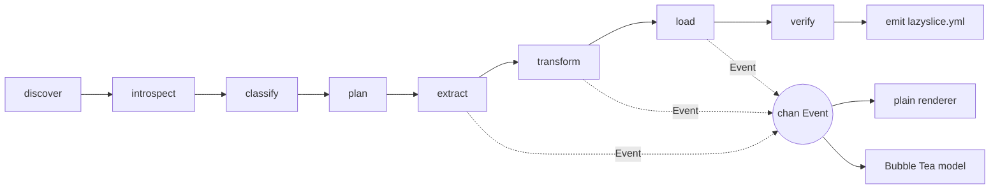
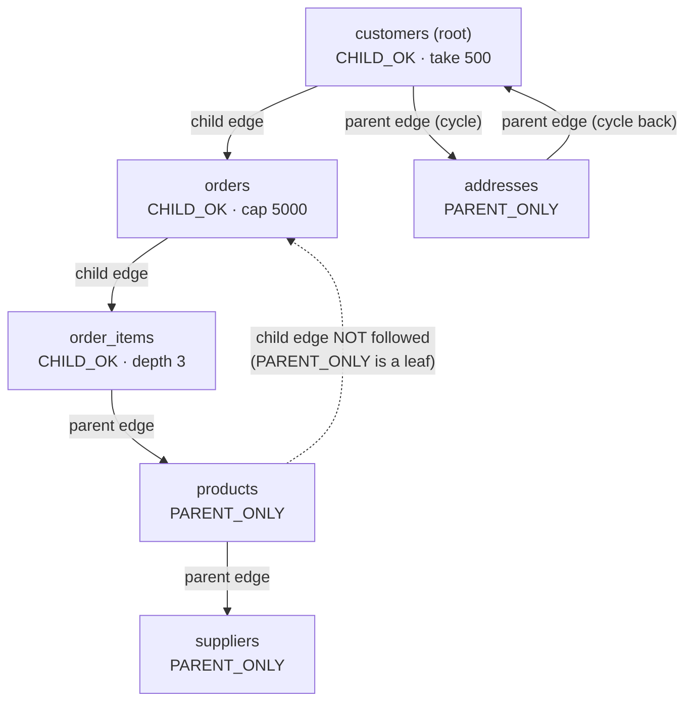

# Proposal: MVP-first

**Lens.** The only thing that matters is [BUILD_PLAN.md Gate 4](../../docs/BUILD_PLAN.md): Pagila, 200 customers, container to container, under 60 s, zero flags beyond the root, six invariants green, a GIF. Where research offers a better-but-later answer, I take the cheaper one and write the reversal condition. `research/BENCHMARK_LANGUAGE.md` does not exist as of 2026-09-05; decision 1 stands without it.

---

## D1. Language: Go

Go 1.24+ (`crypto/hkdf` is in the standard library from 1.24 — [HARD_PROBLEMS.md §2.1](../HARD_PROBLEMS.md#21-simplest-correct-approach-keyed-hash-to-seed-per-semantic-category)), `CGO_ENABLED=0`, one static binary. Dependencies: `github.com/jackc/pgx/v5` v5.10.0 (typed `CopyFrom`, binary COPY, statement cache — [HARD_PROBLEMS.md §4.1](../HARD_PROBLEMS.md#41-simplest-correct-approach)), `github.com/docker/docker/client`, `spf13/cobra`, `nyaruka/phonenumbers`, `golang.org/x/text`, `gopkg.in/yaml.v3`, `testcontainers-go` (test only). No gofakeit: embed our own word lists with `go:embed` to avoid the version-drift trap ([HARD_PROBLEMS.md §2.3](../HARD_PROBLEMS.md#23-traps)).

Why not Python: [SYNTHESIS.md fact 9](../SYNTHESIS.md#1-the-ten-facts-that-most-change-what-we-build) — install is the top-voted feature request in this category, and a native-dependency pin killed Snaplet Snapshot's afterlife. Breadth is not on the Gate 4 path.

Go's Docker client does not resolve contexts, so we write ~60 lines of resolution ourselves ([OPEN_QUESTIONS.md item 7](../OPEN_QUESTIONS.md)): `DOCKER_HOST` → `DOCKER_CONTEXT` → `currentContext` in `~/.docker/config.json` plus `~/.docker/contexts/*/meta.json` → the default socket list (`/var/run/docker.sock`, `~/.orbstack/run/docker.sock`, `~/.colima/default/docker.sock`, `~/.rd/docker.sock`). If none answer, print every endpoint tried and continue with the env/DSN rungs. FPE is struck for v1 ([SYNTHESIS.md §3](../SYNTHESIS.md#3-revised-non-goals-for-v1)).

**Reversal:** the phase-5 benchmark shows Go extract+mask throughput below 20k rows/s on the 2M-row fixture and profiling blames the language, not our code.

## D2. TUI: Bubble Tea v2.0.0, entered only when it is free

`charmbracelet/bubbletea` v2.0.0 with `lipgloss` and `bubbles`, per the lazygit lineage. The MVP cut: **the default renderer is the plain-text one**, and it is the only renderer Gate 4's GIF needs. The TUI is one `tea.Model` with three views — table picker, plan preview, progress — reading the same `<-chan Event`. It is entered only when stdin and stdout are a TTY *and* a blocking question exists or `--tui` is passed. Anything not expressible as a flag is not built.

**Reversal:** if the plain renderer cannot make a 20-second GIF that reads as impressive, promote the TUI to the default for interactive runs.

## D3. Database order: PostgreSQL 13–18, one adapter, one definition of done

All engine-specific code lives in `internal/pg`; no `switch engine` exists elsewhere. An adapter is **done** when: it implements the seven interfaces in D5; invariants I1–I6 pass on Pagila and `nasty.sql` in CI on every supported major; `make integration` runs it under testcontainers-go with no manual setup; and its error paths appear in `docs/ERRORS.md`. A second engine starts only when zero Postgres subsetting issues are open and it gets its own CI job ([SYNTHESIS.md §3](../SYNTHESIS.md#3-revised-non-goals-for-v1)).

**Reversal:** none before v1. This is the discipline both dead companies failed.

## D4. Configuration: emitted, never required, and never an excuse

No config file is read on a first run. `lazyslice.yml` is written **after** a successful run: tool version, source/target provenance (host, port, database — never credentials), root, `--take`, caps and budgets used, the source snapshot id, the masking-key fingerprint, and one line per column with category, confidence and reason.

Reading it back supplies defaults only, and can never weaken a safety rule: a column the file has never seen is classified fresh and masked if the classifier says anything above `none`; a column whose type changed has its opt-out ignored and is re-masked with a warning. There is no `unsafe`, no pass-through, no wholesale-disable flag, and a CI grep test fails the build on `--no-mask|--disable-mask|--skip-mask|unsafe` appearing as a flag string ([SYNTHESIS.md fact 3](../SYNTHESIS.md#1-the-ten-facts-that-most-change-what-we-build)).

**Key lifecycle** ([OPEN_QUESTIONS.md item 4](../OPEN_QUESTIONS.md)): 32 random bytes in `./lazyslice.secret`, mode 0600, gitignored on first run; `LAZYSLICE_SECRET` (hex) overrides. No OS keyring in v1 — a native dependency and a first-run question for no Gate 4 benefit. A keyless CI run generates an ephemeral key, prints `masking key: ephemeral (fakes will not match your laptop)`, and exits 0. Rotation is: delete the file. A fingerprint mismatch against the committed yml warns, never fails.

**Reversal:** if two dogfood sessions show people committing `lazyslice.secret` by accident, move the default to the OS keyring and keep the file as a flag.

## D5. Pipeline

Seven stages; verify is a stage because [SYNTHESIS.md fact 3](../SYNTHESIS.md#1-the-ten-facts-that-most-change-what-we-build) makes silent success the most-evidenced failure in the corpus.



Types, in `internal/model`:

```go
type Schema struct { Tables []Table; FKs []FK; Enums []Enum; Sequences []Sequence }
type Classification struct { Columns map[ColumnRef]Verdict }   // Category, Confidence, Reason, Masker
type Plan struct { Steps []Step; Estimate Estimate; Notes []Note }
type Step struct { Table TableRef; Mode Mode; Keys KeySet; Cap int; Order int }
type Batch struct { Table TableRef; Cols []string; Rows [][]any }
type Report struct { FKs []ConstraintResult; Residual []ResidualHit; Sequences []SeqResult; Counts map[TableRef]int64 }
```

```go
type Introspector interface { Introspect(context.Context) (*Schema, error) }
type Classifier   interface { Classify(context.Context, *Schema, Sampler) (*Classification, error) }
type Planner      interface { Plan(context.Context, *Schema, Request) (*Plan, error) }
type Extractor    interface { Extract(context.Context, *Plan, chan<- Batch) error }
type Transformer  interface { Transform(*Batch) (*Batch, error) }
type Loader       interface { Load(context.Context, <-chan Batch) (*Report, error) }
type Verifier     interface { Verify(context.Context, *Plan, *Classification) (*Report, error) }
```

`internal/run.Run(ctx, Request, chan<- Event) (*Result, error)` is the whole product. `cmd/lazyslice` builds a `Request` from flags, chooses a renderer by `isatty`, and calls it; the TUI's `tea.Cmd` reads the same channel. Each stage also has a subcommand (`lazyslice introspect|classify|plan --json`) so it is testable alone.

```go
type Event struct { Stage Stage; Kind Kind; Table string; Done, Total int64; Msg string; Err error }
```

`Kind` ∈ `{Start, Progress, Note, Warn, Done}`. Events are advisory: dropping one never changes the run.

## D6. Extension model: maskers selectable, classifier closed, no plugins in v1

The classifier is never pluggable — it is a safety component, and a user-supplied classifier is a wholesale-disable flag with extra steps. Maskers are pluggable **by selection only**: `lazyslice.yml` names a built-in masker per column from a compiled-in registry (`email`, `person_name`, `phone`, `address`, `date_of_birth`, `national_id`, `financial`, `network`, `credential`, `free_text`, `json_whole`, `enum_label`, `null_out`). No Go plugins (breaks the static binary), no expression language (a DSL is a product), no subprocess (a supply-chain hole) in v1. The masker ships as its own importable module `github.com/Liarea/lazyslice/mask` with its own tests, per [ADR-007](../../docs/adr/007-tool-not-company.md), so it outlives the tool as copycat outlived Snaplet.

**Reversal:** if three separate users need a masker we will not build, add a subprocess protocol (JSON lines over stdin/stdout), never in-process plugins.

---

## The subset planner

Client-side monotone worklist, provenance-tagged ([HARD_PROBLEMS.md §1.1](../HARD_PROBLEMS.md#11-simplest-correct-approach-a-monotone-worklist)). No SQL recursion, no temp tables on the source.

1. **Root and seed.** `--root <table>` (default: inbound − outbound FK count, lookup tables filtered, name preference `customers|users|accounts|tenants|organizations`, ties by row count — [SQLIT_STUDY.md §5.4](../SQLIT_STUDY.md#54-root-table-default-and-why-it-can-be-defaulted-at-all)). Seed `--take/-n` rows (default 500) ordered by primary key descending.
2. **Row identity**, per table, printed: PK → non-partial non-expression unique index → inferred pseudo-key (FK columns plus NOT NULL discriminators, probed for uniqueness on a sample) → `ctid` under the held snapshot. A `ctid`-only table over 100k rows is refused by name.
3. **Parents to completeness.** Uncapped, any depth, always. Skip a composite FK with any NULL column under `MATCH SIMPLE`. Rows pulled here are tagged `PARENT_ONLY`.
4. **Children.** Only from `CHILD_OK` rows, capped at `--child-cap` (default 10 × take) per parent key using `row_number() OVER (PARTITION BY fk_col ORDER BY pk)`, and depth-limited by `--depth` (default 3). A row's mode is fixed the first time it is pushed.
5. **Cycles.** Tarjan's SCCs, condensed, topologically sorted for load order. Because FKs are created post-data (below), no edge needs breaking; the plan names the SCC and which edge would have been deferred. Zero cycles is a tested case ([Greenmask #329](https://github.com/GreenmaskIO/greenmask/issues/329)).
6. **Unreachable tables.** A table with no outgoing FKs, ≥1 incoming FK, and <1000 rows is a lookup table: copied whole and labelled. Every other unreachable table gets schema only, listed in the plan.
7. **Budgets.** Abort planning, exit 10, when the estimated row count exceeds `--row-budget` (default 2,000,000) or the selected-key set exceeds `--key-budget` (default 256 MiB, estimated at 16 bytes per key). Both printed in the plan preview before any extract.
8. **Polymorphic pairs.** `<x>_type`/`<x>_id` and `content_type_id`/`object_id` are inferred, mapped to tables from sampled `_type` values, followed in the parent direction only, and reported. Unmapped values warn; FK verification cannot catch them.



The dotted edge is the whole size control: every other supplier's orders never enter the slice ([Jailer #126](https://github.com/Wisser/Jailer/issues/126)).

**Snapshot.** One `REPEATABLE READ` transaction holds `pg_export_snapshot()`; every other source connection runs `SET TRANSACTION SNAPSHOT` first. If that statement is rejected — the PgBouncer transaction-mode case, [OPEN_QUESTIONS.md item 1](../OPEN_QUESTIONS.md) — do not refuse: fall back to a single-connection serialized extract on the snapshot holder and print `source looks pooled; single-connection extract, slower`. The plan prints the estimated hold time.

## Deterministic masking

`K` = 32 bytes. `K_cat = HKDF-SHA256(K, info="lazyslice/v1/"+category)`. `h = HMAC-SHA256(K_cat, typeTag || canonical(value))`. `fake = generator[category](h)` — `h` drives every choice; no global seeded faker. Canonicalise per category: case-fold emails, E.164 phones, NFKC names. Categories propagate along FK edges; the referenced column's decision wins ([HARD_PROBLEMS.md §2.1](../HARD_PROBLEMS.md#21-simplest-correct-approach-keyed-hash-to-seed-per-semantic-category)). NULL stays NULL, empty stays empty, no prefix or length survives. Fake emails use RFC 2606 domains — real domains leak employer.

Under a unique index: use a ≥2⁶⁴ generator domain with a hash-derived suffix. Never retry with a counter. If the column's admissible domain `d` (from type, `atttypmod`, parseable `CHECK`, enum labels) is below `d_required ≈ n²/2ε` at ε = 10⁻⁶, refuse the column by name with both numbers ([HARD_PROBLEMS.md §2.2](../HARD_PROBLEMS.md#22-refinements)). Partition-key columns are excluded from masking with a printed reason.

## v1 safety controls (all blocking)

| # | Control | Failure |
|---|---|---|
| 1 | Target eligible iff reachable, `has_schema_privilege(...,'CREATE')`, and (every user table has zero `n_live_tup` **or** the `lazyslice_meta` marker table exists). "Migrated but empty" passes; "partially seeded" fails and is reported. Only an explicit `--target` overrides. | exit 4 |
| 2 | Refuse a target whose `(host, port, database)` matches the source after loopback normalisation. | exit 4 |
| 3 | Source opened `default_transaction_read_only = on`; role privileges checked with `has_table_privilege` and printed. `--require-read-only-role` makes a writable role fatal. | exit 6 |
| 4 | Post-data FK creation `NOT VALID` then `VALIDATE CONSTRAINT`, per constraint. | exit 8 |
| 5 | **Residual-PII scan.** Transform inserts every *source* value it masked into a per-column Bloom filter (1e-6 FP). Verify streams each masked column from the target and re-checks hits exactly. Zero false negatives against its input set; the false-negative *surface* is: columns the classifier never flagged, and a fake that collides with a real value. The README says exactly this. | exit 9 |
| 6 | `setval(seq, coalesce(max(id),1), max(id) IS NOT NULL)` after commit; never `coalesce(...,0)`. Verified per sequence. | exit 8 |
| 7 | Credentials never written to `lazyslice.yml`, never logged; DSNs redacted in every message. `snapshots/` and `lazyslice.secret` appended to `.gitignore` on first run. | build-time test |
| 8 | Every planned non-empty table has non-zero rows in the target. | exit 9 |

Exit codes otherwise follow [SQLIT_STUDY.md §5.7](../SQLIT_STUDY.md#57-error-presentation): 2 bad invocation, 3 no source, 5 missing credential, 7 extract/load failure, 130 interrupted with the target rolled back.

## What I cut to reach Gate 4

Keyring, custom-masker plugins, resumable extracts, MySQL, JSON partial redaction, NER, per-entity keys, `--percent` in any form, and every traversal knob that is not a budget. Each is a tracker item, not a v1 feature.
