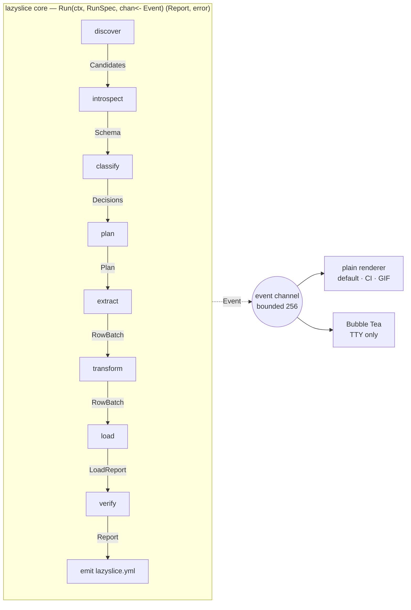
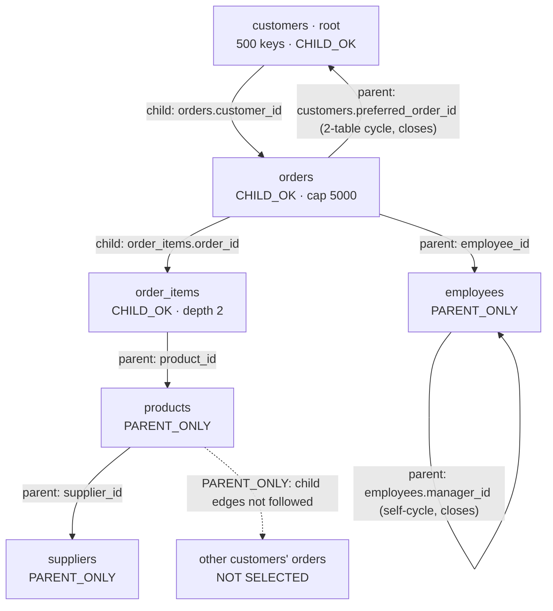

# Proposal: MVP-first

**Lens.** The only target is [BUILD_PLAN.md Gate 4](../../docs/BUILD_PLAN.md): Pagila, 200 customers, container to container, under 60 s, zero flags beyond the root, six invariants green, a GIF. Where research offers a better-but-later answer I take the cheaper one and write the reversal condition. `research/BENCHMARK_LANGUAGE.md` does not exist as of 2026-09-05.

## D1 — Language: Go, one static binary

Go (toolchain ≥ 1.24, `CGO_ENABLED=0`): `crypto/hkdf` is standard library from 1.24, so the masker needs no crypto dependency ([HARD_PROBLEMS.md §2.1](../HARD_PROBLEMS.md)). Dependencies, pinned exactly at scaffold: `jackc/pgx/v5` (v5.7 line — typed `CopyFrom`, binary COPY, statement cache, [HARD_PROBLEMS.md §4.1](../HARD_PROBLEMS.md)); `docker/docker/client`; `spf13/cobra` v1.9.x; `nyaruka/phonenumbers`; `golang.org/x/text`; `gopkg.in/yaml.v3`; `testcontainers-go` (tests only). **No gofakeit**: word lists are our own and `go:embed`ed, since a faker's lists changing between versions silently changes the mapping ([§2.3](../HARD_PROBLEMS.md)).

Python loses on install alone: "How do I install this?" is the category's top-voted issue and a native pin killed Snaplet Snapshot ([SYNTHESIS.md fact 9](../SYNTHESIS.md)).

Go's Docker client does not resolve contexts, so we write ~60 lines ourselves ([OPEN_QUESTIONS.md item 7](../OPEN_QUESTIONS.md)): `DOCKER_HOST` → `DOCKER_CONTEXT` → `currentContext` in `~/.docker/config.json` plus `~/.docker/contexts/*/meta.json` → default sockets (Docker, OrbStack, Colima, Rancher). If none answer, print every endpoint tried and continue down the ladder. FPE is struck ([SYNTHESIS.md §3](../SYNTHESIS.md)).

**Reversal:** the phase-5 benchmark shows extract+mask below 20k rows/s on the 2M-row fixture and profiling blames the language, not our code.

## D2 — TUI: Bubble Tea, and the plain renderer is the default

`charmbracelet/bubbletea` (v2 line; v1.3.x if v2 is not GA at scaffold) with `lipgloss` and `bubbles`. The MVP cut: **the plain-text renderer is the default and the only one Gate 4's GIF requires.** The TUI is one `tea.Model` with three views — table picker with classifier reasons, plan preview, live progress — reading the same `<-chan Event`. It is entered only when stdin *and* stdout are a TTY *and* either a blocking question exists or `--tui` was passed. Nothing in it is not already a flag ([CONCEPT.md](../../CONCEPT.md)).

**Reversal:** the plain renderer cannot carry a 20-second GIF that reads as impressive; then the TUI becomes the interactive default.

## D3 — Databases: PostgreSQL 14–18, one adapter, one definition of done

Postgres only. 13 is end-of-life; CI runs 14 and 18. All engine-specific code lives in `internal/pg` behind the D5 interfaces; `switch engine` appears nowhere. **An adapter is done when:** it implements all eight interfaces; I1–I6 pass on Pagila *and* `nasty.sql` on every supported major in CI; `make integration` runs it under testcontainers-go with no manual setup; every error it raises appears in `docs/ERRORS.md` with its exit code. A second engine begins only when zero Postgres subsetting issues are open and it has its own CI job ([POSTMORTEMS.md §10 item 4](../POSTMORTEMS.md)).

**Reversal:** none before v1. This is the discipline both dead companies wrote down and broke.

## D4 — Configuration: emitted after, never required before

No config is read on a first run. `lazyslice.yml` is written **after** a successful run: tool version, source/target provenance (host, port, database — never credentials), root, `--take`, caps and budgets used, the snapshot id, the key fingerprint, and one line per column with category, confidence, reason and type fingerprint.

Reading it back supplies defaults only and never weakens a rule. A column the file has never seen is classified fresh and masked at or above `possible`. A column whose type fingerprint changed has its opt-out **ignored** and is re-masked with a warning ([SYNTHESIS.md fact 3](../SYNTHESIS.md)). No unsafe mode, no pass-through, no wholesale-disable flag; a CI grep fails the build on `--no-mask|--disable-mask|--skip-mask|unsafe` as a flag string.

**Key lifecycle** ([OPEN_QUESTIONS.md item 4](../OPEN_QUESTIONS.md)): 32 random bytes in `./lazyslice.secret`, mode 0600, gitignored on creation; `LAZYSLICE_SECRET` (hex) overrides. No OS keyring in v1 — a native dependency and a first-run question for no Gate 4 benefit. A keyless CI run gets an ephemeral key, prints `masking key: ephemeral — fakes will not match your laptop`, exits 0. Rotation is deleting the file; a fingerprint mismatch warns, never fails.

**Reversal:** two dogfood sessions show `lazyslice.secret` being committed by accident; move the default to the OS keyring, keep the file as a flag.

## D5 — Pipeline: seven stages, one core, one event channel



Interfaces in `internal/pipeline`, implemented in `internal/pg`:

```go
type Discoverer interface{ Discover(ctx) ([]Candidate, error) }
type Introspector interface{ Introspect(ctx, *pgxpool.Pool) (*Schema, error) }
type Classifier   interface{ Classify(ctx, *Schema, Sampler) (Decisions, error) }
type Planner      interface{ Plan(ctx, *Schema, Decisions, PlanSpec) (*Plan, error) }
type Extractor    interface{ Extract(ctx, *Plan, chan<- RowBatch) error }
type Transformer  interface{ Transform(RowBatch) (RowBatch, error) }   // pure
type Loader       interface{ Load(ctx, <-chan RowBatch, *Plan) (LoadReport, error) }
type Verifier     interface{ Verify(ctx, *Plan, LoadReport) (Report, error) }
```

Types: `Schema{Tables, Columns, PKs, FKs, UniqueIndexes, Sequences, Partitions, Enums, Generated, RLS, ApproxRows, Samples}`; `Decisions map[ColumnRef]Decision{Category, Confidence, Reason, Masker}`; `Plan{Steps []Step{Table, Mode, Predicate, Cap, KeySource}, EstRows, EstBytes}`; `RowBatch{Table, Cols, Rows, Seq}`; `Event{Stage, Table, Done, Total, Msg, Level}`.

`Run` is the whole product. `cmd/lazyslice` drains the channel into the plain renderer; the TUI calls the same function and forwards each `Event` as a `tea.Msg`. Neither reaches a stage directly, so no capability can exist in one and not the other. Each stage is also a subcommand (`introspect`, `classify`, `plan`, `verify`) with `--json`. Progress is lossy: a full channel drops progress events rather than blocking; errors and stage transitions are never dropped.

**Reversal:** the channel cannot carry two-way TUI actions (cancel a table mid-extract); add a `Control` channel, never a second core.

## D6 — Extension model: rules are data, maskers are a library

**Classifier: pluggable, as data.** The rule pack (name patterns, weights, dictionaries, validator bindings) is an embedded YAML file; `--rules extra.yml` merges another. A pack may *add* categories or *raise* confidence, never lower a column below the mask threshold — that is the per-column opt-out's job, recorded with a reason.

**Maskers: not pluggable in v1.** No Go plugins (breaks the static binary), no subprocess (a masker sees every PII value — [BUILD_PLAN PROMPT 2.5](../../docs/BUILD_PLAN.md) names "a malicious custom masker" as a threat), no expression language (an interpreter is a week we do not have). The masker ships instead as a dependency-free importable module, `github.com/Liarea/lazyslice/mask`, with its own tests and release tag, so it outlives the tool as copycat outlived Snaplet ([SYNTHESIS.md fact 4](../SYNTHESIS.md); [ADR-007](../../docs/adr/007-tool-not-company.md)). Users pick *which* built-in masker a column gets by setting its category in the yml.

**Reversal:** three reports need a masker we do not ship and cannot add in a release; then add subprocess maskers with a declared category contract, never in-process plugins.

## The subset planner

Defaults: `--take 500` (`-n`), child cap `10 × take` per parent key, depth 4, row budget 2,000,000, key memory 256 MB.

1. **Root.** `--root`, else the highest `inbound_fk − outbound_fk` after discarding lookup-shaped tables, preferring `customers|users|accounts|organizations|tenants` ([SQLIT_STUDY.md §5.4](../SQLIT_STUDY.md)). Root rows: `ORDER BY pk LIMIT take`.
2. **Worklist.** Monotone, every entry tagged `CHILD_OK` or `PARENT_ONLY` ([HARD_PROBLEMS.md §1.1](../HARD_PROBLEMS.md)). Parents are pulled uncapped at any depth as `PARENT_ONLY`. Children are pulled **only** from `CHILD_OK` entries, depth-limited and capped per parent key with `row_number() OVER (PARTITION BY fk_col ORDER BY pk) <= cap`. A row's mode is fixed when first pushed and never upgraded: that is the size control, and "most permissive mode wins" is a larger algorithm ([SYNTHESIS.md §5 q3](../SYNTHESIS.md)).
3. **Keys.** Chunks of 2,000 joined against `unnest($1)`, one prepared shape. Composite keys are tuples via multi-array `unnest`; under `MATCH SIMPLE` a composite FK with any NULL column is skipped.
4. **Row identity.** PK → non-partial, non-expression unique index → composite pseudo-key from the table's FK columns, probed on a sample → **refuse**, naming the table and `--key table=col,col`. `ctid` is cut: not reproducible, buys one fixture.
5. **Cycles.** Selection needs no special case: the worklist terminates on self-references and SCCs alike. Load order is Tarjan SCC plus a topological sort of the condensation, but FKs are created **after** data, so order inside an SCC is irrelevant and verification *is* `ADD FOREIGN KEY … NOT VALID` then `VALIDATE CONSTRAINT`, per constraint ([HARD_PROBLEMS.md §4.2](../HARD_PROBLEMS.md)). Zero cycles is a first-class fixture.
6. **Lookup tables** (no outgoing FKs, ≥1 incoming, under 1,000 rows) are copied whole and named. **Unreachable tables** get schema and zero rows, listed as `empty: not reachable from customers`.
7. **Budgets.** The plan prints tables, estimated rows, key memory (`keys × 8 B × 2`) and snapshot hold time, and aborts naming the offending table when a budget is exceeded; `--row-budget` and `--memory-budget` raise them.
8. **Polymorphic pairs.** `<x>_type`/`<x>_id` and `content_type_id`/`object_id` are detected, mapped from sampled `_type` values, followed in the **parent** direction only; unmapped values print `not followed: no constraint`.



## Deterministic masking

```
K      = 32 random bytes (lazyslice.secret | $LAZYSLICE_SECRET)
K_cat  = HKDF-SHA256(K, info = "lazyslice/v1/" + category)
h      = HMAC-SHA256(K_cat, typeTag || canonical(value))
fake   = generator[category](h)          // h drives every choice; no global seed
```

Canonicalise per category before hashing: case-fold emails, E.164 phones, NFKC names, decimal-normalise numeric identifiers, so one identity masks identically as `text` here and `bigint` there ([HARD_PROBLEMS.md §2.1](../HARD_PROBLEMS.md)). Categories propagate along FK edges — a masked FK target overrides its referencing columns, or the join breaks. NULL stays NULL, `''` stays `''`. Fakes use RFC 2606 domains and the 555-0100–0199 range; no real domain, prefix, length or first character survives. Under a unique index the domain is ≥2⁶⁴ with a hash-derived suffix, never a retry counter; refuse the column by name when its admissible domain `d < n²/2ε` at `ε = 10⁻⁶`. Free text and JSON are replaced whole (`{}` for varying-key documents). Partition-key and generated columns are never masked.

## v1 safety controls (all blocking)

1. **Source.** Connections open `default_transaction_read_only = on`; the role's write grants are checked with `has_table_privilege` and **printed**. A writable role warns; `--require-read-only-role` makes it exit 6.
2. **Target gate** ([OPEN_QUESTIONS.md item 2](../OPEN_QUESTIONS.md)). Eligible iff reachable, `has_schema_privilege(current_user,'public','CREATE')`, **and** (every user table has `n_live_tup = 0` — so a migrated-but-empty compose database passes — **or** it carries the `lazyslice_meta` marker). `--target` names a database, it does not bypass the gate; `--replace` truncates only a marked target. Else exit 4, row counts shown.
3. **Never the source.** Source and target resolving to one `(host, port, database)` is exit 2.
4. **Snapshot.** One `pg_export_snapshot()` under `REPEATABLE READ`, imported by every source connection. **Pooled endpoints** ([OPEN_QUESTIONS.md item 1](../OPEN_QUESTIONS.md)): probe by importing it on a second connection; on failure fall back to a single-connection serialised extract in one transaction, printing `pooled endpoint detected — single-connection extract, slower`; if that fails too, refuse with the direct-DSN advice. Standby cancellation is a named, retryable error.
5. **Verify; any failure is non-zero.** (a) every FK validates. (b) **Residual-PII scan**: extract already sees every source value, so masked columns' canonical HMACs go into a Bloom filter (1% FP, ~2 MB/million); the target's masked columns are then scanned in full and any hit, re-hashed to confirm, fails the run. *It cannot catch, and the README says so:* PII in unflagged columns, structure leaking through a whole-value mask, blobs, re-identification by frequency. (c) `setval(seq, coalesce(max(id),1), max(id) IS NOT NULL)` after commit, never a literal 0. (d) every planned table non-empty.
6. **Failure leaves the target empty or complete**: per-table transactions, schema dropped on any stage failure.
7. **Secrets.** DSNs redacted in every event and error; the key never enters the yml.
8. **CI enforcement.** The no-unsafe-flag grep, an invariant that the source issued no write, `docs/ERRORS.md` coverage of every error.
