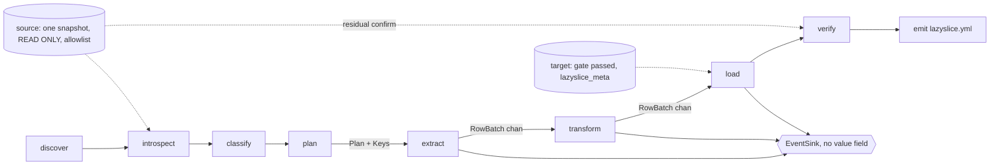
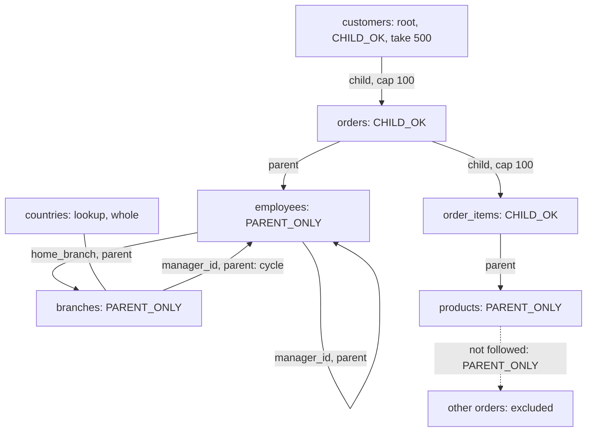

# Proposal: risk-first

Lens: never leak production data, never touch the source. Every choice names the threat it removes; tired people run this against real prod. Written 2026-09-05. `research/BENCHMARK_LANGUAGE.md` does not exist (parked); versions below were checked today against proxy.golang.org.

## Threats

- **T1** exit 0 with cleartext in the target (research/SYNTHESIS.md §1 fact 3; research/COMPLAINTS.md "Frequency ranking").
- **T2** masked rows written into production (research/SQLIT_STUDY.md §5.2; SYNTHESIS.md §2 risk 2).
- **T3** committed config goes stale and a new column passes through (COMPLAINTS.md PII-1; research/HARD_PROBLEMS.md §3.3).
- **T4** values leave the process: logs, events, plugins, network (research/POSTMORTEMS.md §3; HARD_PROBLEMS.md §3.2).
- **T5** key or DSN lands in git (HARD_PROBLEMS.md §2.3).
- **T6** the tool writes to, or pins, the source (COMPLAINTS.md TR-15; HARD_PROBLEMS.md §4.3).
- **T7** runaway slice: memory, time, xmin held on prod (COMPLAINTS.md SP-3, SP-4; HARD_PROBLEMS.md §1.3).

## 1. Language: Go

Go 1.27.1, `CGO_ENABLED=0`, `toolchain` pinned in `go.mod`. One static binary with no native dependency removes the failure that ended Snapshot (SYNTHESIS.md §1 fact 9). HMAC-SHA256 and HKDF are standard library since Go 1.24 (HARD_PROBLEMS.md §2.1), so masking needs no third-party crypto (T4). `jackc/pgx/v5` v5.10.0 is pure Go and streams `CopyFrom` from a bounded channel (HARD_PROBLEMS.md §4.2). SYNTHESIS.md §5 Q1: Docker contexts are ours (S9); FPE is struck (HARD_PROBLEMS.md §2.2).

Reversal: a benchmark shows Go's peak RSS growing with table size, or under half of `psql \copy` throughput, unfixable in one task.

## 2. TUI: Bubble Tea v2

`charmbracelet/bubbletea/v2` v2.0.9, `lipgloss/v2` v2.0.6, `bubbles/v2` v2.2.1. The TUI owns no logic: it builds the same `core.Request` as the CLI and subscribes to the same events. `TestEveryTUIActionHasFlag` fails on any keybinding without a `Flag` (CONCEPT.md "Terminal first"). Reversal: if v2 API churn costs more than one task per phase, pin the v1 line; `core` never imports the TUI.

## 3. Database order: PostgreSQL, then nothing until the gate

An adapter is done when it implements `Source` and `Target` (§5) with privilege report, allowlist tracer, snapshot primitive or named refusal, eligibility gate and marker table; passes I1–I6 on every fixture of SYNTHESIS.md §2 risk 3, in its own CI job against a real server (research/AI_PROJECT_PRACTICES.md §4 item 8); and has a THREAT_MODEL.md row per control. Then MySQL, SQLite, SQL Server. Reversal: suite green everywhere and no open Postgres subsetting bug for thirty days (POSTMORTEMS.md §10 item 4).

## 4. Configuration: emitted, never an excuse

`lazyslice.yml` is written after success and holds decisions and reasons, never secrets: `source`, `target`, `root`, `take`, `caps`, `key_fingerprint`, `schema_fingerprint`, `snapshot_id`, `tool_version`, and per column `{category, confidence, reason, masker}` or `unmask: {reason, by}`.

On re-run the classifier always runs; the file supplies opt-outs only, each valid while the column's recorded category and type still match. A column absent from the file is masked on any signal, copied only at `none` with high confidence, and printed under `drift:`. Headless with a committed file, drift is exit 10 unless `--accept-drift` (rewrites the file): a new prod column needs a human's eyes (COMPLAINTS.md PII-1). No pass-through mode exists (POSTMORTEMS.md §10 item 1). Reversal: if CI fails weekly on benign columns, exit 10 narrows to flagged columns.

## 5. Pipeline

Stages: **discover → introspect → classify → plan → extract → transform → load → verify → emit**. Each is an interface in `internal/<stage>`, runnable alone (`lazyslice plan …`). HARD_PROBLEMS.md §1 lives in plan, §2 in transform, §3 in classify, §4 in extract/load.

```go
type Source interface {
    Snapshot(ctx) (SnapshotID, error)        // pg_export_snapshot
    Reader(ctx, SnapshotID) (Reader, error)  // SET TRANSACTION SNAPSHOT
    Privileges(ctx) (RolePrivileges, error)
}
type Target interface { Gate(ctx) (Eligibility, error); Writer(ctx) (Writer, error) }

type Introspector interface { Introspect(ctx, Reader) (*Schema, error) }
type Classifier   interface { Classify(*Schema, Samples) *Classification }
type Planner      interface { Plan(ctx, Reader, *Schema, *Classification, PlanRequest) (*Plan, error) }
type Extractor    interface { Extract(ctx, Reader, *Plan, out chan<- RowBatch) error }
type Transformer  interface { Transform(RowBatch, *Classification, *mask.Key) (RowBatch, error) }
type Loader       interface { Load(ctx, Writer, *Plan, in <-chan RowBatch) (*LoadResult, error) }
type Verifier     interface { Verify(ctx, Reader, Writer, *Plan, *Classification, *Residual) *Report }

type Schema   struct { Tables; FKs; Uniques; Sequences; Partitions; Fingerprint string }
type Plan     struct { Steps []Step; Keys map[TableRef]KeySet; Lookups []TableRef; SCCs [][]TableRef; Estimate }
type Step     struct { Table TableRef; Mode Mode; Identity Identity }   // ChildOK|ParentOnly|Lookup; PK|Unique|Pseudo|Ctid
type RowBatch struct { Table TableRef; Cols []Column; Rows [][]any }
type Event    struct { Stage; Kind; Table TableRef; Rows, Bytes int64; Msg string; At time.Time }  // no value field
```

`core.Run(ctx, Request, EventSink) (*Report, error)` is the only entry point. CLI sink: lines or NDJSON (`--json`); TUI sink: a `tea.Cmd` feeding `Update`. `Event` cannot carry a row value and `Msg` is built from identifiers and counts, so progress, logs and the TUI cannot leak (T4). Classifier and Transformer are pure. Extract, transform and load are goroutines joined by channels of 2,000 rows (HARD_PROBLEMS.md §4.2), so a slow target back-pressures the source instead of growing memory (T7).



## 6. Extension model

Maskers are pluggable in-process; the classifier is not. `mask` is its own module, `github.com/Liarea/lazyslice/mask`, depending only on stdlib, `golang.org/x/text` v0.41.0 and `nyaruka/phonenumbers` v1.8.1, so it outlives the tool (docs/adr/007; POSTMORTEMS.md §11 item 1). Users pick maskers by name in the yml (`email`, `fixed:REDACTED`, `null`) and add new ones with `mask.Register` at build time. No Go plugins, subprocesses or expression language in v1: each hands production values to code we did not review (T4). Classifier overrides may only increase masking, plus recorded `unmask`. Reversal: three independent requests for an out-of-process masker reopen it as `--masker-exec`, fed canonical bytes over stdin, with a THREAT_MODEL.md row.

## Subset planner

HARD_PROBLEMS.md §1.1's worklist against the exported snapshot: printed row counts are exact, bytes estimated.

1. Root: `--root`, else `inbound − outbound` FKs with lookup filtering and the name preference (SQLIT_STUDY.md §5.4). Seed `ORDER BY pk LIMIT --take` (`-n`, default 500) or `--where`.
2. Pop `(table, keys, mode)`; `new = keys − selected[t]`; `selected[t] |= new`. `KeySet`: `RoaringBitmap/roaring/v2` v2.27.0 for integer keys, else a sorted tuple slice.
3. Parents: per outgoing FK, `SELECT DISTINCT fk cols WHERE pk IN new`, skipping NULLs under MATCH SIMPLE; push `PARENT_ONLY`, uncapped, any depth.
4. Children, only when mode is `CHILD_OK`: `row_number() OVER (PARTITION BY fk ORDER BY pk) <= cap`; push `CHILD_OK`; depth ≤ `--depth` (default 3); `--cap table=n` (default 100). A row's mode is fixed at first push; that rule, not the cap, is the size control (SYNTHESIS.md §1 fact 2).
5. Budgets: `--row-budget` 1,000,000; `--memory-budget` 256 MiB, twice the sum of `GetSizeInBytes`; a printed snapshot-hold estimate. Exceeding any aborts planning, naming the table (T7).
6. Unreachable tables: schema only. Lookup tables (no outgoing FK, any incoming, ≤1,000 `reltuples`) copied whole. Both listed.
7. Cycles: selection is monotone and needs nothing; load creates FKs post-data, so no edge is deferred; the plan prints each SCC and says so.
8. Identity: PK → non-partial, non-expression unique index → probed pseudo-key → `ctid`; a `ctid` table over 100,000 rows is refused without `--allow-ctid`.
9. Polymorphic `_type/_id` pairs inferred, followed parent-direction only, printed; unresolved `_type` values named.
10. Key lookups: `JOIN unnest($1)` in chunks of 5,000 (HARD_PROBLEMS.md §1.3).



## Deterministic masking

`K`: 32 random bytes in `lazyslice.secret` (mode 0600, gitignored on first run), or `LAZYSLICE_KEY`, or the OS keyring via `lazyslice key save` (`zalando/go-keyring` v0.2.8). `K_cat = HKDF-SHA256(K, info="lazyslice/v1/"+category)`; `h = HMAC-SHA256(K_cat, typeTag ‖ canonical(value))`; the generator consumes only `h` (HARD_PROBLEMS.md §2.1). Canonicalise per category: NFKC, case-fold, E.164. Categories propagate along FKs and equal column names. Under a unique index the fake comes from the full hash in a ≥2⁶⁴ domain; a type that cannot hold `n²/2ε` at ε = 10⁻⁶ is refused by name; never retry with a counter (§2.2). Never keep a prefix, length or domain; emails move to `example.com` (§2.3). NULL stays NULL, empty stays empty. Free text and JSON are replaced whole. Word lists are embedded, not gofakeit's.

Lifecycle (OPEN_QUESTIONS.md 4): yml and `lazyslice_meta` carry `sha256(K)[:8]` only. A keyless headless run uses an ephemeral key, prints `key: ephemeral`, consistent within the run only; `--require-key` makes that exit 5. Rotation (`lazyslice key rotate`) is a new fingerprint; a marked target with the old one is truncated and reloaded. Loss costs cross-run stability only. Compromise lets the holder confirm guesses against the fakes; the README says pseudonymisation under GDPR Art. 4(5), not anonymisation, and that a snapshot is personal data to regenerate after an erasure request (HARD_PROBLEMS.md §2.3).

## v1 safety controls

| Id | Control | Removes |
|---|---|---|
| S1 | Source: every transaction `REPEATABLE READ READ ONLY`; one `pg_export_snapshot` shared by every reader; a `pgx.QueryTracer` on the source pool fails the run on any statement outside `SELECT`, `WITH`, `SET TRANSACTION`, `BEGIN`, `COMMIT`, and invariant I4 replays the trace; role privileges via `has_table_privilege`, printed; a writable role on a non-loopback source exits 6 unless `--allow-writable-source-role` | T6 |
| S2 | Pooler: the second reader runs `SET TRANSACTION SNAPSHOT`; on failure fall back to one connection, print `pooler detected: single-connection extract`; `--single-connection` forces it. Never extract without a snapshot (OPEN_QUESTIONS.md 1) | T6 |
| S3 | Target gate: reachable; `CREATE` privilege; differs from the source by normalised host:port/db and, when readable, `pg_control_system().system_identifier`; and either `lazyslice_meta` present or every user table empty by `SELECT EXISTS` per table (never stats), capped at 2,000 tables, exempting migration bookkeeping (`schema_migrations`, `_prisma_migrations`, `alembic_version`, …) and extension-owned tables. A migrated-but-empty compose database passes; its empty tables are dropped and recreated from the source catalog, each drop printed. Else exit 4 unless `--allow-nonempty-target` (OPEN_QUESTIONS.md 2) | T2 |
| S4 | No pass-through: unknown or uncertain columns mask; `--unmask table.col` only; CI grep fails on `--no-mask\|--disable-mask\|--skip-mask\|--unsafe` | T1 |
| S5 | Values never leave the pipeline: `Event` has no value field; `pgconn.PgError` `Detail` and `Where` are dropped unless `--show-row-values-in-errors`; the binary connects only to the two databases and Docker's socket | T4 |
| S6 | Verify is the invariant suite: FKs added `NOT VALID` then `VALIDATE CONSTRAINT` per constraint (exit 8); residual scan (exit 9); `setval` after commit in the strict-NULL form; every planned table non-empty; unmasked columns byte-identical on a sample | T1 |
| S7 | Residual scan: during transform every masked cell's `HMAC(runKey, col ‖ canonical(source))` enters a Bloom filter sized for 10⁻⁶ false positives (≈29 bits per cell); verify streams each masked target column, canonicalises, and on a filter hit confirms with one `SELECT EXISTS` on the held snapshot. Cannot catch: personal data in a column classified `none`, values inside binary columns, quasi-identifier combinations, frequency and prefix leaks in unmasked columns (OPEN_QUESTIONS.md 3) | T1 |
| S8 | Secrets: no password or key in yml, events, `lazyslice_meta` or `--json`; `lazyslice.secret` gitignored | T5 |
| S9 | Discovery resolves Docker in order `DOCKER_HOST`, `DOCKER_CONTEXT`, `currentContext` in `~/.docker/config.json` with `contexts/meta/*/meta.json`, then default sockets; each failure prints a remedy (OPEN_QUESTIONS.md 7). Client `moby/moby/client` v0.6.0 (`docker/docker` stopped at v28.5.2). Compose files name, never connect | T2 |
| S10 | Headless (`--yes` or no TTY): no questions; creating or destroying needs `--create-target` or `--allow-nonempty-target`; standby cancellation exits 7 with a retry message | T2, T7 |

Exit codes: 0 ok, 2 usage, 3 no source, 4 target refused, 5 credential or key, 6 writable role, 7 extract or load, 8 FK, 9 residual, 10 drift, 11 budget, 130 interrupted with rollback (SQLIT_STUDY.md §5.7, extended).

Also `spf13/cobra` v1.10.2, `goccy/go-yaml` v1.19.2.
