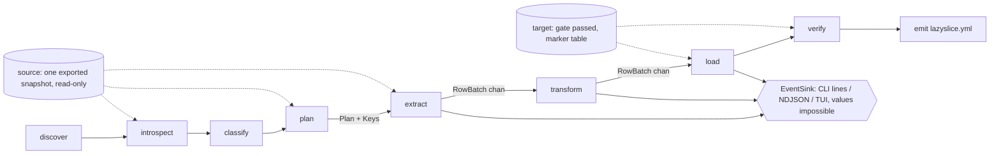
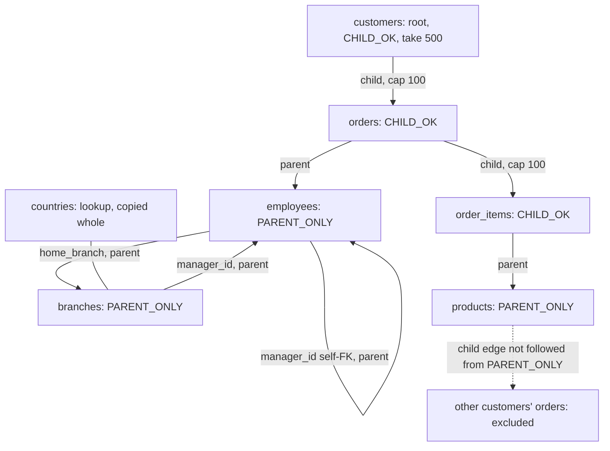

# Proposal: risk-first

Lens: never leak production data, never touch the source. Every choice names the threat it removes. Assumes tired people running it against real prod. Written 2026-09-05; library versions checked that day against proxy.golang.org, api.github.com and go.dev/dl. `research/BENCHMARK_LANGUAGE.md` did not exist when this was written.

## The threats

| Id | Threat | Evidence |
|---|---|---|
| T1 | Run exits 0 with cleartext in the target | SYNTHESIS.md §1 fact 3; COMPLAINTS.md "Frequency ranking" |
| T2 | Masked rows written into production | SQLIT_STUDY.md §5.2; SYNTHESIS.md §2 risk 2 |
| T3 | Committed config goes stale; a new column passes through | COMPLAINTS.md PII-1; HARD_PROBLEMS.md §3.3 "Schema drift" |
| T4 | Production values leave the process: logs, events, plugins, a cloud call | POSTMORTEMS.md §3 L200–213; HARD_PROBLEMS.md §3.2 |
| T5 | Key or DSN lands in git | HARD_PROBLEMS.md §2.3 "Key in the committed config" |
| T6 | The tool writes to, or pins, the source | COMPLAINTS.md TR-15; HARD_PROBLEMS.md §4.3 |
| T7 | Runaway slice: memory, time, xmin held on prod | COMPLAINTS.md SP-3, SP-4; HARD_PROBLEMS.md §1.3 |

## 1. Language: Go

Go 1.27.1 (current stable), `CGO_ENABLED=0`, `toolchain` pinned in go.mod. A static binary with no native dependency is what Snapshot lacked when a `better-sqlite3` pin ended it (SYNTHESIS.md §1 fact 9). HMAC-SHA256 and HKDF are standard library since Go 1.24 (HARD_PROBLEMS.md §2.1), so the masking path has no third-party crypto (T4, supply chain). `jackc/pgx/v5` v5.10.0 is pure Go and streams `CopyFrom` from a bounded channel (HARD_PROBLEMS.md §4.2 "Batch size and memory"). Two gaps SYNTHESIS.md §5 Q1 names are ours: Docker context resolution is written by us (S9), and FPE is struck for v1 (HARD_PROBLEMS.md §2.2 verdict).

Reversal: `BENCHMARK_LANGUAGE.md` shows Go's peak RSS growing with table size, or under half of `psql \copy` throughput and unfixable in one task. Driver breadth is not a reversal reason; breadth is phase 7.

## 2. TUI: Bubble Tea v2

`charmbracelet/bubbletea/v2` v2.0.9, `lipgloss/v2` v2.0.6, `bubbles/v2` v2.2.1. The TUI owns no logic: it builds the same `core.Request` the CLI builds from flags and subscribes to the same `Event` channel. `TestEveryTUIActionHasFlag` walks the keybinding table and fails on any action without a `Flag` field (CONCEPT.md "Terminal first"). Reversal: if v2 API churn costs more than one task per phase, pin the v1 line; nothing in `core` imports the TUI.

## 3. Database order: PostgreSQL, then nothing until the gate

An adapter is done when it implements `Source` and `Target` (§5) including the privilege report, a consistent-snapshot primitive or a named refusal, the eligibility gate and the marker table; passes I1–I6 on every fixture (Pagila, nasty.sql, and the cycle set from SYNTHESIS.md §2 risk 3) in its own CI job against a real server (AI_PROJECT_PRACTICES.md §4 item 8); and has one THREAT_MODEL.md row per control naming the engine's mechanism. Then MySQL, SQLite, SQL Server, per BUILD_PLAN. Reversal of Postgres-only: the suite green on every fixture and no open Postgres subsetting bug for thirty days (POSTMORTEMS.md §10 item 4).

## 4. Configuration: emitted, never an excuse

`lazyslice.yml` is written after success and holds references, decisions and reasons, never secrets: `source: docker:shop-db`, `target: docker:shop-db-test`, `root`, `take`, `caps`, `key_fingerprint`, `schema_fingerprint`, `tool_version`, and per column `{category, confidence, reason, masker}` or `unmask: {reason, by}`.

On re-run the classifier always runs again; the file supplies opt-outs only, and an opt-out applies only while the column's recorded category and type still match. A column absent from the file is masked if the classifier finds any signal, copied only at category `none` with high confidence, and every such column is printed under `drift:`. `--fail-on-drift` (exit 10) goes in the CI recipe. This closes T3 with no pass-through mode (POSTMORTEMS.md §10 item 1). Reversal: if dogfooding shows `drift:` lines ignored, `--fail-on-drift` becomes the headless default.

## 5. Pipeline

Stages: **discover → introspect → classify → plan → extract → transform → load → verify → emit**. Each is an interface in `internal/<stage>`, runnable alone (`lazyslice plan --from URL --root T --take N`). HARD_PROBLEMS.md §1 lives in plan, §2 in transform, §3 in classify, §4 in extract and load.

```go
type Source interface {                                   // internal/db
    Snapshot(ctx) (SnapshotID, error)                     // REPEATABLE READ + pg_export_snapshot
    Reader(ctx, SnapshotID) (Reader, error)               // SET TRANSACTION SNAPSHOT, read-only
    Privileges(ctx) (RolePrivileges, error)
}
type Target interface { Eligibility(ctx) (Gate, error); Writer(ctx) (Writer, error) }

type Introspector interface { Introspect(ctx, Reader) (*Schema, error) }
type Classifier   interface { Classify(*Schema) *Classification }                       // pure
type Planner      interface { Plan(ctx, Reader, *Schema, *Classification, PlanRequest) (*Plan, error) }
type Extractor    interface { Extract(ctx, Reader, *Plan, out chan<- RowBatch) error }
type Transformer  interface { Transform(RowBatch, *Classification, *mask.Key) (RowBatch, error) } // pure
type Loader       interface { Load(ctx, Writer, *Plan, in <-chan RowBatch) (*LoadResult, error) }
type Verifier     interface { Verify(ctx, Writer, *Plan, *Classification, *Residual) *Report }

type Schema   struct { Tables []Table; FKs []FK; Uniques []UniqueIndex; Sequences []Sequence; Partitions []Partition; Fingerprint string }
type Decision struct { Category Category; Confidence Confidence; Reason string; Masker string } // one per column
type Plan     struct { Steps []Step; Keys map[TableRef]*roaring.Bitmap; Lookups []TableRef; SCCs [][]TableRef; Estimate Estimate; Warnings []string }
type Step     struct { Table TableRef; Mode Mode /* ChildOK | ParentOnly | Lookup */; Identity Identity /* PK | Unique | Pseudo | Ctid */ }
type RowBatch struct { Table TableRef; Cols []Column; Rows [][]any }
type Event    struct { Stage Stage; Kind Kind; Table TableRef; Rows, Bytes int64; Msg string; At time.Time } // no value field, by design
```

`core.Run(ctx, Request, EventSink) (*Report, error)` is the only entry point. The CLI sink prints lines or NDJSON (`--json`); the TUI sink is a `tea.Cmd` feeding `Update`. `Event` has no field that can carry a row value, so progress, logs and the TUI cannot leak data (T4). Extract, transform and load are three goroutines joined by channels of 2,000 rows (HARD_PROBLEMS.md §4.2), so a slow target back-pressures the source instead of growing memory (T7).



## 6. Extension model

Maskers are pluggable in-process; the classifier is not. `mask` is its own module, `github.com/Liarea/lazyslice/mask`, depending only on stdlib, `x/text` v0.41.0 and `nyaruka/phonenumbers` v1.8.1, so it outlives the tool (ADR-007; POSTMORTEMS.md §11 item 1). Users pick maskers by name in the yml (`masker: email`, `fixed:REDACTED`, `null`) and add new ones with `mask.Register` by importing the module. No Go plugins, subprocesses or expression language in v1: each hands production values to code we did not review (T4). The classifier accepts per-column overrides that only increase masking, plus recorded `unmask`. Reversal: three independent requests for an out-of-process masker reopen it as `--masker-exec`, receiving canonical bytes only, with a THREAT_MODEL.md row.

## Subset planner

The worklist of HARD_PROBLEMS.md §1.1, run on the reader pool against the exported snapshot, so printed counts are exact and only bytes are estimated.

1. Root: `--root`, else the score `inbound − outbound` FKs with lookup filtering and the name preference (SQLIT_STUDY.md §5.4). Seed `ORDER BY pk LIMIT --take` (`-n`, default 500) or `--where`.
2. Pop `(table, keys, mode)`; `new = keys − selected[t]`; `selected[t] |= new`. Keys are `RoaringBitmap/roaring/v2` v2.27.0 bitmaps for integer keys, sorted tuple slices otherwise.
3. Parents: for every outgoing FK, `SELECT DISTINCT fk cols WHERE pk IN new`, skipping NULLs under MATCH SIMPLE; push `PARENT_ONLY`, uncapped, any depth.
4. Children, only when mode is `CHILD_OK`: `row_number() OVER (PARTITION BY fk ORDER BY pk) <= cap`; push `CHILD_OK`; depth ≤ `--depth` (default 3); cap per parent key `--cap table=n` (default 100). A row's mode is fixed at first push; SYNTHESIS.md §1 fact 2's rule is the size control.
5. Budgets: `--row-budget` 1,000,000, `--memory-budget` 256 MiB (twice the sum of `GetSizeInBytes`), and printed snapshot hold time; exceeding any aborts planning naming the table (T7).
6. Unreachable tables: schema only. Lookup tables (no outgoing FK, one or more incoming, ≤1,000 `reltuples`) are copied whole and listed.
7. Cycles: selection is monotone and needs nothing; load creates FKs post-data, so nothing is deferred; the plan prints each SCC: `cycle: employees→branches→employees, resolved by post-data FK creation`.
8. Identity: PK → non-partial, non-expression unique index → probed pseudo-key → `ctid`; a `ctid` table over 100,000 rows is refused without `--allow-ctid`.
9. Polymorphic `_type/_id` pairs inferred, followed parent-direction only, printed; unresolved `_type` values named.
10. Lookups are `JOIN unnest($1)` in chunks of 5,000 with one prepared shape.



## Deterministic masking

`K`: 32 random bytes in `lazyslice.secret` (mode 0600, appended to `.gitignore` on first run), or `LAZYSLICE_KEY`, or the keyring via `lazyslice key save` (`zalando/go-keyring` v0.2.8). `K_cat = HKDF-SHA256(K, info = "lazyslice/v1/" + category)`; `h = HMAC-SHA256(K_cat, typeTag ‖ canonical(value))`; the generator consumes `h` and nothing else (HARD_PROBLEMS.md §2.1). Canonicalise per category: NFKC, case-fold, E.164. Categories propagate along FKs and equal column names. Under a unique index the domain is ≥2⁶⁴ from the full hash; refuse by name when the column type's domain is under `n²/2ε` at ε = 10⁻⁶; never retry with a counter (§2.2). Never keep a prefix, length or domain: emails move to `example.com` (§2.1, employer leak). NULL stays NULL. Free text and JSON are replaced whole. Word lists are embedded, not gofakeit's.

Lifecycle (OPEN_QUESTIONS.md 4): yml and `lazyslice_meta` carry `sha256(K)[:8]` only. A keyless headless run uses an ephemeral key, prints `key: ephemeral`, and is consistent within the run only. Rotation is a new fingerprint; a marked target with the old one is truncated and reloaded. Loss costs cross-run stability, nothing else. Compromise lets the holder confirm guesses against the fakes; the README says pseudonymisation under GDPR Art. 4(5), not anonymisation (HARD_PROBLEMS.md §2.3).

## v1 safety controls

| Id | Control | Removes |
|---|---|---|
| S1 | Source: `default_transaction_read_only = on`, `REPEATABLE READ`, one `pg_export_snapshot` shared by every reader; role privileges via `has_table_privilege`, printed; `--require-read-only-role` exits 6 | T6 |
| S2 | Pooler: a second reader runs `SET TRANSACTION SNAPSHOT` on connect; on failure fall back to one connection and print `pooler detected: single-connection extract`; `--single-connection` forces it. Never extract without a snapshot (OPEN_QUESTIONS.md 1) | T6 |
| S3 | Target gate: reachable, `CREATE` privilege, host:port/db differs from the source, and either `lazyslice_meta` present with `schema_version` ≤ ours or every user table empty by `SELECT EXISTS (SELECT 1 FROM t)` per table (stats can be stale), capped at 2,000 tables. A migrated-but-empty compose database passes. Else exit 4 unless `--allow-nonempty-target` (OPEN_QUESTIONS.md 2) | T2 |
| S4 | No pass-through: unknown or uncertain columns mask; `--unmask table.col` only; CI grep fails on `--no-mask|--disable-mask|--skip-mask|--unsafe` | T1 |
| S5 | Values never leave the pipeline: `Event` has no value field; `pgconn.PgError` `Detail` and `Where` are dropped from output unless `--show-row-values-in-errors` | T4 |
| S6 | Verify is the invariant suite: FKs added `NOT VALID` then `VALIDATE CONSTRAINT` per constraint (exit 8); residual scan (exit 9); `setval` in the strict-NULL form after commit; every planned table non-empty; untouched columns byte-identical on a sample | T1 |
| S7 | Residual scan: during extract, each masked column's canonical source value is hashed under a run-local random key into an in-memory set; verify streams each masked target column, canonicalises, and fails on any hit. Cannot catch personal data in an unflagged non-text column, values inside binary columns, quasi-identifier combinations, or frequency and prefix leaks (OPEN_QUESTIONS.md 3) | T1 |
| S8 | Secrets: no password or key in yml, events, `lazyslice_meta` or `--json`; `lazyslice.secret` gitignored | T5 |
| S9 | Discovery resolves Docker in order `DOCKER_HOST`, `DOCKER_CONTEXT`, `currentContext` in `~/.docker/config.json` with `contexts/meta/*/meta.json`, then default sockets; each failure state prints a remedy (OPEN_QUESTIONS.md 7). Client: `moby/moby/client` v0.6.0, the path receiving releases in 2026; `docker/docker` last tagged v28.5.2 in November 2025. Compose files name, never connect | T2 |
| S10 | Headless (`--yes` or no TTY): no questions; creating or destroying needs `--create-target` or `--allow-nonempty-target`; standby cancellation exits 7 with a retry message | T2, T7 |

Exit codes: 0 ok, 2 usage, 3 no source, 4 target refused, 5 credential, 6 writable role, 7 extract or load, 8 FK, 9 residual, 10 drift, 11 budget, 130 interrupted with rollback (SQLIT_STUDY.md §5.7, extended).

Other dependencies: `spf13/cobra` v1.10.2, `goccy/go-yaml` v1.19.2 (`go-yaml/yaml` archived 2025-04-01), `testcontainers-go` v0.44.0, `goreleaser` v2.18.0 with keyless signing.
