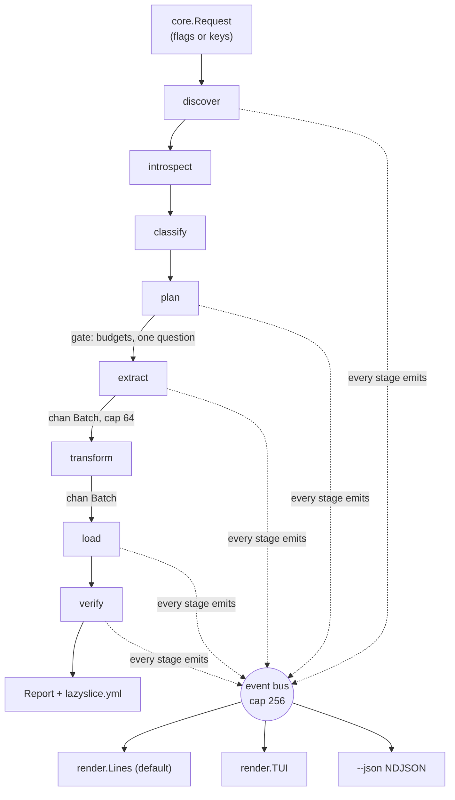
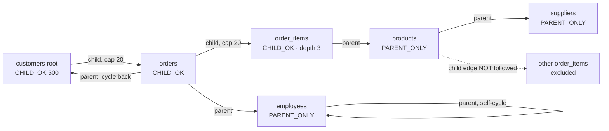

# Proposal: user-first

**Lens: Scenario A of `research/SQLIT_STUDY.md` §5.5 is the product.** Each decision cites `research/COMPLAINTS.md` or a sqlit / lazygit mechanism.

## 1. Language: Go 1.27.1, `CGO_ENABLED=0`

The top-voted request in this category is *installation*: pg_sample's most-upvoted issue is "How do I install this?", open since 2020 (`COMPETITORS.md` §4). One static binary is a first-run feature, not an ops preference. Go also gives stdlib `crypto/hkdf`, `pgx` v5.10.0, and the Docker SDK.

We budget for the one price now. `client.FromEnv` does not resolve Docker contexts, "the highest-risk single defect in the first-run path" (`SQLIT_STUDY.md` §5.1), so `internal/discover/dockerctx` is ours — `--host` → `DOCKER_HOST` → `DOCKER_CONTEXT` → `currentContext` in `~/.docker/config.json` and `contexts/*/meta.json` → default sockets including Colima's and OrbStack's — and it is the first integration test. FPE is struck: no maintained Go library exists (`HARD_PROBLEMS.md` §2.2).

**Reversal condition.** `research/BENCHMARK_LANGUAGE.md` does not exist yet (T-0014/T-0019). Reverse only if it puts Go within 20% of an asyncpg baseline **and** a single-file Python build passes `lazyslice --version` everywhere. After phase 3 this is a rewrite, not a reversal.

## 2. TUI: Bubble Tea v2.0.9, Lip Gloss v2.0.6, Bubbles v2.2.1 — not entered by default

The framework is the lazygit lineage (`BUILD_PLAN.md` L115). The user-first decision is *when*: **the happy path is a line printer, not an alternate screen.** CONCEPT.md's transcript is scrollback — it survives the run and pastes into a compliance ticket; an alternate-screen app erases itself on exit.

`lazyslice` prints lines; `--tui`, or `?` at a prompt, enters Bubble Tea for the two screens that need paging: the classifier's reasons and the plan table. Three sqlit mechanisms carry over.

- **Discovery never blocks the first line** — sqlit's "single most important structural decision" (§2.0). Candidates print as each verification resolves.
- **The footer is computed from state, not screen** (§2.4); unavailable bindings render struck-through rather than vanishing.
- **`docs/KEYBINDINGS.md` and the flag reference are generated**, with a CI drift check — lazygit's `go generate`; sqlit's hand-kept table has four wrong rows in eleven.

**Reversal condition.** If the plan table and reasons list both fit in 40 printed lines on every fixture, drop Bubble Tea for the line printer plus `$PAGER`. If users cannot find `?`, make `--tui` the TTY default — never move a capability into it.

## 3. Database order, and what "done" means

PostgreSQL 13–18 only. Breadth is not the hard part: "and then noticed it didn't support MSSQL" (DB-1) heads 16 entries about *discovering unsupportedness after installing*. So a support table above the fold, and `lazyslice --source mysql://…` exits 2 naming it.

An adapter is **done** when: (a) I1–I6 are green on every torture fixture — no-cycle, self-cycle, two-table cycle, overlapping SCC, keyless junction, polymorphic pair, 300-column table (`SYNTHESIS.md` risk 3); (b) it has a CI job per major version; (c) seven capability rows are filled and printed by `lazyslice doctor` — snapshot, bulk load, FK/unique introspection, sequence reset, cycle handling, read-only check, residual scan — with no silent "n/a"; (d) `docs/ADDING_A_DATABASE.md` is corrected by the port.

**Reversal condition.** A second engine starts when Postgres has no open subsetting or masking issue and downloads — not stars (dbslice: 143 stars, 33/month) — name it.

## 4. Configuration: emitted, never required

"Say I have nearly a hundred tables..." (CB-1) is the argument, and two 2026 entrants already reach a masked subset with no authored config. `lazyslice.yml` is written on success and by `--plan`: source/target *references* (`{from: env, var: DATABASE_URL}`), root, `--take`, per-column category + reason + masker + opt-outs, caps, schema fingerprint, secret **fingerprint**, tool version. Never a secret.

Reading it back can only tighten. A column in the source and absent from the yml is masked with its category default and printed `new column`; under `--strict-schema` (default with no TTY, CI-1's `gcc -Werror` request) that is exit 9 — CB-5's deny-by-default request and CB-13's drift bug, answered structurally.

**Reversal condition.** If the yml is hand-edited more often than regenerated, add `lazyslice explain --write` — never a precondition.

## 5. The pipeline

Eight stages, not `BUILD_PLAN.md` L118's six: every error must name its stage (`SQLIT_STUDY.md` §5.7), and the two added carry the promises — it finds your database and proves it worked.



```go
type Schema struct { Tables []Table; FKs []FK; Uniques []UniqueIndex; Seqs []Sequence; Parts []Partition }
type Classification struct { Col ColumnRef; Cat Category; Conf Confidence; Reason string; Masker MaskerID }
type Step struct { Table TableRef; Mode Mode /* CHILD_OK | PARENT_ONLY */; Key KeyStrategy; Pred Predicate; Cap int }
type Plan struct { Root TableRef; Take int; Steps []Step; SCCs []SCC; Unreachable []TableRef; EstRows, EstMem int64 }
type Batch struct { Table TableRef; Cols []string; Rows [][]any }

// ctx elided.
type Discoverer   interface{ Discover() ([]Candidate, error) }
type Introspector interface{ Introspect(ReadOnlyConn) (*Schema, error) }
type Classifier   interface{ Classify(*Schema, Sampler) ([]Classification, error) }
type Planner      interface{ Plan(*Schema, PlanRequest) (*Plan, error) }
type Extractor    interface{ Extract(*Plan, chan<- Batch) error }
type Transformer  interface{ Transform(*Batch) error }
type Loader       interface{ Load(<-chan Batch, *Plan) error }
type Verifier     interface{ Verify(*Plan, []Classification) (*Report, error) }
```

**One entry point:** `core.Run(ctx, core.Request, chan<- event.Event) (*Report, error)`. `cmd/lazyslice` builds `Request` from flags; `internal/tui` builds the identical `Request` from keystrokes and reads the same channel via `tea.Program.Send`. `TestEveryTUIActionHasFlag` fails on any binding whose action lacks a flag. `event.Event{Stage, Kind, Table, N, Total, Text, Err}` is sent non-blocking, drops counted; `--json` emits that stream as NDJSON, so the TUI provably adds nothing.

## 6. Extension model: maskers plug in, the classifier does not

A pluggable classifier is a supported way to see *less* PII — the mode CONCEPT.md refuses. Maskers must be pluggable because "client had no proper idea of what the field were" (CB-3): value shape is local knowledge.

A masker is a compiled-in pure function `func(h [32]byte, in Value, c Constraints) (Value, error)` in a registry, in a **separate module** `github.com/Liarea/lazyslice-mask` — stdlib only, own release tags — because copycat outlived Snaplet at 121,478 weekly downloads and ADR-007 requires the same here. No `.so`, Lua or WASM: a runtime code loader is a pass-through mode with extra steps. Extension happens in `lazyslice.yml` — shipped maskers per column, plus `mapping_file:`, the 1:1 CSV `HARD_PROBLEMS.md` §2.2 rule 4 requires — and in `classify.extra_patterns`, which may add a category or raise confidence but never lower or remove one (`TestConfigCannotLowerConfidence`).

**Reversal condition.** Three unrelated requests for a masker we will not ship buys a v2 WASM sandbox, same signature — still no classifier plugin.

## 7. The subset planner

A client-side monotone worklist (`HARD_PROBLEMS.md` §1.1), never SQL pushdown: the tool must say *why a row is present* and must not write temp tables on the source.

1. **Seed.** `SELECT <key> FROM root ORDER BY <key> LIMIT N` (`--take`/`-n`, default 500; optional `--where`), tagged `CHILD_OK`.
2. **Parents** run for *every* entry: uncapped, any depth, tagged `PARENT_ONLY`; rows with a NULL FK column are skipped under `MATCH SIMPLE`; composite keys travel as tuples via `unnest($1::int8[], $2::text[])`, chunked at 2,000 keys; unindexed FK edges warn per edge from `pg_index`.
3. **Children** run **only** for `CHILD_OK` entries: per-parent-key cap 20 (`--cap table=n`), depth limit 3 from the root. A row first reached as a parent is never re-expanded (`SYNTHESIS.md` §5 Q3) — both the size and the privacy control: Jailer #126 put other customers' orders in customer 1's slice for eight months.
4. **Cycles** never affect selection. Tarjan SCC → condensed DAG → topological load order; inside an SCC order is arbitrary because FKs are created post-data, so verification *is* `ADD FOREIGN KEY … NOT VALID` + `VALIDATE CONSTRAINT`; the plan names each cycle.
5. **Unreachable lookup tables** are copied whole iff `n_live_tup ≤ 10,000` and nothing in them classifies above `low`; otherwise schema-only.
6. **Row identity** falls back PK → unique non-partial non-expression index → inferred pseudo-key (FK columns plus NOT NULL discriminators, probed on a `TABLESAMPLE`) → `ctid`, printed per table. A `ctid`-only table over 1,000,000 rows is refused (exit 4): `ctid` breaks I3/I5 across a `VACUUM FULL`.
7. **Budgets.** Key sets are roaring bitmaps for single int8 keys, sorted tuple slabs otherwise. The plan prints `23 tables · ~18k rows · ~120 MB · ~46 MB planner memory` **before** extraction and aborts on `--memory-budget` (512 MB) or `--row-budget` (`100 × N`), naming the table and the `--cap` that fixes it. "less than 200Mb, and still I get OOM killed with 3GB" (SP-3) is a planning failure.
8. **Polymorphic** `_type`/`_id` pairs are inferred from distinct values, walked as `PARENT_ONLY` virtual FKs, always reported.



Both cycles are selected with no special case and loaded with no ordering.

## 8. Deterministic masking

`K` = 32 random bytes, written on first run to `./lazyslice.secret` (0600, gitignored, printed once), overridden by `$LAZYSLICE_SECRET` or the OS keyring (`zalando/go-keyring` v0.2.8). `lazyslice.yml` stores `secret_fingerprint: sha256(K)[:8]`. Then `K_cat = HKDF-SHA256(K, info="lazyslice/v1/"+category)`, `h = HMAC-SHA256(K_cat, canonical(value))`, `fake = generator[category](h)`. Canonicalisation is per category (case-folded emails, E.164 phones via `nyaruka/phonenumbers` v2.0.11), and categories propagate along FK edges and identical column names *before* masking, or joins break. NULL stays NULL, empty stays empty, no prefix or length survives. A column under a unique index gets a ≥2⁶⁴ generator with a hash-derived suffix (`alice.k7v2x@example.com`), never a retry counter; one whose admissible domain `d < n²/2ε` at `ε = 10⁻⁶` is refused by name. Fakes land in RFC 2606 domains and the 555-0100–0199 range; free text and JSON are replaced whole (`{}` for varying-key documents).

**Lifecycle.** Rotation is a new fingerprint: `lazyslice_meta` holds the previous one, so a re-run prints `secret changed — masked values will differ` and truncates. A keyless CI run generates an ephemeral key, says so, and gets consistent joins with different fakes — never a hard failure, since failing CI on a missing secret is how secrets get committed.

## 9. v1 safety controls

1. **No unsafe mode exists.** A CI grep fails the build on any flag matching `no-mask|disable-mask|skip-mask|unsafe`.
2. **Target eligibility gate:** reachable, `has_schema_privilege(…,'CREATE')`, and *either* zero rows in every user table (`pg_stat_user_tables`) *or* `lazyslice_meta` with `schema_version ≤ ours` (newer fails closed). A migrated-but-empty compose database passes; a partially seeded one is reported ineligible with row counts. Nothing else is written to without `--target` plus `--allow-nonempty-target`.
3. **Source read-only:** `default_transaction_read_only = on` plus a printed `has_table_privilege` report; `--require-read-only-role` makes a writable role exit 6. The source pool's type is `ReadOnlyConn`, which has no `Exec` method — I4 is enforced by the compiler, not by discipline.
4. **Residual-PII scan** in `verify`: per masked column, assert no target value's HMAC matches its source value's HMAC (digests, not values), then re-run the classifier over target samples. **Stated false negatives**, printed in the README: values already fake in the source; PII in a column the classifier never flagged; PII inside `bytea`; a masked value coinciding with another row's real value; PII in rows the `TABLESAMPLE` missed.
5. **Exit codes:** 0 ok, 2 bad invocation, 3 no source, 4 target refused, 5 credential missing, 6 source not read-only, 7 extract/load failure, 8 FK verification failed, 9 schema drift under `--strict-schema`, 130 interrupted with target rolled back.
6. **Poolers** (`OPEN_QUESTIONS.md` 1): attempt `pg_export_snapshot()` under `REPEATABLE READ` and a second connection's `SET TRANSACTION SNAPSHOT`; on failure, extract on one connection and say so. Never refuse: the pooler DSN is often the only one the developer has.
7. **Secrets cannot be logged:** `event.Event` has no field able to hold a DSN, `dsn.Ref.String()` redacts, and a test asserts its transitive field types exclude `dsn.DSN`.
