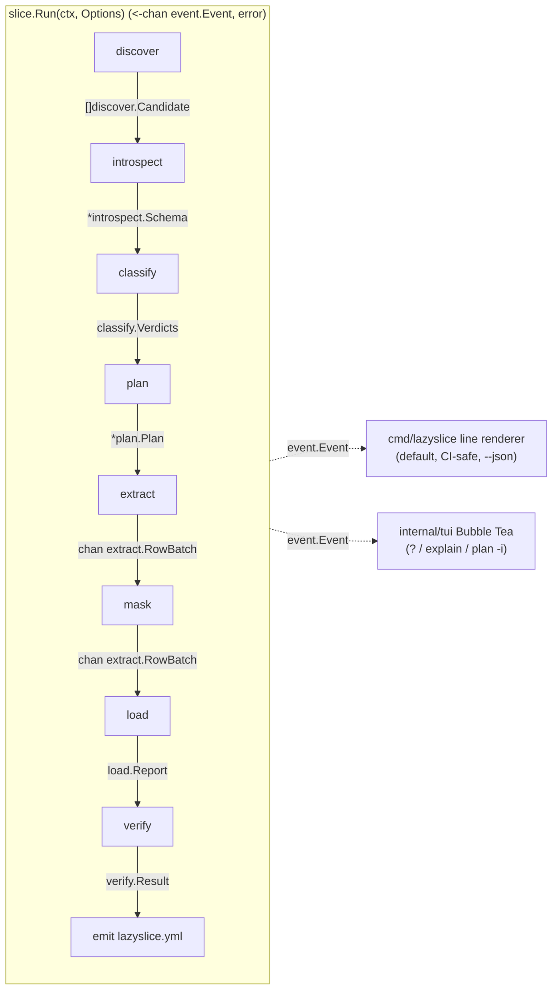
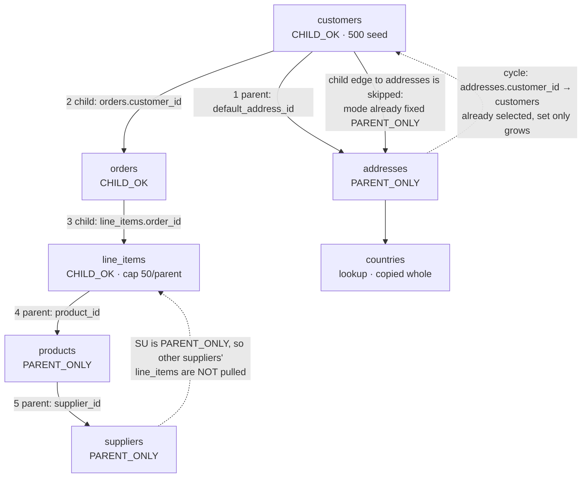

# Proposal: user-first

Architecture proposal for phase 2, written under one lens: **the first run in `research/SQLIT_STUDY.md` §5.5 Scenario A is the product**. Every choice is defended by a user quote in `research/COMPLAINTS.md` or a named mechanism in sqlit or lazygit.

---

## 1. Language: Go 1.27.1, `CGO_ENABLED=0`

`research/BENCHMARK_LANGUAGE.md` does not exist as of 2026-09-05. The available evidence is one-sided. Installation is the top-voted feature request in this category (`COMPETITORS.md` §4): pg_sample's most-upvoted issue is "How do I install this?", Snaplet Snapshot's top two are npm failures on Apple Silicon, Replibyte cannot be built. `POSTMORTEMS.md` §8 records Snapshot being cut off while still growing by a `better-sqlite3` pin. `SQLIT_STUDY.md` §2.6c spends a page on sqlit's machinery for printing the right `pip`/`pipx`/`uv` command and concludes a static Go binary "sidesteps the entire driver problem — which is a real argument for the language choice". Go also has the two libraries the pipeline is made of: `pgx` v5.10.0 (`CopyFrom` at 357,100 rows/s, `HARD_PROBLEMS.md` §4.1) and the Docker SDK.

Dependency set, verified against proxy.golang.org on 2026-09-05: `jackc/pgx/v5` v5.10.0, `docker/docker` v28.5.2+incompatible, `spf13/cobra` v1.10.2, `nyaruka/phonenumbers` v1.8.1, `golang.org/x/text` v0.41.0, `zalando/go-keyring` v0.2.8, `brianvoe/gofakeit/v7` v7.16.0 (word lists vendored, not called — §8), `testcontainers-go` v0.44.0 (test only), released by `goreleaser` v2.18.0. All MIT/Apache-2.0/BSD per `LICENSE_DECISION.md` L82.

**We write Docker context resolution ourselves**, ~150 lines in `internal/dockerctx`: `--host` → `DOCKER_HOST` → `DOCKER_CONTEXT` → `currentContext` in `~/.docker/config.json` → `~/.docker/contexts/*/meta.json` → default socket, with the resolved context printed by name. `SQLIT_STUDY.md` §5.1 calls `client.FromEnv`'s blindness to contexts "the highest-risk single defect in the first-run path". **FPE is struck for v1** (`HARD_PROBLEMS.md` §2.2: standard in flux, no maintained Go library).

*Reversal condition:* the benchmark shows masking below 50k rows/s on a 20-column table, or a Postgres feature we need has no pure-Go client path.

## 2. TUI: Bubble Tea v2.0.9 + Lip Gloss v2.0.6 — entered on demand, never by default

The framework is settled (lazygit lineage, `BUILD_PLAN.md` L115). The user-first decision is *when it runs*. **The happy path is a line-printing renderer, not an alternate-screen app.** CONCEPT.md's transcript is scrollback: it survives the run, and TR-10's data custodian ("Sounds fantastic") is shown a transcript, not a screenshot. An alternate screen erases the evidence the user came for. The full-screen Bubble Tea view is entered on exactly three triggers — `?` at any prompt or mid-run, `lazyslice explain`, `lazyslice plan --interactive` — and renders the same `event.Event` stream.

Two mechanisms are adopted verbatim. **The footer is computed from current state, not the current screen** (`SQLIT_STUDY.md` §2.4 layer 2): `? why masked` appears only after classify; `s skip table` only while a table extracts. **Every rendering of a binding comes from one table and CI fails on drift** — lazygit's "This file is auto-generated… run `go generate ./...`" — because four of eleven rows in sqlit's own README keybinding table are wrong nine months after that was its top launch complaint. Cancel (`q`, `Ctrl+C`) is not rebindable.

*Reversal condition:* if the plan preview cannot be read as scrollback on a 40-table schema without paging, plan becomes full-screen by default and the line renderer becomes `--plain`.

## 3. Database order: PostgreSQL only, and "done" is a test list

Postgres 13–18. No second engine. "Done" for an adapter is not a feature list; it is: **the invariant suite passes on all eight fixture schemas, the engine has its own CI job, and zero subsetting issues are open against Postgres** (`SYNTHESIS.md` §3, `POSTMORTEMS.md` §10 item 4: "Both companies wrote that sentence and then did not obey it"). The eight fixtures, committed before the planner exists (`SYNTHESIS.md` §5 item 23), built from real `information_schema` output: no cycles; one self-cycle; a two-table cycle; an SCC with two overlapping cycles; a keyless junction table; a polymorphic `_type`/`_id` pair; a 300-column table; a partitioned table with a masked partition key. The first exists because Greenmask panics on schemas with *no* cycles (`COMPLAINTS.md` FK-8).

*Reversal condition:* all eight pass, no open Postgres subsetting issue for one release cycle, and MySQL is asked for by more people than the tracker's open Postgres bugs.

## 4. Configuration: emitted after, and an unseen column is never passed through

`lazyslice.yml` is written **on success only**, as a record. "Say I have nearly a hundred tables..." (CB-1) and "I suspect it's likely to take a couple of hours to set up this tool too!" (CB-2) are the bar; two 2026 entrants already clear it (`COMPETITORS.md` "Time from install").

The rot is the real problem: "the committed file *is* the stale config" (`SYNTHESIS.md` fact 3). So the file is **not** an allowlist. Every run re-introspects and re-classifies from scratch; the yml supplies *decisions*, not *coverage*. A column the file has never seen is classified fresh, and if the classifier says personal data — or says "cannot classify" — it is **masked and reported as new**. That is CB-5 and CB-6 asking for deny-by-default three years apart. `--strict` promotes any new-column report to exit 9, which is CI-1's `gcc -Werror`. Opt-outs (`--unmask table.column`) are per column with a reason; there is no wholesale switch, and no `unsafe` mode for one to live in.

`lazyslice verify --target …` re-runs the whole verification set against an existing target and exits non-zero. Nobody in the field ships this (`COMPETITORS.md` §6).

## 5. The pipeline

Eight stages, each a pure function over immutable value types, in `internal/`. The core is a library; both front ends are renderers over one event channel.

`event.Event` is one struct: `{Stage Stage; Kind Kind; Table string; Rows, Total int64; Reason string; Err error}`. Every error carries its `Stage`, because "a 20-minute run that fails needs to say where" (`SQLIT_STUDY.md` §5.7), and no raw driver error reaches the user without a lazyslice sentence above it — the gap §2.6d finds in sqlit. Exit codes are §5.7's table plus 9 for `--strict`. `slice.Options` is populated only from cobra flags, so "every TUI action is reachable by a CLI flag" is a compile-time fact, not a review rule.

## 6. Extensions: rule packs yes, masker plugins no

**The classifier is pluggable, by data, not code.** `--rules pack.yml` (and `~/.config/lazyslice/rules/*.yml`) adds name patterns, validators by name, and dictionaries. A pack can only **add a category or raise a confidence** — never lower one, never mark a column non-personal; that is `--unmask`, per column, recorded. This is the extension people actually need: CB-7's team writes a comment on every column plus a diff job because their tool will not classify. It cannot make the tool less safe.

**Maskers are not runtime-pluggable in v1.** The masker ships as a separately importable, dependency-free module, `github.com/Liarea/lazyslice/mask`, with its own tests and release cadence, because copycat outlived Snaplet by two years and 121k weekly downloads (ADR-007). Extending means importing it and registering a `mask.Masker` (`Category() string; Mask(h [32]byte, in mask.Value) (mask.Value, error)`) — compile-time, deterministic, auditable. No Go plugins (cgo), no WASM, no scripting: a plugin API is how a tool becomes a platform, and CI-5's user could not get data into CI because the tool needed a Temporal cluster.

*Reversal condition:* three tracker entries asking for a masker we will not ship in-tree; then an out-of-process `--masker-command` protocol, never in-process code.

## 7. The subset planner

Client-side monotone worklist (`HARD_PROBLEMS.md` §1.1), not SQL pushdown: we must print why a row is present and must not write to the source.

- **Root:** `--root`, else score `= inbound FK count − outbound FK count`, discard lookup-shaped tables, prefer `{customers, users, accounts, organizations, tenants, …}`, then row count (`SQLIT_STUDY.md` §5.4). `?` shows the ranked top five with components. This is the one blocking question on the happy path; it tab-completes against the already-introspected schema and re-prompts on an unrecognised name rather than silently defaulting.
- **N:** `--take` / `-n`, default 500 (decided, `OPEN_QUESTIONS.md`).
- **Parents:** mandatory, uncapped, any depth, tagged `PARENT_ONLY`. Composite keys as tuples; under `MATCH SIMPLE` a partially-NULL FK references nothing, so skip it.
- **Children:** only from `CHILD_OK` rows, capped per parent key in one query with `row_number() OVER (PARTITION BY fk_col ORDER BY pk) <= cap`, depth-limited (`--depth`, default 4).
- **Mode is decided once.** A row first reached as a parent is never re-expanded as a child. This is the size control and it is what stops Jailer #126, where customer 1's slice contained customers 2–10's orders.
- **Cycles** need no special case for selection (sets only grow), and no special case for loading either, because FKs are created post-data. The plan still *names* every SCC it found — nobody prints that (`COMPETITORS.md` item 7).
- **Lookup tables** (no outgoing FKs, ≥1 incoming, <1,000 rows) are copied whole and listed as such.
- **Unreachable tables** are schema-only, listed by name, never silently copied.
- **Row identity:** PK → unique non-partial non-expression index → inferred pseudo-key probed on a sample → `ctid` under the held snapshot; printed per table, and refused above 1,000,000 rows because a `ctid`-keyed run is not reproducible.
- **Budgets:** `--row-budget` (default 2,000,000) and `--memory-budget` (default 512 MB, estimated as keys × 8 × 2). Planning aborts with a message instead of "collecting data indefinitely". SP-3 is "my database weighs less than 200Mb, and still I get OOM killed with 3GB".
- **The plan prints before extraction** — tables, rows, caps applied, SCCs, unindexed FK columns, estimated snapshot hold time. Nobody does this (`COMPETITORS.md` "Where we can beat everyone").

## 8. Deterministic masking

`K` = 32 random bytes per project. `K_cat = HKDF(K, info="lazyslice/v1/"+category)` (`crypto/hkdf`, Go 1.24+). `h = HMAC-SHA256(K_cat, canonical(value))`. `fake = generator[category](h)` — `h` drives every choice; never a seeded global faker, so gofakeit's word lists are vendored under `mask/data` and versioned, not called.

Canonicalise per category before hashing (case-fold emails, E.164 phones, NFKC names, type tag prefix) or the same person masks differently in two tables. Propagate the category along FK edges and identical column names; a PK/unique column's decision overrides the FK columns pointing at it. Fakes land in RFC 2606 domains and the 555-0100..0199 range. NULL stays NULL, empty stays empty; `varchar(n)`, `CHECK` and enum labels are respected.

**Uniqueness:** any column under a unique index (including expression and partial indexes) gets a generator with domain ≥ 2⁶⁴ and a hash-derived suffix. **No retry-with-counter** — it makes the mapping order-dependent. If the column's admissible domain `d` (from type, `atttypmod`, parseable `CHECK`, enum labels) is below `d_required ≈ n²/2ε` at ε = 10⁻⁶, refuse *that column by name* at plan time with both numbers.

**Key lifecycle** (`OPEN_QUESTIONS.md` item 4): `./lazyslice.secret` (mode 0600, added to `.gitignore` on creation), else `LAZYSLICE_SECRET`, else the OS keyring under service `lazyslice`. The yml records only `secret_fingerprint`, the first 8 hex of SHA-256(K). A keyless CI run generates an ephemeral key, is internally consistent, and prints that its fakes will not match the laptop's; under `--strict` a keyless run is exit 5. Rotation is a new fingerprint: verify reports the mismatch, and the marked target is truncated and reloaded.

## 9. v1 safety controls

1. **Target eligibility is a hard gate**, re-checked every run even from the yml: reachable, `CREATE` on the schema, and *either* zero rows in every user table per `pg_stat_user_tables` *or* our `lazyslice_meta` marker. Migrated-but-empty passes — that is the compose test database (`OPEN_QUESTIONS.md` item 2). Only an explicit `--target` plus `--allow-nonempty-target` overrides. A `lazyslice_meta` with a newer `schema_version` fails closed.
2. **Source is opened read-only and the role is printed**: `default_transaction_read_only = on` (our own guard, not access control) plus `has_table_privilege` checks, printed as the loudest header line when the role can write. `--require-read-only-role` makes it exit 6.
3. **No unsafe mode exists.** A CI grep for `--no-mask|--disable-mask|--skip-mask|unsafe` fails the build (`SYNTHESIS.md` §5 item 19).
4. **Verification set, all failures non-zero:** every post-data FK created `NOT VALID` then `VALIDATE CONSTRAINT`, per-constraint; the residual-PII scan; sequences set with `setval(seq, coalesce(max(id),1), max(id) IS NOT NULL)` after commit and re-read; every planned table non-empty; unmasked columns byte-identical to source.
5. **The residual-PII scan, and what it cannot catch.** During extract we keep, per masked column, an HMAC set (run-local key) of up to 100,000 distinct canonical source values; after load we stream the target column and fail on any hash hit. Then we re-run the classifier's *validators* over target values in columns marked non-personal and report hits. It cannot catch: values beyond the 100,000 cap; personal data inside a column the classifier never flagged; personal data in free text inside a column classified non-personal; opted-out columns; binary blobs; quasi-identifier combinations; and frequency and ordering leakage, which deterministic masking preserves by construction. The README says exactly this, and says "pseudonymised", never "anonymised".
6. **Pooled source endpoints** (`OPEN_QUESTIONS.md` item 1): we attempt `pg_export_snapshot()` under `REPEATABLE READ`; if a second connection's `SET TRANSACTION SNAPSHOT` fails (PgBouncer transaction mode), we degrade to a **single-connection extract inside that one transaction**, print "pooled endpoint detected — single-connection extract, slower, still consistent", and continue. `--require-snapshot-sharing` turns the degrade into exit 7. Standby cancellation past `max_standby_streaming_delay` is an expected, named failure with a retry message, not a generic error.
7. **Interrupt rolls the target back and says what it rolled back.** Per-table transactions; `q`/`Ctrl+C` is not rebindable.

*The claim this proposal is most likely to be wrong about:* that the root-table heuristic proposes the expected table on eight of ten real schemas (`SQLIT_STUDY.md` §7). It is untested. If it is wrong, Q2's default is wrong on the happy path, and the one question stops being answerable with Enter.
